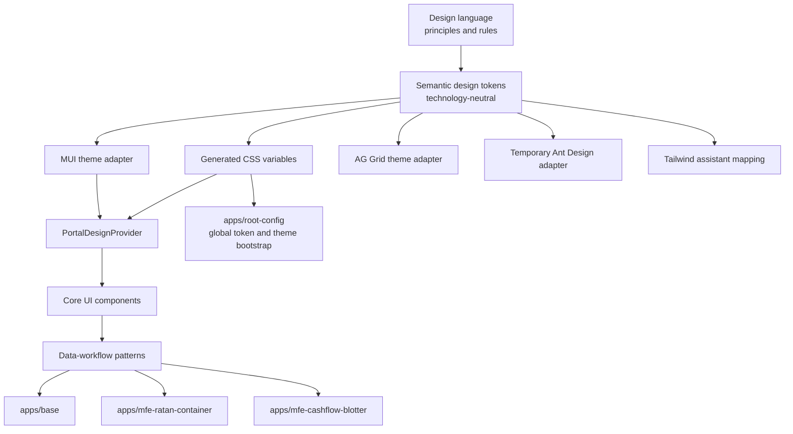
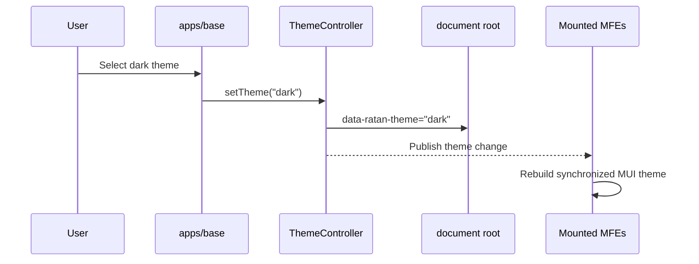

# Current UI Problems Solution

**Status:** Proposed target architecture and migration plan  
**Plan date:** 2026-07-18  
**Related assessment:** [CURRENT_UI_PROBLEMS_STATEMENT.md](CURRENT_UI_PROBLEMS_STATEMENT.md)  
**Scope:** `apps/base`, `apps/root-config`, `apps/mfe-ratan-container`, and `apps/mfe-cashflow-blotter`

## Executive Decision

The portal should adopt a single concrete design system implemented through a governed React UI library.

The recommended foundation is:

- **Material UI** as the primary React component foundation.
- **Emotion** as the component-level CSS-in-JS engine.
- **Technology-neutral semantic design tokens**, compiled to CSS custom properties, as the cross-micro-frontend visual contract.
- **Plain CSS** for generated variables, fonts, minimal global styles, third-party class-based integrations, and AG Grid theming.
- **AG Grid** retained for complex, high-density financial data workflows, but placed behind one design-system wrapper and one pinned theme/version.
- **Ant Design** treated as a temporary migration dependency behind a shared adapter, with no new direct application usage.
- **Tailwind** retained only where useful for assistant UI, but configured as a consumer of portal semantic tokens rather than an independent visual system.
- **Less** deprecated and removed progressively.

The goal is not “CSS-in-JS everywhere.” The goal is **token-driven styling everywhere**, with each styling mechanism limited to the work it performs best.

## Design System, UI Library, and Product Patterns

The solution must distinguish three related but different assets.

### Design System

The design system defines:

- visual principles
- semantic tokens
- typography
- spacing and density
- interaction behavior
- accessibility requirements
- component usage rules
- content and state guidance
- governance and contribution rules

It is the source of truth for what the portal should look and behave like.

### UI Library

The UI library is the reusable React implementation of the design system. It provides typed, tested, accessible components built primarily on MUI and Emotion.

MUI is an implementation dependency, not the public portal design system.

### Product and Workflow Patterns

Patterns combine UI components into recurring portal workflows, including:

- data workspaces
- quick and advanced search
- grid action toolbars
- export flows
- audit/history views
- detail dialogs and panels
- empty, loading, and error states

Domain-specific business behavior must remain in the business application. The design-system package should not contain settlement rules, cashflow permissions, API calls, or product-specific state machines.

## Target Architecture



The architecture has four layers:

| Layer | Responsibility | Examples |
| --- | --- | --- |
| Foundation | Visual language and behavioral rules | Tokens, typography, focus, motion, elevation, density |
| Primitive | Product-neutral controls | Button, IconButton, Input, Select, Dialog, Tabs |
| Pattern | Reusable workflow composition | DataWorkspace, QuickSearch, ExportFlow, AuditDialog |
| Domain | Business-specific behavior | Cashflow audit fields, settlement actions, permissions |

Dependencies flow downward only. A foundation cannot depend on a component, and the core design system cannot depend on cashflow domain code.

## Recommended Package Structure

Evolve `packages/ratan-design` into the authoritative design-system package. Initially keep one package with explicit subpath exports. Splitting it into many independently versioned packages too early would create unnecessary release and dependency-management complexity.

```text
packages/ratan-design/
├── src/
│   ├── tokens/
│   │   ├── primitive/
│   │   ├── semantic/
│   │   ├── component/
│   │   └── generated/
│   ├── foundations/
│   │   ├── typography/
│   │   ├── focus/
│   │   ├── motion/
│   │   ├── elevation/
│   │   └── density/
│   ├── theme/
│   │   ├── PortalDesignProvider.tsx
│   │   ├── createPortalTheme.ts
│   │   ├── ThemeController.ts
│   │   └── mui-augmentation.d.ts
│   ├── components/
│   │   ├── Button/
│   │   ├── IconButton/
│   │   ├── Dialog/
│   │   ├── TextField/
│   │   ├── Select/
│   │   ├── DatePicker/
│   │   ├── Tabs/
│   │   ├── Status/
│   │   └── ...
│   ├── data/
│   │   ├── DataGrid/
│   │   ├── GridToolbar/
│   │   ├── GridStatusCell/
│   │   └── GridEmptyState/
│   ├── patterns/
│   │   ├── DataWorkspace/
│   │   ├── QuickSearch/
│   │   ├── AdvancedSearch/
│   │   ├── AuditDialog/
│   │   ├── DetailPanel/
│   │   └── ExportFlow/
│   ├── adapters/
│   │   ├── antd/
│   │   ├── ag-grid/
│   │   └── assistant-ui/
│   ├── icons/
│   └── styles/
│       ├── tokens.css
│       ├── globals.css
│       └── fonts.css
├── stories/
├── tests/
└── package.json
```

Recommended public entry points:

```ts
import { Button, Dialog, TextField } from 'ratan-design';
import { DataGrid, GridToolbar } from 'ratan-design/data';
import { DataWorkspace, QuickSearch } from 'ratan-design/patterns';
import { PortalDesignProvider } from 'ratan-design/theme';
import 'ratan-design/styles.css';
```

Internal directories must not become accidental public APIs. Package `exports` should expose only stable, documented entry points.

## Why MUI Should Be the Foundation

MUI is the most practical primary component foundation because:

- it is already used by all three UI-bearing in-scope applications
- `apps/base` already contains a substantial MUI theme
- it supports theme extension and typed customization
- Emotion is already part of the dependency graph
- it supplies mature accessibility and interaction behavior
- MUI X is already used in the shell
- migrating the shell and Ratan components to Ant Design would require more work
- creating all primitives from scratch would reproduce solved behavior and accessibility concerns

MUI must remain an implementation detail. The design-system package must not simply re-export MUI:

```ts
// Do not do this.
export * from '@mui/material';
```

A one-line pass-through wrapper is also insufficient:

```tsx
// This does not establish a portal component contract.
export const Button = (props: MuiButtonProps) => <MuiButton {...props} />;
```

The portal component should own its permitted variants and behavior:

```tsx
<Button
  variant="primary"
  size="compact"
  tone="default"
  loading={isSaving}
>
  Save
</Button>
```

Create a governed wrapper when at least one of these conditions applies:

- the portal needs stricter variants than MUI provides
- density, appearance, or behavior must be standardized
- recurring accessibility behavior must be guaranteed
- several applications currently implement the component differently
- the portal API should remain stable across future MUI changes

Basic MUI layout utilities may remain temporarily available through documented exceptions. They should not be used to recreate design-system components inside applications.

## CSS and CSS-in-JS Strategy

Emotion is the correct component-level styling approach for this repository, but it should be part of a hybrid strategy.

### Use Emotion `styled` For

- component anatomy
- typed variants
- interaction states
- theme-aware reusable components
- conditional styling driven by component props
- encapsulation of MUI implementation details

Example:

```tsx
const StyledButton = styled(MuiButton, {
  shouldForwardProp: (property) => property !== 'tone',
})<{ tone: ButtonTone }>(({ theme, tone }) => ({
  borderRadius: theme.ratan.radius.control,
  minHeight: theme.ratan.size.controlCompact,
  backgroundColor: theme.ratan.action[tone].background,
  '&:focus-visible': {
    outline: `2px solid ${theme.ratan.focus.color}`,
    outlineOffset: theme.ratan.focus.offset,
  },
}));
```

### Use MUI `sx` For

- composition and page layout
- responsive arrangement
- flex and grid properties
- small one-off spacing using approved tokens

Do not use `sx` repeatedly to invent a new component appearance in application files. Repeated `sx` styling must be promoted into a design-system component or pattern.

### Use Plain CSS For

- generated token variables
- font-face declarations
- minimal global normalization
- root theme and density attributes
- AG Grid class and variable integration
- third-party class-based integrations
- assistant UI/Tailwind mappings
- print styles

### Deprecate or Prohibit

- new Less files
- raw hexadecimal, RGB, HSL, or OKLCH values outside token definitions
- arbitrary pixel values where a token exists
- new `!important` declarations, except reviewed third-party integration exceptions
- inline `style={{ ... }}` for ordinary component design
- deep selectors into MUI or Ant internal DOM structure
- new application-specific CSS custom-property namespaces
- arbitrary local z-index values
- new direct imports from a third-party component library when a design-system equivalent exists

The governing rule is: **all visual decisions originate from tokens, regardless of the final styling mechanism.**

## Token Architecture

Use three token levels.

### Primitive Tokens

Primitive tokens contain raw values without product meaning:

```text
color.blue.500
color.neutral.900
space.4
radius.2
font.size.100
shadow.3
```

Application components must not use primitive tokens directly.

### Semantic Tokens

Semantic tokens describe intent:

```text
color.content.primary
color.content.secondary
color.surface.default
color.surface.elevated
color.border.subtle
color.action.primary.default
color.action.primary.hover
color.status.negative
color.focus.ring
```

Semantic tokens carry light/dark differences. A component asks for `color.surface.elevated`; it does not decide which raw gray belongs to the dark theme.

### Component Tokens

Component tokens express decisions unique to one component:

```text
button.compact.height
dialog.header.background
grid.row.selected.background
grid.header.height
input.border.focus
```

Component tokens must reference semantic or primitive tokens instead of introducing unrelated values.

### Generated CSS Variables

The token build should produce variables resembling:

```css
:root,
[data-ratan-theme='light'] {
  --ratan-color-content-primary: ...;
  --ratan-color-surface-default: ...;
  --ratan-color-focus-ring: ...;
}

[data-ratan-theme='dark'] {
  --ratan-color-content-primary: ...;
  --ratan-color-surface-default: ...;
  --ratan-color-focus-ring: ...;
}
```

CSS variables are required because they work across Single-SPA boundaries without depending on one shared React context instance.

## Theme Ownership Across Micro-Frontends

`apps/root-config` should initialize the global design-system state because it exists above mounted applications.

Its design-system responsibilities should be limited to:

- load global token CSS
- determine the initial light, dark, or system preference
- set `data-ratan-theme` on the document root
- set `data-ratan-density` on the document root
- publish changes through a stable controller or event contract
- validate compatible design-system versions where practical

`apps/base` should render theme and density controls but call the shared theme controller. It should not maintain an independent theme model.

Each React MFE should wrap its React tree with the shared provider:

```tsx
<PortalDesignProvider>
  <App />
</PortalDesignProvider>
```

The provider reads shared root attributes and keeps the MUI theme synchronized. It must not create a separate preference store.

This creates one state flow:



## Ant Design Migration Strategy

Ant Design must not be removed in one rewrite. It is too widely used in the two business MFEs.

### Transitional Adapter

Create a shared Ant adapter derived from semantic tokens:

```ts
const antdTheme = createAntTheme(ratanTokens);
```

The adapter should standardize:

- colors
- typography
- control heights
- border radius
- focus appearance
- disabled states
- validation colors
- popup stacking
- dark mode
- notification placement

Replace both local Ant `ConfigProvider` implementations with this adapter.

### Migration Rules

- no new direct Ant Design use
- existing Ant components are allowed only behind the shared adapter
- replace high-visibility overlapping components first
- track every remaining Ant import
- permit specialist controls temporarily when replacement cost is disproportionate
- remove the adapter and dependency only when the remaining import count reaches zero

Recommended replacement order:

1. Button and IconButton
2. Input, Select, Checkbox, and InputNumber
3. Dialog/Modal
4. Tooltip and Popover
5. Message and notification
6. Date and time controls
7. Form layout and validation
8. Remaining specialist components

## AG Grid Strategy

Retain AG Grid for complex, high-density financial tables. Library purity is not a sufficient reason to replace it with MUI Data Grid.

Create one design-system wrapper controlling:

- one exact runtime and stylesheet version
- locally bundled styles
- semantic theme variables
- compact and comfortable density
- row and header heights
- typography
- selected, hover, warning, and error states
- keyboard focus
- loading overlay
- empty state
- error state
- column menus
- pagination
- server-side data behavior
- common cell renderers
- accessibility defaults

Applications should provide domain data and configuration rather than presentation mechanics:

```tsx
<RatanDataGrid
  columns={columns}
  dataSource={dataSource}
  density="compact"
  state={gridState}
  onSelectionChange={handleSelection}
/>
```

`apps/base` may retain MUI Data Grid for smaller shell use cases. Both grid implementations must consume the same typography, color, density, status, and focus tokens.

## Icon Strategy

Select one primary icon family and expose it through the design-system icon registry.

The application API should use semantic names:

```tsx
<Icon name="delete" />
<Icon name="export" />
<Icon name="warning" />
```

Applications must not choose between MUI Icons, Ant Icons, Lucide, or local SVG assets independently. Exceptions are allowed for product logos and specialized domain symbols.

The icon system should standardize:

- optical size
- stroke or fill treatment
- alignment
- accessible labels
- decorative-icon behavior
- status colors
- button sizing

## Core Component Scope

The first stable UI-library release should include:

### Foundations

- typography
- focus-visible treatment
- spacing
- responsive breakpoints
- surface and elevation
- density
- motion and reduced motion
- z-index scale

### Controls

- Button
- IconButton
- Link
- TextField
- TextArea
- Select
- Checkbox
- Radio
- Switch
- DatePicker and TimePicker
- FormField and FormSection

### Navigation and Overlays

- Tabs
- Menu
- Tooltip
- Popover
- Dialog
- Drawer
- Notification

### Feedback and Status

- Alert
- StatusIndicator
- Badge
- Tag/Chip
- LoadingIndicator
- Skeleton
- EmptyState
- ErrorState
- PermissionDeniedState

### Layout

- Page
- Panel
- Toolbar
- Stack
- Inline
- ResponsiveGrid
- Divider

## Data-Workflow Pattern Scope

Build these after the foundations and core controls are stable:

- standardized AG Grid wrapper
- grid toolbar
- column and cell renderers
- quick search
- advanced search/filter builder
- filter tags
- pagination/load-next controls
- bulk-action toolbar
- export flow
- audit/history view
- detail panel/dialog
- reusable DataWorkspace composition

A target `DataWorkspace` might compose:

```tsx
<DataWorkspace
  title="Cashflow Utilization"
  search={<QuickSearch configuration={searchConfiguration} />}
  actions={<WorkspaceActions actions={actions} />}
  grid={<RatanDataGrid columns={columns} dataSource={dataSource} />}
  details={<DetailPanel configuration={detailConfiguration} />}
/>
```

The pattern owns layout and common interaction behavior. The feature owns data, permissions, actions, and business rules.

## Accessibility Contract

Accessibility must be part of the component API, not a final audit step.

Every core component must define:

- semantic role and accessible name behavior
- keyboard interactions
- focus entry, movement, trapping, and restoration
- visible `:focus-visible` styling
- disabled versus read-only behavior
- error and validation relationships
- loading-state announcements
- status communication without color alone
- reduced-motion behavior
- minimum target-size behavior for compact density
- zoom and responsive expectations

Immediate critical work:

1. remove global focus-outline suppression
2. introduce a tokenized focus-visible ring
3. test dialogs for trapping and focus restoration
4. test grid navigation and selected-cell indication
5. validate compact controls for operable target size and readable text

## Governance and Enforcement

Once a design-system equivalent exists, application code must not import the underlying library directly.

Example ESLint direction:

```js
'no-restricted-imports': [
  'error',
  {
    patterns: [
      {
        group: ['@mui/material/*', 'antd', '@ant-design/icons'],
        message: 'Use the corresponding ratan-design component.',
      },
    ],
  },
];
```

During migration, exceptions must be explicit and carry an issue or migration reference.

Additional enforcement should cover:

- no raw color values outside token definitions
- no new Less
- no remote CDN styles
- no undocumented arbitrary spacing or z-index
- no new `!important`
- one approved icon API
- no new local component that duplicates a design-system component
- no unversioned public package entry points

## Documentation and Design Workflow

The executable token source should be canonical. If a Figma library is maintained, it should mirror the same semantic token and component names.

Each component needs Storybook documentation covering:

- purpose
- when to use it
- when not to use it
- anatomy
- variants
- sizes and density
- light and dark modes
- loading and disabled states
- validation and errors
- keyboard behavior
- accessibility contract
- responsive behavior
- content guidance
- migration examples
- deprecated APIs

A component is not complete merely because it renders correctly in one application.

## Quality Gates

Every design-system component should have:

- behavior-focused unit tests
- accessibility tests using Axe or an equivalent tool
- keyboard interaction tests
- light and dark visual regression
- compact and comfortable density visual regression
- responsive examples
- public type and API tests
- bundle-size monitoring
- documentation and usage examples

Representative end-to-end portal coverage should include:

1. login and shell navigation
2. New Tile drawer and workspace tabs
3. Ratan grid, filter, dialog, and detail flow
4. one cashflow static-table workflow
5. one `Cashflow_CN` grid and action workflow
6. assistant sidebar and modal

## Migration Principles

### Do Not Use a Big-Bang Rewrite

The current system is too broad for a safe one-time replacement. The migration must preserve deployable application states after every phase.

### Migrate Complete Component Families

Do not convert isolated CSS declarations file by file. Migrate a coherent component or workflow family, including:

- visual states
- accessibility behavior
- tests
- documentation
- consuming application code
- removal of superseded implementation

### Build Adapters Before Replacements

Shared Ant, AG Grid, and assistant token adapters provide immediate consistency while component migrations continue.

### Prove Patterns With One Representative Feature

Build and validate one representative static-table feature before applying the pattern to sibling features.

### Remove Legacy Paths Promptly

Once consumers migrate, delete the superseded implementation. Long-lived parallel implementations recreate ambiguity.

## Phased Implementation Plan

## Phase 0: Decisions and Baseline

### Work

- approve the architecture in this document
- define ownership and contribution roles
- create the dependency/version compatibility matrix
- inventory components and pattern variants
- capture representative screenshots in light and dark modes
- record accessibility and interaction baselines
- map current values to proposed semantic tokens
- select the primary icon family
- decide which MUI direct imports remain temporarily permitted

### Deliverables

- architecture decision record
- component migration matrix
- token mapping workbook or document
- dependency version policy
- representative visual baseline
- accessibility baseline

### Exit Criteria

- ownership, naming, foundation libraries, and migration rules are approved
- no unresolved architectural question blocks the token implementation

## Phase 1: Critical Stabilization

### Work

- align AG Grid runtime and CSS to one exact version
- bundle AG Grid styles locally
- replace outline suppression with an accessible focus-visible treatment
- document global CSS ownership
- freeze new Less usage
- freeze new direct Ant Design usage
- prevent new CDN-delivered core styles

### Exit Criteria

- AG Grid runtime and styles are version-aligned
- keyboard focus is visible in representative shell and grid workflows
- new high-risk styling debt is prevented

## Phase 2: Token System

### Work

- define primitive tokens
- define semantic light and dark tokens
- define density and typography scales
- define focus, elevation, motion, and z-index scales
- implement token validation
- generate CSS variables
- generate the MUI theme adapter
- generate the temporary Ant adapter
- generate the AG Grid adapter
- map Tailwind assistant tokens

### Exit Criteria

- all styling technologies can consume the same semantic source
- generated output is deterministic and tested
- no application-specific value is required to render the foundational theme

## Phase 3: Provider and Runtime Integration

### Work

- implement `PortalDesignProvider`
- implement the root theme/density controller
- initialize theme state in `apps/root-config`
- connect theme controls in `apps/base`
- replace both MFE-local provider implementations
- standardize font loading
- standardize CSS baseline behavior
- standardize scrollbars
- standardize overlay stacking and notifications

### Exit Criteria

- all four applications observe one theme and density state
- local MFE providers no longer define independent token values
- theme changes propagate without full MFE reloads

## Phase 4: Core UI Library

Implement in this order:

1. typography and focus
2. icon system
3. Button and IconButton
4. FormField, TextField, Select, Checkbox, and DatePicker
5. Tooltip, Popover, and Menu
6. Dialog and Drawer
7. Notification, Alert, and status components
8. Tabs, Tag/Chip, and Badge
9. loading, empty, permission, and error states
10. layout primitives

### Exit Criteria

- the common controls have documented, stable portal APIs
- equivalent application controls no longer need both MUI and Ant implementations
- each component passes the agreed quality gates

## Phase 5: Data UI and Workflow Patterns

### Work

- implement the standardized AG Grid wrapper
- implement grid cell and status renderers
- implement grid toolbar and action areas
- implement quick search
- implement advanced filter/search composition
- implement export flow
- implement audit/history composition
- implement detail panel/dialog composition
- implement DataWorkspace

### Exit Criteria

- one representative cashflow static-table feature can be expressed primarily through configuration and domain callbacks
- grid appearance and interaction are identical across representative Ratan and cashflow workflows

## Phase 6: Application Migration

Migrate in this order:

1. `apps/base`
2. reusable surfaces in `apps/mfe-ratan-container`
3. one representative cashflow static-table feature
4. remaining static-table features
5. dashboard and group-management workflows
6. `Cashflow_CN` in bounded workflow slices
7. authorization-limit workflows

For each migration slice:

1. capture the current visual and behavioral state
2. map current components to target components and patterns
3. add or update tests before replacing behavior
4. migrate the complete workflow slice
5. run light, dark, keyboard, responsive, and visual checks
6. remove superseded implementation and styles
7. update the migration matrix

### Exit Criteria

- the application no longer maintains competing implementations for migrated component families
- no user-visible regression remains in representative flows

## Phase 7: Legacy Removal and Strict Enforcement

### Work

- remove superseded MFE theme providers
- remove duplicate dialogs and grid wrappers
- remove unused Less and local variables
- remove direct Ant imports and dependency
- remove obsolete icon dependencies
- remove the cashflow façade over `@fm/ratan_container` where design-system imports replace it
- enable strict import and token linting
- add visual and accessibility gates to CI
- document deprecations and completed migrations

### Exit Criteria

- legacy paths cannot be reintroduced accidentally
- all four applications consume the same design-system release
- application code contains domain behavior and composition rather than independent component design

## Component Migration Matrix

Maintain this table as a tracked artifact during implementation:

| Component or pattern | Current implementations | Target owner | Transitional adapter | Migrated applications | Legacy removable |
| --- | ---: | --- | --- | --- | --- |
| Button | MUI, Ant, local variants | `ratan-design` | Ant | None initially | No |
| Dialog | Several MUI variants, Ant Modal | `ratan-design` | Ant | None initially | No |
| Form controls | MUI, Ant, local wrappers | `ratan-design` | Ant | None initially | No |
| DataGrid | AG wrappers, MUI X | `ratan-design/data` | AG Grid | None initially | No |
| QuickSearch | Multiple feature copies | `ratan-design/patterns` | None | None initially | No |
| AuditDialog | Multiple feature copies | `ratan-design/patterns` | None | None initially | No |
| DetailPanel | Multiple feature copies | `ratan-design/patterns` | None | None initially | No |
| ExportFlow | Multiple feature copies | `ratan-design/patterns` | None | None initially | No |

## Progress Metrics

Track migration through objective measurements:

- direct MUI imports outside the design-system package
- direct Ant Design imports
- remaining Less files
- remote CSS imports
- raw color literals outside token sources
- `!important` occurrences
- inline style occurrences
- duplicated dialog, search, grid, and export implementations
- percentage of representative flows under visual regression
- accessibility violations
- design-system version adopted by each MFE
- bundle-size change per application
- component documentation coverage

Counts should come from repeatable scripts or CI rather than manually maintained estimates.

## Risks and Mitigations

| Risk | Mitigation |
| --- | --- |
| The design system becomes a thin MUI re-export | Define semantic variants and stable portal APIs; review every public component contract |
| Migration stalls with both old and new systems indefinitely | Define migration owners, deadlines, import counts, and removal criteria |
| Token design becomes an abstract project disconnected from screens | Validate tokens against representative shell, grid, dialog, dashboard, and assistant surfaces |
| A big-bang migration creates regressions | Migrate complete bounded workflow slices and retain deployability after every phase |
| MUI and Ant remain visually different during transition | Introduce the shared Ant token adapter before component replacement |
| CSS variables and MUI theme diverge | Generate both from the same token source and test generated equivalence |
| Root-level CSS affects unrelated MFEs | Keep global CSS minimal; use namespaced variables and scoped component styles |
| AG Grid wrapper becomes over-generalized | Standardize presentation and interaction; keep business column/data behavior configurable |
| Domain components leak into the core library | Enforce the foundation/primitive/pattern/domain layer boundary |
| Compact density damages accessibility | Define minimum target, focus, typography, and keyboard requirements for every density mode |
| Bundle size grows during transition | Monitor per-entry bundle size and remove replaced dependencies promptly |

## Ownership Model

The design system needs explicit ownership.

Recommended responsibilities:

- **Design-system maintainers:** tokens, foundations, component APIs, release policy
- **Design/UX owner:** visual language, component behavior, Figma alignment if applicable
- **Accessibility owner:** interaction specifications, audits, and regression standards
- **Application teams:** domain composition, migration, and feedback on missing patterns
- **Platform/root-config owner:** global theme bootstrap and cross-MFE compatibility

New components should require review from both a design-system maintainer and an accessibility-aware reviewer.

## Definition of Done for a Component

A design-system component is complete only when:

- its use case and API are approved
- it consumes semantic tokens
- it supports light and dark themes
- it supports required density modes
- keyboard and focus behavior are defined and tested
- accessibility semantics are documented
- loading, error, disabled, and other relevant states are implemented
- Storybook documentation exists
- unit and visual-regression tests pass
- public types are stable
- migration guidance exists
- direct legacy alternatives are deprecated or removed

## Definition of Done for the Program

The portal is considered design-system unified when:

- one semantic token source controls all four applications
- MUI is an implementation detail behind stable portal APIs
- Emotion styling references tokens and typed variants
- global CSS is small, deliberate, and centrally owned
- AG Grid uses a pinned local version and one governed wrapper
- Ant Design and Less are removed, or every remaining exception is explicit and time-bounded
- application code contains domain behavior rather than independent component design
- repeated cashflow workflows use shared patterns
- light/dark mode, density, focus, overlays, and responsive behavior are consistent across MFEs
- every core component has documentation, tests, accessibility guarantees, and visual-regression coverage
- CI prevents reintroduction of the current fragmentation
- a portal-wide design change can be delivered centrally without editing dozens of feature-local style files

## Recommended First Implementation Slice

The first implementation change should be intentionally narrow but architectural:

1. establish the semantic token schema
2. generate light/dark CSS variables
3. generate the MUI theme from the same tokens
4. implement `PortalDesignProvider`
5. introduce the tokenized focus-visible treatment
6. create one Button and one Dialog component
7. integrate them into one representative `apps/base` surface
8. add Storybook, accessibility, and visual-regression coverage

This slice proves the complete design-system pipeline—from source token to application rendering—before the team commits to broad component migration.

## Final Solution Statement

The correct target is a design system with a MUI-based React library, Emotion-based component styling, and semantic CSS-variable tokens shared across every micro-frontend. AG Grid should remain for financial data workflows behind one governed adapter. Ant Design should be normalized immediately through a shared token adapter and then removed progressively. Tailwind may remain for assistant UI only as a consumer of the same semantic tokens. Less and uncontrolled local styling should be retired.

The migration must proceed from foundations to providers, components, data patterns, application workflows, and finally legacy removal. Governance, accessibility, visual regression, version compatibility, and CI enforcement are required parts of the solution—not follow-up polish.
