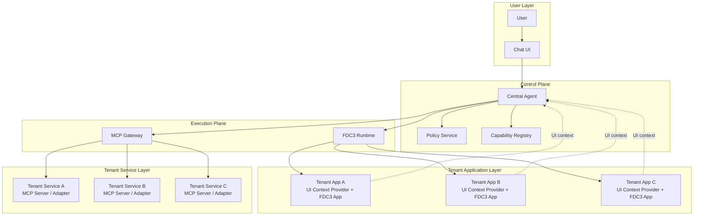
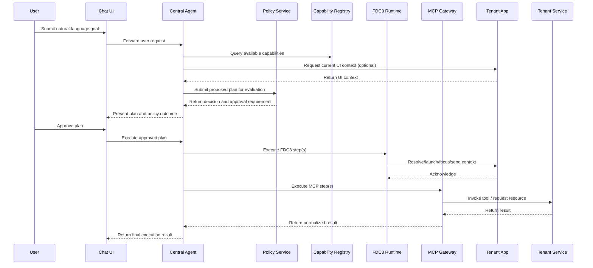

# Final Design Document

## AI Chatbot + FDC3 + MCP Unified Control Plane for Tenant Applications

## 1. Background

The platform is a multi-tenant MFE environment where users can open and operate many tenant applications. These applications already participate in an interoperability model through FDC3-style intents and context exchange. The next step is to make the chatbot the primary user entry point, so users can express goals in natural language and let the platform coordinate the right applications and services.

The design evolved from a simple “chatbot generates an interop schema” approach into a stronger control-plane model:

- tenant applications provide **UI context**
- tenant services expose **MCP tools/resources**
- the chatbot becomes the **central agent and supervisor**
- FDC3 remains the **cross-application interoperability layer**
- MCP becomes the **structured action and data-access layer**

This direction aligns well with the standards involved. FDC3 is centered on app interoperability through intents, context, app directories, and app resolution, and is intentionally positioned as an interoperability baseline rather than a complete RPC framework. MCP is centered on standardized access to tools, resources, and prompts, with explicit protocol concepts around client-server capability exchange and authorization.

---

## 2. Design Objective

The objective is to define a clean architecture in which:

- the user can rely on a single chatbot as the main control surface
- tenant applications remain the source of UI state and navigation targets
- tenant services remain the source of business actions and data operations
- the system preserves tenant isolation, authorization, reviewability, and auditability
- the architecture remains minimal and understandable, without prematurely becoming a full generic workflow engine

This document focuses on:

- architecture
- module responsibilities
- protocol boundaries
- system models
- runtime interactions
- technology design

This document does **not** cover:

- implementation planning
- rollout phases
- delivery sequencing
- team/process organization

---

## 3. Core Design Principles

### 3.1 The chatbot is the unified control plane

The chatbot is the single user-facing entry point for planning and supervising work across tenant applications.

It is not just a UI widget. It is the control plane that:

- interprets user goals
- gathers relevant context
- decides which system capability to use
- composes an action plan
- asks for approval when required
- supervises execution

---

### 3.2 Applications are capability providers, not passive screens

Each tenant application should expose structured information upward, not just render UI.

Each app contributes:

- **UI context**
- **FDC3 app capabilities**
- optional UX hints for the agent

The app remains responsible for its own rendering and internal UX, but it participates in the control plane as a provider of state and interoperability metadata.

---

### 3.3 Services are the action surface

Business mutations and structured business reads should be executed through service-backed interfaces, not through raw UI automation.

Therefore:

- **read current visible state from the app**
- **navigate via FDC3**
- **act via MCP tools/resources**

This avoids fragile and unsafe “AI clicking buttons” patterns.

---

### 3.4 FDC3 and MCP serve different roles

The architecture intentionally separates them.

**FDC3 is used for:**

- app discovery
- launch/focus
- cross-app context handoff
- lightweight intent-based navigation

**MCP is used for:**

- structured tool execution
- backend data/resource access
- typed domain operations
- optionally reusable prompts

This matches the standards. FDC3 app directories are for app discovery around intents and supported context, and MCP formalizes server exposure of tools, resources, and prompts.

---

### 3.5 The agent plans; policy governs; runtimes execute

Three responsibilities must remain separate:

- **Agent**: decides what should happen
- **Policy**: decides whether it is allowed
- **Runtime**: carries it out

That is the minimum clean separation needed for enterprise control.

---

### 3.6 Human review remains central

Even if the chatbot becomes the main control surface, the architecture should not assume unrestricted autonomy.

The design must support:

- review before execution
- explicit confirmation for risky actions
- bounded autonomy only within policy

---

### 3.7 Keep the workflow model minimal

The architecture should not start as a general BPM engine.

The minimal execution model is:

- ordered steps
- each step is either **FDC3** or **MCP**
- stop on policy denial or execution failure
- allow user review between planning and execution

This is enough to express most high-value cross-application user journeys without introducing unnecessary DSL complexity.

---

## 4. Target System Definition

### 4.1 System statement

The target system is a **chatbot-centered unified control plane** for a multi-tenant application platform.

It consists of:

- one **Chat UI**
- one **Central Agent**
- one **Policy Service**
- one **Capability Registry**
- one **FDC3 Runtime**
- one **MCP Gateway**
- many **Tenant Apps**
- many **Tenant Services**

The tenant apps and tenant services are not mere dependencies. They are platform participants with explicit contracts.

---

## 5. High-Level Architecture



---

## 6. Layered View

The system can be understood in four layers.

### 6.1 User layer

Contains only the chatbot interface.

Responsibilities:

- accept natural-language goals
- display interpreted plan
- request approval
- show execution progress and results

---

### 6.2 Control plane

Contains:

- Central Agent
- Policy Service
- Capability Registry

Responsibilities:

- understand goals
- discover available capabilities
- compose plans
- validate plans
- enforce guardrails

---

### 6.3 Execution plane

Contains:

- FDC3 Runtime
- MCP Gateway

Responsibilities:

- resolve and invoke app interoperability operations
- broker structured tool and resource access

---

### 6.4 Tenant provider layer

Contains:

- Tenant Apps
- Tenant Services

Responsibilities:

- expose current application state
- expose discoverable capabilities
- respond to interoperability requests
- perform business operations

---

## 7. Core Modules and Responsibilities

## 7.1 Chat UI

### Role

The single user-facing interface for conversational control.

### Responsibilities

- receive user goals in natural language
- present clarifications when the agent lacks inputs
- present the generated action plan
- allow approve / reject / amend
- display execution progress
- display execution outcome and intermediate results
- render structured result components from normalized payloads
- surface typed follow-up actions such as FDC3 app jumps and MCP follow-up actions

### Architectural position

The Chat UI is not responsible for:

- authorization logic
- capability discovery
- execution routing
- business validation

It is a presentation and interaction surface over the control plane.

---

## 7.2 Central Agent

### Role

The planner and supervisor of the system.

### Responsibilities

- interpret user intent
- determine whether current UI context is needed
- request context from one or more tenant apps
- retrieve available capabilities from the registry
- decide whether a required action is best expressed as FDC3 or MCP
- compose a structured action plan
- request clarification for missing inputs
- submit the plan for policy evaluation
- supervise execution of approved steps
- explain planned or executed actions to the user

### Non-responsibilities

The Central Agent should not:

- make final authorization decisions
- own tenant entitlement rules
- bypass FDC3 or MCP contracts
- mutate systems directly outside approved interfaces

### Design note

The agent is a **coordination intelligence**, not a direct operator.

---

## 7.3 Policy Service

### Role

The hard governance boundary of the system.

### Responsibilities

- validate the structure of an action plan
- validate that each step references a known capability
- validate tenant scope
- validate entitlement and access rights
- classify execution risk
- decide whether approval is required
- block forbidden steps
- return explicit decisions and reasons
- provide audit-friendly policy outcomes

### Non-responsibilities

The Policy Service should not:

- decide how to plan a user request
- discover app metadata directly from runtimes
- execute any action itself

### Design note

This service is the most important system boundary for enterprise trust.

---

## 7.4 Capability Registry

### Role

The unified source of system capabilities.

### Responsibilities

- serve as the onboarding target for tenant capability metadata
- register FDC3 app capabilities
- register MCP tools/resources/prompts
- describe required and optional inputs
- describe risk and execution class
- define tenant ownership and scope
- define supported context types
- provide a normalized view to the agent and policy layer

### Why it is unified

The architecture deliberately uses **one registry**, not separate semantic and runtime registries.

That keeps the minimal design clean:

- the agent uses it to map goals to actions
- policy uses it to validate references and risk
- runtimes use it as metadata support for discovery and invocation

### Onboarding rule

Tenant providers onboard by registering capability metadata into the **Capability Registry**.

That onboarding must include:

- FDC3 application metadata, including app identity, supported intents, supported context types, and launch metadata
- MCP capability metadata, including tools, resources, optional prompts, required inputs, execution class, tenant scope, and risk level

The Central Agent consumes the registry at runtime. It is not the source of registration truth and should not own provider onboarding state.

---

## 7.5 FDC3 Runtime

### Role

The cross-application interoperability runtime.

### Responsibilities

- register tenant apps and their metadata
- resolve apps by intent and context
- launch or focus apps
- deliver context payloads to apps
- support app-to-app handoff
- return resolution or invocation outcomes

### Design boundary

The FDC3 Runtime is responsible for application-level interop, not structured backend business operations.

That distinction is important because FDC3 is fundamentally an interoperability standard around app resolution, intents, and context.

---

## 7.6 MCP Gateway

### Role

The structured gateway between the agent and tenant service capabilities.

### Responsibilities

- broker MCP interactions with tenant services
- expose tools/resources/prompts in a normalized form
- propagate and normalize user/session/auth context
- validate MCP contract conformance
- return typed tool/resource results
- insulate the control plane from direct service-specific integration sprawl

### Design boundary

The MCP Gateway is not the place for business policy.
It is a protocol broker and normalization layer.

MCP itself defines standardized ways for servers to expose tools, resources, and prompts, and includes authorization-related protocol concepts, which makes it suitable as the tool-access substrate.

---

## 7.7 Tenant Apps

### Role

UI-facing capability providers.

### Responsibilities

- render application-specific UI
- expose current UI context in structured form
- register supported FDC3 intents and context types
- respond to FDC3 runtime requests
- resolve declared FDC3 context into a meaningful user-visible UI state
- optionally offer agent-readable interaction hints

### Design boundary

Tenant apps are responsible for **state exposure and navigation participation**, not backend mutation protocol design.

### Context resolution contract

If a tenant app declares support for an FDC3 intent and context combination, it must be able to transform the received context into a concrete and meaningful application state.

That means the app must do more than accept the payload syntactically. It must land the user in an appropriate view, selection, or detail state that satisfies the declared capability.

---

## 7.8 Tenant Services

### Role

Business capability providers.

### Responsibilities

- expose MCP tools for business actions
- expose MCP resources for structured reads
- optionally expose MCP prompts for reusable domain interactions
- enforce service-side validation rules
- return typed results

### Design boundary

Tenant services should be the preferred path for:

- drafting
- reading structured business data
- mutations
- submissions

They should not rely on UI automation as the canonical execution channel.

---

## 8. Technology Design

## 8.1 Control-plane technology shape

### Chat UI

Technology-neutral in this document, but logically it needs:

- conversational interaction surface
- plan review rendering
- approval interaction
- execution timeline view

### Central Agent

Logically requires:

- LLM-backed reasoning
- access to registry metadata
- access to current UI context
- planning logic that outputs a structured plan contract

### Policy Service

Logically requires:

- rule evaluation
- tenant and entitlement lookup
- schema validation
- risk mapping
- explicit decision output

### Capability Registry

Logically requires:

- normalized metadata model for both FDC3 and MCP capabilities
- query APIs for agent and policy use
- strong identity fields for capability references

---

## 8.2 Execution-plane technology shape

### FDC3 Runtime

Must support the FDC3 concepts relevant to this architecture:

- app identity
- supported intents
- supported context types
- launch/focus
- context routing
- app resolution

These are aligned with the FDC3 model around app directories, contexts, and intents.

### MCP Gateway

Must support MCP interaction concepts relevant to this architecture:

- tool invocation
- resource access
- optional prompt exposure
- capability metadata exchange
- auth/session propagation

These are aligned with the MCP server model.

---

## 8.3 Provider-side technology shape

### Tenant apps

Need to support:

- FDC3 registration
- current UI context extraction
- contextual response to app-level handoff

### Tenant services

Need to support:

- MCP server or MCP adapter exposure
- typed inputs and outputs
- backend validation
- secure access within tenant boundaries

---

## 9. Canonical Interaction Model

The architecture intentionally supports only two executable step kinds.

## 9.1 FDC3 step

A step whose purpose is:

- navigate
- open/focus app
- transfer user attention
- pass interoperable context

Example uses:

- open chart app with instrument
- open exception app with selected exception
- switch to order ticket app with preloaded context

---

## 9.2 MCP step

A step whose purpose is:

- read structured backend data
- create or update a draft
- perform a business operation
- retrieve domain-specific rule or metadata

Example uses:

- prepare order draft
- fetch SSI details
- create exception case

---

## 9.3 Why only two step kinds

This is the core simplification that keeps the system comprehensible.

Instead of building a generic workflow language with many step types, the architecture only needs to understand:

- **Where should attention move?** → FDC3
- **What structured operation should run?** → MCP

---

## 10. Canonical Models

## 10.1 Capability Model

This is the unified registry contract.

### MCP capability example

```json id="9i8yfi"
{
  "capabilityId": "trade.prepare_order",
  "name": "Prepare Order",
  "tenant": "tenant-trading",
  "channel": "mcp",
  "target": "tenant-service-trade",
  "executionClass": "draft",
  "requiredInputs": ["instrument", "side"],
  "optionalInputs": ["quantity", "account"],
  "riskLevel": "high",
  "description": "Prepare an order draft for equity trading"
}
```

### FDC3 capability example

```json id="kldjzt"
{
  "capabilityId": "view.chart",
  "name": "View Chart",
  "tenant": "tenant-market",
  "channel": "fdc3",
  "target": "chart-app",
  "intent": "fdc3.ViewChart",
  "supportedContextTypes": ["fdc3.instrument"],
  "executionClass": "navigate",
  "riskLevel": "low"
}
```

### Required fields

Each capability must minimally declare:

- capability id
- tenant
- channel
- target
- required inputs or supported context
- execution class
- risk level

---

## 10.2 UI Context Model

This is what tenant apps expose upward to the agent.

```json id="cy9rra"
{
  "appId": "exception-app",
  "tenant": "tenant-settlement",
  "view": "exception-detail",
  "selection": {
    "type": "bank.settlement.exception",
    "id": "EX-10231"
  },
  "state": {
    "status": "OPEN",
    "account": "ACC-7788"
  }
}
```

### Purpose

The UI Context Model answers:

- what app is active
- what object is selected
- what relevant state is visible
- what user-facing context may help planning

### Design rule

This model should expose **state**, not arbitrary implementation detail.

---

## 10.3 Agent Action Plan Model

This is the main control-plane contract.

```json id="jlwmu5"
{
  "planId": "plan-001",
  "summary": "Open TSLA chart and prepare a buy order draft",
  "approvalRequired": true,
  "steps": [
    {
      "stepId": "s1",
      "kind": "fdc3",
      "intent": "fdc3.ViewChart",
      "context": {
        "type": "fdc3.instrument",
        "id": {
          "ticker": "TSLA"
        }
      }
    },
    {
      "stepId": "s2",
      "kind": "mcp",
      "tool": "trade.prepare_order",
      "arguments": {
        "ticker": "TSLA",
        "side": "BUY",
        "quantity": 100
      }
    }
  ]
}
```

### Required fields

At minimum:

- plan id
- human-readable summary
- ordered steps
- overall approval flag

### Step rules

Each step must be either:

- `kind = fdc3`
- `kind = mcp`

No other step kinds are part of this architecture.

---

## 10.4 Policy Decision Model

```json id="v4d2v3"
{
  "planId": "plan-001",
  "status": "approved_with_user_confirmation",
  "tenantScope": ["tenant-market", "tenant-trading"],
  "riskLevel": "high",
  "stepDecisions": [
    {
      "stepId": "s1",
      "allowed": true,
      "reason": "Low-risk navigation"
    },
    {
      "stepId": "s2",
      "allowed": true,
      "requiresApproval": true,
      "reason": "Trading-related mutation"
    }
  ]
}
```

### Purpose

The Policy Decision Model makes governance explicit and reviewable.

It records:

- overall status
- tenant scope touched
- aggregate risk
- per-step decision

---

## 10.5 Execution Result Model

```json id="3s0xp0"
{
  "stepId": "s2",
  "status": "success",
  "resultType": "trade.orderDraft",
  "data": {
    "draftId": "DRAFT-9918",
    "instrument": "TSLA",
    "side": "BUY",
    "quantity": 100
  }
}
```

### Purpose

The agent and UI need a normalized way to present execution outcomes regardless of provider.

---

## 10.6 Renderable Result Model

This is the normalized contract for structured chatbot UI rendering.

```json
{
  "componentType": "todo-list",
  "title": "Workflow Todo",
  "data": {
    "items": [
      {
        "id": "WF-1001",
        "label": "Approve settlement exception",
        "status": "OPEN"
      }
    ]
  },
  "actions": [
    {
      "actionType": "fdc3",
      "label": "Go to app",
      "intent": "bank.workflow.ViewTodo",
      "context": {
        "type": "bank.workflow.todo",
        "id": "WF-1001"
      }
    }
  ]
}
```

### Purpose

The Renderable Result Model allows the Chat UI to render structured responses consistently instead of depending on provider-specific payload shapes.

### Supported component categories

The architecture should support at least these renderable component categories:

- `summary-card`
- `todo-list`
- `table`
- `chart`
- `form`

### Design rule

MCP results should be normalized into this model before the Chat UI renders them. The UI should not need to understand tenant-specific backend payloads directly.

---

## 10.7 UI Action Model

This is the typed action contract attached to renderable chatbot components.

```json
{
  "actionType": "fdc3",
  "label": "Go to app",
  "intent": "bank.workflow.ViewTodo",
  "context": {
    "type": "bank.workflow.todo",
    "id": "WF-1001"
  }
}
```

### Supported action kinds

- `fdc3`
- `mcp`
- `chat_followup`

### Purpose

The UI Action Model makes follow-up behavior explicit and typed. A rendered button is therefore not view-only decoration; it is a controlled action contract that the Chat UI can hand back to the control plane for execution.

### Design rule

Deferred FDC3 handoff from a rendered chatbot component must be represented through this model rather than through ad hoc UI logic.

---

## 11. Sequence and Runtime Flow

## 11.1 End-to-end sequence



---

## 11.2 Logical control flow

1. User expresses goal
2. Agent retrieves capability metadata
3. Agent optionally retrieves current UI context
4. Agent composes action plan
5. Policy service validates and classifies plan
6. User reviews
7. Agent supervises execution of approved steps
8. FDC3 handles app-level interop
9. MCP handles service-level operations
10. Results are returned to the user

---

## 11.3 Canonical scenario: Workflow todo shown in chat, then opened in app

1. The workflow provider onboards by registering workflow MCP read capability metadata and workflow FDC3 intent/context metadata into the Capability Registry
2. The user asks for their workflow todo list in the chatbot
3. The agent queries the registry and selects the workflow MCP capability
4. The MCP Gateway invokes the workflow service and returns structured todo data
5. The result is normalized into a `todo-list` Renderable Result Model payload
6. The Chat UI renders the todo list, including a typed `fdc3` UI action such as `Go to app`
7. When the user clicks the action, the Chat UI submits that typed action for execution
8. The FDC3 Runtime resolves the target app and delivers the declared context
9. The workflow app resolves the context into the correct todo detail or worklist state

This scenario is the canonical pattern for chat-driven read followed by app handoff:

- data retrieval via MCP
- presentation via renderable chat component
- navigation via FDC3

---

## 11.4 Canonical scenario: Admin telemetry question rendered as chart

1. The telemetry provider onboards by registering telemetry MCP capability metadata into the Capability Registry
2. The capability is classified with the correct tenant scope, execution class, and policy restrictions
3. The user asks for workflow page views for yesterday
4. The agent queries the registry and selects the telemetry MCP capability
5. The agent submits the planned analytics read to policy for entitlement and risk evaluation
6. If approved, the MCP Gateway invokes the telemetry service, which queries Elasticsearch and returns hourly page-view data
7. The result is normalized into a `chart` Renderable Result Model payload
8. The Chat UI renders the chart directly in the conversation

This scenario stays entirely in the MCP lane because it is an analytics read rather than an application-navigation task.

---

## 12. Responsibility Matrix

## 12.1 Planning phase

### Chat UI

- collect user goal
- display questions and plan

### Central Agent

- interpret goal
- gather UI context
- discover capabilities
- compose plan

### Capability Registry

- provide available capability metadata
- act as the provider onboarding system of record for FDC3 and MCP capability declarations

### Tenant Apps

- provide optional current UI context
- resolve declared FDC3 context into meaningful UI state after handoff

---

## 12.2 Control phase

### Policy Service

- validate structure
- validate scope and entitlement
- classify risk
- return decision

### Chat UI

- display approval need
- capture user decision

---

## 12.3 Execution phase

### Central Agent

- supervise step order
- interpret intermediate outcomes

### FDC3 Runtime

- handle app launch/focus/context handoff

### MCP Gateway

- handle tool/resource access

### Tenant Apps

- respond to app-level interop

### Tenant Services

- execute typed domain actions

---

## 13. Security and Governance Design

## 13.1 Tenant boundary

Every capability must carry tenant identity and allowed scope.

This prevents the agent from treating the platform as a flat universal action space.

---

## 13.2 Execution class

Every capability should declare an execution class:

- `read`
- `navigate`
- `draft`
- `mutate`
- `submit`

This gives policy a simple semantic model for control.

---

## 13.3 Risk level

Every capability should declare:

- `low`
- `medium`
- `high`

This drives approval decisions.

---

## 13.4 Approval policy

Recommended logic:

- low-risk navigate/read: may run after explicit plan review
- medium-risk draft/mutate: requires confirmation
- high-risk submit/mutation: requires confirmation every time

---

## 13.5 Service-backed mutation only

High-value mutations should be executed through MCP-backed services, not through browser-level UI control.

This is a major architectural safeguard.

---

## 13.6 Separation of concerns

The architecture must preserve these separations:

- agent vs policy
- app interop vs service action
- provider logic vs control-plane logic
- user-visible context vs internal implementation details

---

## 14. What Is Intentionally Excluded

To keep the design clean and aligned with what we discussed, the following are intentionally out of scope for the architecture:

- general-purpose BPM/workflow engine
- branching/looping workflow DSL
- compensation/rollback engine
- multi-agent tenant-local planners
- raw UI click automation as the primary control model
- separate semantic catalog and runtime registry
- standalone event bus as a first-class architecture element
- autonomous background operation without explicit policy framing

These are not forbidden forever; they are simply not part of the target architecture definition.

---

## 15. Architectural Positioning

This design is best understood as:

**A chatbot-centered control plane over a multi-tenant application platform, using FDC3 for application interoperability and MCP for structured service capabilities.**

It is **not**:

- a desktop RPA system
- a universal UI automation engine
- a full BPM platform
- a pure chat assistant detached from application reality

It is a governed orchestration architecture.

---

## 16. Final Architecture Summary

The final design centers on a single chatbot that acts as the unified control plane for tenant applications. Tenant providers onboard by registering both FDC3 and MCP capability metadata into the Capability Registry, which remains the source of registration truth for the platform. Tenant apps provide current UI context, FDC3 interoperability metadata, and explicit context-resolution behavior so declared handoffs land users in meaningful UI state. Tenant services provide MCP tools, resources, and optionally prompts. The Central Agent interprets user goals and composes a structured action plan. The Policy Service validates tenant scope, entitlement, risk, and approval requirements. The FDC3 Runtime handles application discovery, launch/focus, and context handoff. The MCP Gateway handles structured service-side actions and reads. The Chat UI renders normalized result components and typed follow-up actions, which makes scenarios such as workflow todo rendering plus app jump, and policy-gated telemetry chart rendering, first-class architectural flows rather than ad hoc UI behavior. The result is a minimal but complete architecture that gives users a single conversational control surface without collapsing application logic, authorization, and execution into one unsafe layer. FDC3’s intent/context/app-directory model supports the app-side interoperability layer, and MCP’s server model supports the tool/resource side of the architecture.
