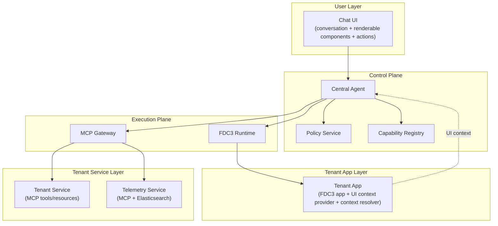

Yes — **the current design can support both scenarios**, but it needs **three explicit additions** to make the requirements fully first-class rather than only “implicitly possible.”

The good news is that the core architecture already matches your flow:

- tenant apps register **FDC3 intents + supported context**
- tenant services register **MCP tools/resources**
- the chatbot agent chooses which capability to call
- FDC3 is used for **open/focus + handoff**
- MCP is used for **structured reads/actions**
- the chatbot UI renders results and lets the user continue into the target app

That direction is consistent with FDC3’s app-directory and intent/context model, and with MCP’s tool/resource model. FDC3 app directories are explicitly for declaring apps, their supported intents, supported context, and launch metadata; MCP explicitly standardizes tools and resources exposed by servers. ([fdc3.finos.org][1])

---

# 1. Requirement-by-requirement review

## Requirement A

A tenant application registers its MCP service and intent declaration in the agent when onboarding.

### Verdict

**Mostly yes, but the wording should be adjusted.**

In the current design, onboarding should not mean “register directly in the agent.” It should mean:

- register **FDC3 app metadata** into the **Capability Registry / App Directory**
- register **MCP server/tool/resource metadata** into the **Capability Registry**
- the **agent reads from the registry**, rather than owning registrations directly

That is a better fit for the architecture and for FDC3. FDC3 app directories are meant to hold application identity, supported intents, supported context combinations, and launch/integration metadata. ([fdc3.finos.org][1])

### What to change in the design

Make onboarding target the **Capability Registry**, not the agent itself.

### Recommended architectural statement

> Tenant providers onboard by registering FDC3 application metadata and MCP capability metadata into the unified Capability Registry. The agent consumes this registry at runtime and does not act as the source of registration truth.

---

## Requirement B

User asks: “how is my workflow todo, show in UI?”
Agent retrieves workflow MCP server, gets todo list, renders todo list in chatbot UI component.

### Verdict

**Yes, this is fully compatible with the current design.**

This is exactly an **MCP read/use case**:

- agent discovers a workflow capability from the registry
- agent invokes a workflow MCP tool or reads a workflow MCP resource
- result returns as structured data
- chatbot UI renders it

MCP tools are for invoking operations, and MCP resources are for exposing structured data to clients. For your todo list scenario, either can work:

- **resource** if it is a read-only view
- **tool** if parameters, filtering, or server-side composition are needed ([Model Context Protocol][2])

### What is missing in the current design

The current document says “chat UI can render results,” but it does **not yet define a formal UI result contract**.

That is the first gap.

### What to add

Add a model called **Chat Component Payload** or **Renderable Result Model**.

Example:

```json
{
  "type": "todo-list",
  "title": "Workflow Todo",
  "items": [
    {
      "id": "WF-1001",
      "label": "Approve settlement exception",
      "status": "OPEN",
      "actions": [
        {
          "type": "fdc3",
          "label": "Go to app",
          "intent": "bank.workflow.ViewTodo",
          "context": {
            "type": "bank.workflow.todo",
            "id": "WF-1001"
          }
        }
      ]
    }
  ]
}
```

Without this model, the architecture supports the behavior conceptually, but not formally.

---

## Requirement C

User clicks “go to app” in chatbot UI, which triggers an FDC3 intent to open the target app, and the workflow app must handle the context to show the todo in app.

### Verdict

**Yes, this is directly supported by the design, and it fits FDC3 very well.**

This is exactly what FDC3 is good at:

- application discovery
- launch/focus
- context delivery
- intent routing

FDC3 applications register supported intents and supported context types in the app directory, and the `type` field in context is required for routing. ([fdc3.finos.org][3])

### What the current design already covers

- FDC3 Runtime exists
- tenant apps register FDC3 capabilities
- apps receive context
- app must handle the context and navigate appropriately

### What needs to be made explicit

The current design should explicitly say that the chatbot UI is allowed to trigger:

- a **deferred FDC3 action**
- represented as metadata in the rendered component

That way the “go to app” button is not just UI sugar; it is an actual typed action contract.

### Recommended addition

Define **UI Action Model** with action kinds:

- `fdc3`
- `mcp`
- optionally `chat_followup`

Example:

```json
{
  "type": "fdc3",
  "label": "Go to app",
  "intent": "bank.workflow.ViewTodo",
  "context": {
    "type": "bank.workflow.todo",
    "id": "WF-1001"
  }
}
```

---

## Requirement D

Workflow app must handle context and show the todo in app.

### Verdict

**Yes, but this should be elevated from implication to explicit tenant-app responsibility.**

The current design says tenant apps register supported intents and context types, but your requirement needs one stronger rule:

> If a tenant app declares an FDC3 intent/context combination, it must be able to consume that context and land the user in a meaningful UI state.

That is already aligned with the FDC3 intent/context model: apps declare supported intent + context combinations for discovery and routing. ([fdc3.finos.org][3])

### Recommended addition

In the tenant app responsibilities section, add:

- **Context Resolution Responsibility**
  The app must transform the received FDC3 context into a concrete UI state, view, or selection.

---

## Requirement E

Admin user asks: “how is the page view of workflow application yesterday?”
Agent queries telemetry MCP connected to Elasticsearch, gets hourly PV chart, renders it in chatbot UI.

### Verdict

**Yes, this also fits the design cleanly.**

This is a classic **MCP analytics read**:

- user asks a telemetry question
- agent checks user role/policy
- agent invokes telemetry MCP capability
- telemetry MCP queries Elasticsearch
- result comes back as chart-ready structured data
- chatbot UI renders chart component

This does **not** require FDC3, because it is not app navigation. It is data retrieval and summarization, which belongs to MCP.

### What the current design already supports

- MCP Gateway for service-side reads
- Policy Service for admin entitlement checks
- Chat UI for rendering results

### What is missing

Again, the architecture needs an explicit **Renderable Result Model** for analytics/chart payloads.

Example:

```json
{
  "type": "time-series-chart",
  "title": "Workflow App Page Views - Yesterday",
  "xAxis": "hour",
  "yAxis": "pageViews",
  "series": [
    {
      "name": "PV",
      "points": [
        { "hour": "00", "value": 120 },
        { "hour": "01", "value": 95 }
      ]
    }
  ]
}
```

---

# 2. Overall architectural assessment

## Does the current design meet your new requirements?

**Yes, structurally it does.**
But it is missing three explicit contracts that your scenarios require.

## The three missing pieces

### 1. Renderable Result Model

The architecture needs a formal model for chatbot-rendered structured content:

- todo list
- chart
- table
- form
- summary card

### 2. UI Action Model

Rendered components need typed actions:

- FDC3 jump to app
- MCP follow-up action
- chat follow-up action

### 3. Tenant App Context Resolution Contract

If an app declares an FDC3 intent/context combination, it must be able to resolve the context into a meaningful UI state.

Those three additions are enough. You do **not** need to redesign the whole system.

---

# 3. Recommended architecture refinement

I would revise the design into this tighter form:



---

# 4. Detailed review of your two scenarios

## Scenario 1: Workflow todo in chat, then jump to app

### Flow

1. Workflow provider onboarded:
   - registers MCP workflow capability
   - registers FDC3 app intent/context capability

2. User asks:
   - “how is my workflow todo, show in UI?”

3. Agent:
   - queries registry for workflow capabilities
   - selects workflow MCP read capability
   - calls MCP
   - gets todo list data

4. Chat UI:
   - renders todo list component
   - each item includes a “Go to app” FDC3 action

5. User clicks “Go to app”

6. Chat UI sends FDC3 action request to agent/runtime

7. FDC3 Runtime resolves target app

8. Workflow app opens and receives context

9. Workflow app resolves context into target todo detail view

### Verdict

**Supported with the three additions above.**

---

## Scenario 2: Admin asks for page views yesterday

### Flow

1. Telemetry provider onboarded:
   - registers telemetry MCP capability
   - capability marked admin-only or policy-restricted

2. User asks:
   - “how is the page view of workflow application yesterday?”

3. Agent:
   - queries registry for telemetry capability
   - submits planned action to policy

4. Policy:
   - verifies admin entitlement
   - allows analytics read

5. Agent:
   - calls telemetry MCP
   - telemetry MCP queries Elasticsearch
   - returns hourly PV data

6. Chat UI:
   - renders chart component

### Verdict

**Fully supported.**
This is actually one of the strongest fits for the architecture because it stays entirely in the MCP lane.

---

# 5. What should be added to the design document

Here is the exact delta I would add.

## 5.1 New model: Renderable Result Model

Purpose:
Structured chatbot UI payloads returned by agent/MCP flows.

```json
{
  "componentType": "todo-list",
  "title": "Workflow Todo",
  "data": {},
  "actions": []
}
```

Supported component types can include:

- summary-card
- todo-list
- table
- chart
- form

Note: If you want this to align more closely with the newest MCP ecosystem direction, there is now an official **MCP Apps** extension announced by MCP maintainers for returning interactive UI components directly in conversations. That is newer than the base tool/resource model and could be a strong future fit for your chatbot-rendered components. ([Model Context Protocol Blog][4])

## 5.2 New model: UI Action Model

Purpose:
Typed actions attached to rendered components.

```json
{
  "type": "fdc3",
  "label": "Go to app",
  "intent": "bank.workflow.ViewTodo",
  "context": {
    "type": "bank.workflow.todo",
    "id": "WF-1001"
  }
}
```

Other types:

- `mcp`
- `chat_followup`

## 5.3 New tenant-app responsibility: Context Resolver

Purpose:
Make app-side context handling explicit.

Definition:

> A tenant app that declares support for an FDC3 intent/context pair must be able to transform the incoming context into a meaningful user-visible application state.

---

# 6. Design risks to watch

## Risk 1

If apps register intents but do not reliably resolve context into UI state, the “go to app” experience will feel broken.

## Risk 2

If MCP results are not normalized into renderable component payloads, the chatbot will become inconsistent and hard to scale.

## Risk 3

If telemetry and operational MCP capabilities are not classified by policy, the agent may surface sensitive data too broadly.

---

# 7. Final verdict

**Your current architecture can meet these requirements.**
It does **not** need a structural rewrite.

It only needs these explicit refinements:

- move onboarding registration explicitly into the **Capability Registry**
- add a **Renderable Result Model**
- add a **UI Action Model**
- add **Tenant App Context Resolver** as a first-class responsibility

With those changes, both of your scenarios become clean, native use cases of the architecture:

- workflow todo = **MCP read + chat component + FDC3 jump**
- admin telemetry = **policy-gated MCP analytics read + chart component**

If you want, I can now fold these requirements into the final design document and produce an updated consolidated architecture spec.

[1]: https://fdc3.finos.org/docs/app-directory/overview?utm_source=chatgpt.com 'App Directory Overview (2.2) - FDC3 - FINOS'
[2]: https://modelcontextprotocol.io/specification/2025-06-18/server/tools?utm_source=chatgpt.com 'Tools'
[3]: https://fdc3.finos.org/docs/intents/spec?utm_source=chatgpt.com 'Intents Overview (2.2) - FDC3 - FINOS'
[4]: https://blog.modelcontextprotocol.io/posts/2026-01-26-mcp-apps/?utm_source=chatgpt.com 'MCP Apps - Bringing UI Capabilities To MCP Clients'
