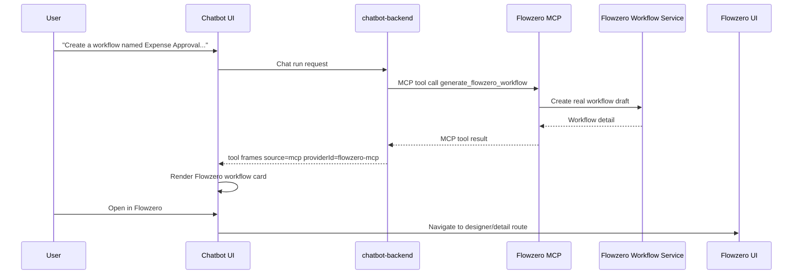

# Flowzero MCP Workflow Generation Design

## Goal

Natural-language workflow creation must create a real Flowzero workflow, visible in Flowzero Workflow Management, and the chatbot must render a workflow card that opens the created workflow directly in the Flowzero UI.

The service integration boundary is MCP. The chatbot must not call Flowzero service APIs directly and must not own the created workflow as chatbot-local mock or in-memory state.

## Current State

`chatbot-backend` has a backend tool named `generate_flowzero_workflow` that builds a BPMN draft and persists it through an in-memory `FlowzeroWorkflowService`. This proves the chat flow, but the created record is not Flowzero-owned and does not naturally appear in the Flowzero Workflow Management grid.

Flowzero UI creates real drafts through its workflow service and opens them through:

`/flowzero/workflow-management/NewWorkflow/?workflowDetail=<encoded-detail>&from=create`

The chatbot UI already supports tool cards through the toolkit renderer pattern, but `generate_flowzero_workflow` currently falls through to generic backend tool rendering.

## Architecture

Flowzero owns workflow generation and persistence. It exposes MCP tools for AI consumers. Chatbot discovers and invokes those tools through its MCP provider infrastructure.

## MCP Tool Contract

Tool name: `generate_flowzero_workflow`

Provider ID: `flowzero-mcp`

Source: `mcp`

Input:

- `prompt`: required natural-language workflow steps or intent.
- `workflowName`: optional display name. If absent, Flowzero MCP derives a safe default.
- `description`: optional description.
- `businessArea`: optional business area, defaulting to a Flowzero-supported value.
- `countryCodes`: optional country list.
- `ownerIds`: optional owner list.
- `createdBy`: optional user identifier from chat context when available.

Output:

- `workflowId`: real Flowzero workflow or BPMN version id used by Flowzero detail APIs.
- `workflowName`: display name.
- `status`: draft/published state, expected `DRAFT` for generated workflows.
- `version` or `displayVersion`: Flowzero version metadata when available.
- `businessArea`, `countryCodes`, `ownerIds`, `description`.
- `summary`: human-readable generated flow summary.
- `steps`: ordered generated step labels.
- `workflowDetail`: the real Flowzero detail payload needed by the designer route.
- `open`: object containing `label`, `route`, and enough route params for the UI to open the workflow.

Errors:

- Validation errors return a structured MCP tool error with user-safe detail.
- Flowzero persistence failures surface as MCP tool errors. The chatbot card should show the failure and not offer an open action.

## Chat Protocol Contract Changes

Add shared Flowzero MCP result types to `packages/chat-protocol-contract` so the backend, UI, tests, and fixtures agree on the result shape.

The stream frames for this tool must include:

- `source: "mcp"`
- `providerId: "flowzero-mcp"`
- `toolName: "generate_flowzero_workflow"`

The contract should include a fixture showing a successful Flowzero workflow generation result with an `open.route`.

## Backend Changes

Remove chatbot-local ownership of Flowzero workflow persistence from the AI integration path. The deterministic routing for explicit Flowzero generation requests should target the MCP tool descriptor from `flowzero-mcp`, not the local backend tool.

`chatbot-backend` should:

- Include `flowzero-mcp` in MCP provider configuration.
- Prefer MCP `generate_flowzero_workflow` for explicit Flowzero generation requests.
- Preserve deterministic routing so repeated NL workflow creation does not depend on model tool-call whim.
- Emit MCP tool-call/result frames with provider metadata.
- Keep non-Flowzero chat behavior unchanged.

## Flowzero Service Changes

Expose Flowzero workflow generation through MCP from the Flowzero service boundary. The MCP tool implementation should reuse Flowzero’s workflow service/application layer to create a real draft, equivalent to the UI’s create workflow path.

The generated content should be valid for the existing Flowzero designer. If the generated BPMN must be minimal initially, it should still be stored as a real draft and open in the designer.

## Frontend Changes

Add a dedicated chatbot renderer for `generate_flowzero_workflow` results from `flowzero-mcp`.

The card should show:

- Workflow name.
- Status/version.
- Summary or ordered steps.
- Real Flowzero ID.
- Primary action: `Open in Flowzero`.

The open action should navigate the active Flowzero workspace if possible. If Flowzero is not open, it should open or focus the Flowzero tile and navigate to the returned route. The route must use the real workflow detail payload or ID returned by MCP.

## Testing

Use TDD for implementation.

Required tests:

- Contract validation accepts the Flowzero MCP generation result and rejects malformed open metadata.
- Flowzero MCP tool creates a real workflow draft through the Flowzero workflow service.
- Chatbot backend routes explicit Flowzero generation prompts to the MCP provider, not the local backend tool or direct HTTP API.
- Streamed tool frames include `source=mcp` and `providerId=flowzero-mcp`.
- Chatbot UI renders the Flowzero workflow card and its open action.
- E2E Chrome verification creates at least five workflows by natural language and opens one from the card in Flowzero UI.

## Acceptance Criteria

- A natural-language workflow creation request creates a real Flowzero draft.
- The created workflow is visible from Flowzero Workflow Management.
- The chatbot transcript shows a Flowzero-specific workflow card.
- The card opens the created workflow directly in the Flowzero designer/detail UI.
- Chatbot does not call Flowzero HTTP APIs directly for this integration.
- Shared contract documents and validates the Flowzero MCP result shape.
