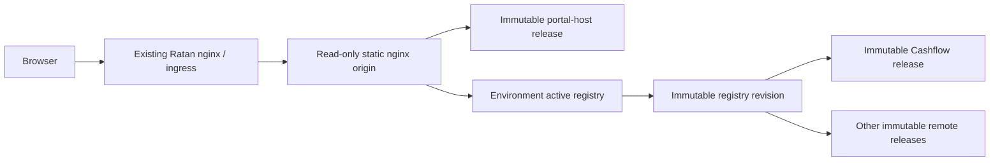

# Realworld production deployment

Status: current Wave 0 deployment contract. The local application/UI matrix is
newer than the Wave 0 allowlist; see [`CURRENT_STATE.md`](./CURRENT_STATE.md).

## Outcome

The Realworld portal and the Wave 0 Cashflow remote can be built once, packaged
under immutable digest-addressed paths, and served through hardened nginx in
two environments without rebuilding. Environment selection is confined to the
active registry pointer. Identity/Profile, FDC3 Admin, and migration MVPs remain
outside the production allowlist until their independent conformance and
promotion gates are approved.



This preserves two runtime layers: `portal-host -> application`. The existing `ratan_servers.conf.j2` remains the legacy route. A dedicated hostname from `ratan_two_layer_servers.conf.j2` sends an approved route or cohort to the new composition root, so Single-SPA and direct federation are not mixed in one page.

## Runnable production-shaped deployment

Prerequisites are Node/npm, OpenSSL, Docker, and `docker-compose`.

From the repository root:

```bash
npm run realworld:deploy:up
npm run realworld:deploy:verify:live
REALWORLD_DEPLOY_URL=https://localhost:9443 npm run realworld:deploy:test:e2e
REALWORLD_DEPLOY_URL=https://localhost:9543 npm run realworld:deploy:test:e2e
```

Open `https://localhost:9443` for DEV and `https://localhost:9543` for test. The generated certificate is local-only and self-signed. Stop the deployment with:

```bash
npm run realworld:deploy:down
```

Generated release bytes, registry revisions, catalog records, and certificates are ignored by Git. The source artifacts that define how to regenerate them are versioned.

## Artifact and promotion model

- `scripts/package-production-deployment.mjs` scans browser output for credential-shaped content, computes a deterministic SHA-256 tree digest, and publishes without overwriting an existing release path.
- Release paths are `artifacts/<application>/<semver>-sha256-<digest-prefix>/`.
- Each catalog record carries the application/package identity, semantic version, source revision, build ID, full artifact digest, contract metadata, capabilities, and declared shared-runtime ranges.
- `devops/registry/production-registry-revision.schema.json` defines the immutable promotion record: selected artifact identity and URL, protocol range, capabilities, embedded ownership, and release-evidence links. The browser continues to receive only the nested lean runtime registry.
- Production candidates are validated before promotion for schema shape, duplicate IDs/routes, trusted origins, release selection, artifact reachability and digest, protocol support, required capabilities, and signature evidence. Artifact resolution and signature verification are injected so the policy remains fail-closed while enterprise services are selected.
- `registries/revisions/<revision>.json` is immutable evidence; `registries/active/<environment>.json` is the small revalidating client pointer.
- `environments/<environment>/host` is an atomic symlink to one immutable host release.
- DEV and test registries select identical remote URLs and digests. Public endpoints and other non-secret environment values belong in registry/capability configuration, not rebuilt JavaScript.
- `assetPrefix: 'auto'` makes remote chunks resolve from the immutable manifest location instead of localhost.
- `devops/registry/applications.json` is the production allowlist. Verification-only and legacy-migration MVPs are intentionally excluded until they pass their own production conformance gates.

## Approved delivery topology

The approved production browser-delivery substrate is immutable object storage
fronted by a CDN. The portal host, active registry pointer, immutable registry
revisions, and remote application assets are exposed through one approved HTTPS
origin behind the existing ingress. Candidate registry entries outside that
origin are rejected by default.

OCI remains an optional transport and retention format; it is not a mandatory
browser runtime or EKS deployment requirement. If a later change introduces a
cross-origin CDN or mandatory OCI/EKS serving, it requires a separately approved
topology decision plus explicit CSP, CORS, signing, and deployed-verification
updates. The local read-only nginx image continues to emulate the static-origin
contract and is not the approved production storage substrate.

## Cache and browser security contract

Immutable artifacts and registry revisions receive `public, max-age=31536000, immutable`. Host HTML and active registry pointers receive `no-store`. The static origin enforces TLS 1.2/1.3, HSTS, a same-origin CSP, no MIME sniffing, same-origin framing, explicit permissions policy, a 1 MiB request limit, structured access logs, a read-only filesystem, and `no-new-privileges`.

Production certificates and keys must be mounted by the approved secret mechanism; never copy them into an image. The approved same-origin topology keeps the default CSP/CORS policy narrow. Any later cross-origin CDN decision must add an explicit allowlist and validate candidate registry origins before activation.

## Existing nginx integration

Render and deploy these additional templates alongside the current files:

- `ratan_two_layer_upstreams.conf.j2`
- `ratan_two_layer_servers.conf.j2`

Required inventory values are `two_layer_enabled`, `two_layer_server_name`, and `two_layer_static_port`; `two_layer_frontend_group` defaults to `frontend_webapps`. The upstream points to replicas of the read-only static origin image. The edge keeps TLS/client policy and passes the original scheme and host.

## Rollback and recovery

Rollback does not rebuild or overwrite assets:

1. Select the previous known-good revision from `registries/revisions/`.
2. Validate its application URLs and catalog digests.
3. Atomically replace only the environment active registry file/pointer.
4. Reload no application assets; new page loads select the previous revision.
5. Notify already-active sessions and request a controlled refresh for a critical incident. Never hot-replace a loaded Module Federation share scope.

If the static origin is lost, restore `artifacts/`, `catalog/`, and `registries/revisions/` from replicated immutable storage, recreate the active pointer from the last known-good revision, then run deployed verification before reopening traffic.

## Responsibilities for Wave 0

| Responsibility                                        | Accountable role          |
| ----------------------------------------------------- | ------------------------- |
| Portal runtime, registry schema, compatibility        | Platform engineering      |
| Cashflow build, tests, ownership metadata             | Cashflow application team |
| Static origin, ingress, backup, deployment automation | DevOps/SRE                |
| Scanner/signing policy and trusted identities         | Security                  |
| Promotion approval, canary stop, rollback decision    | Release owner             |

`devops/policy/release-authorization.json` maps Azure DevOps workload identities
to separate roles for artifact publication, promotion request, promotion
approval, activation, and rollback. Authorization fails closed for missing
roles, prohibits a requester from approving the same promotion, and prevents
an artifact publisher from activating its own release.

Promotion pipelines write append-only JSONL audit events containing requester,
approver, environment, source and target revisions, selected application
versions and digests, evidence URLs, request/approval/completion timestamps, and
the final outcome. Incomplete or self-approved events are rejected before they
can be recorded.

## Decision gates not simulated as complete

The local POC chooses nginx static delivery and self-signed TLS only to prove the deployable contract. CDN-backed object storage with a single trusted HTTPS origin is approved for production browser delivery, with OCI retained as optional transport. Before production traffic, owners must still approve: enterprise PKI, workload identity, signing/attestation service, SBOM format/tool, vulnerability and license thresholds, audit store/retention, production source-map access, regional replication, RPO/RTO, monitoring backend, and cohort gateway. Azure DevOps publication and activation pipelines must use separate identities and approvals.

The release policy baseline is versioned in `devops/policy/release-policy.json`; the ownership schema and Cashflow example sit beside it.
