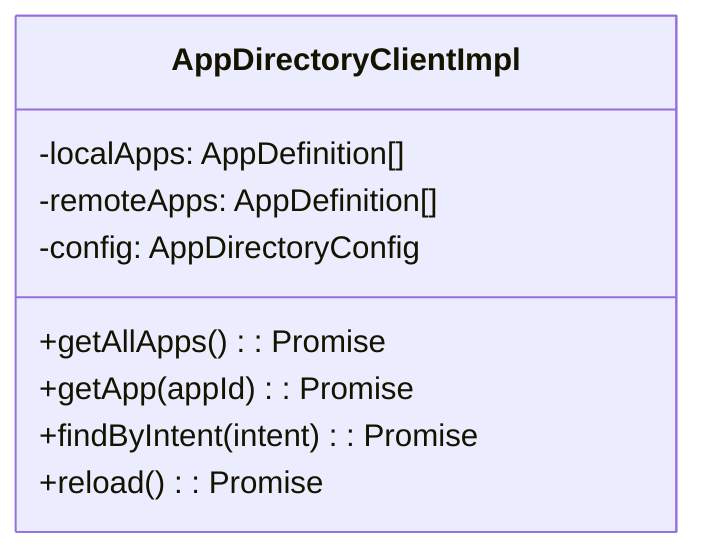

# Design: Local First App Directory

## Architecture

The `AppDirectoryClientImpl` will be enhanced to maintain an internal cache of application definitions, initialized from a static list provided at construction.



## Data Flow

1.  **Generic Read (`getAllApps`)**:
    - Returns `unique([...localApps, ...remoteApps])`.
    - If a remote call fails (e.g. timeout/offline), it should degrade gracefully and return `localApps` (or throw, depending on config? Propasal: Log error and return local apps if confident, otherwise maintain current behavior but add local apps).
    - User requirement suggests "not requires to call externally apis", implying we should return local apps even if remote is not called.

2.  **Initialization**:
    - Constructor accepts `localApps`.
    - Client is "ready" immediately with these apps.

3.  **Lazy Loading / Auth Trigger**:
    - The client is already passive (pull-based). However, to support "load apps info... when sometime (like auth ready)", we might need an explicit `refresh()` or `sync()` method, or simply rely on the next call to `getAllApps()` to try fetching remote again.
    - If `getAuthToken` is provided, the client typically fetches on demand.
    - We might want to suppress initial remote fetch errors if we have local apps.

## Trade-offs

- **Staleness**: Local apps might be outdated compared to the server.
  - _Mitigation_: Remote apps override local apps with same ID? Or Local overrides remote (for development)?
  - _Decision_: Remote apps with same `appId` should probably override local apps to ensure updates are received.
- **Complexity**: Merging lists and handling duplicates.
  - _Mitigation_: Use a Map keyed by `appId`.

## API Changes

```typescript
interface AppDirectoryConfig {
  // ... existing
  localApps?: AppDefinition[];
  /**
   * If true, errors from remote fetch will be suppressed if local apps are available.
   * Default: false
   */
  fallbackToLocal?: boolean;
}
```
