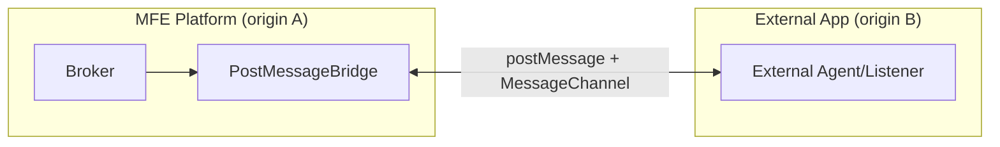

# Design: PostMessage Bridge for FDC3 Broker

## Context

The MFE platform needs to communicate with external domains (partner iframes, cross-origin apps) using FDC3 protocols. Unlike the OpenFin bridge which relies on OpenFin's `fdc3` global, the PostMessage bridge uses the browser's native `window.postMessage` API for cross-origin communication.

**Stakeholders**: MFE platform developers, external app integrators

## Goals / Non-Goals

### Goals

- Enable FDC3 intent routing between MFE platform and external domains
- Provide secure, origin-validated communication
- Follow same patterns as `OpenFinBridge` for consistency
- Support `raiseIntent`, `open`, intent subscription, and app discovery

### Non-Goals

- Full FDC3 Web Connection Protocol (WCP) implementation (we're not a Desktop Agent provider)
- Channel synchronization (placeholder only in this iteration)
- Bidirectional context broadcasting (deferred)

## Architecture



## Message Protocol

All messages follow a consistent structure:

```typescript
interface PostMessageEnvelope {
  type: 'fdc3-pm-request' | 'fdc3-pm-response' | 'fdc3-pm-event';
  correlationId: string; // UUID for request/response matching
  method: string; // e.g., 'raiseIntent', 'open', 'intentEvent'
  payload: unknown;
  meta: {
    timestamp: string;
    origin: string;
    source?: AppIdentifier;
  };
}
```

### Supported Methods (Initial)

| Method                 | Direction | Description                             |
| ---------------------- | --------- | --------------------------------------- |
| `raiseIntent`          | Outbound  | Raise intent to external target         |
| `intentEvent`          | Inbound   | Receive intent from external source     |
| `open`                 | Outbound  | Request external app launch             |
| `findIntent`           | Outbound  | Query external apps for intent handlers |
| `findIntentsByContext` | Outbound  | Query by context type                   |

## Decisions

### 1. Use MessageChannel for reliable two-way communication

**Decision**: After initial handshake via `postMessage`, upgrade to `MessageChannel` for paired request/response.

**Rationale**: MessageChannel provides a dedicated channel that doesn't pollute the global message event listener and enables cleaner correlation.

**Alternatives considered**:

- Pure `postMessage` with correlation IDs: Simpler but noisier, requires filtering all window messages
- WebSocket fallback: Over-engineered for same-browser communication

### 2. Origin allowlist for security

**Decision**: Require explicit allowlist of trusted origins in `PostMessageBridgeOptions`.

**Rationale**: Prevents arbitrary origins from sending FDC3 messages to the broker.

```typescript
interface PostMessageBridgeOptions {
  allowedOrigins: string[]; // e.g., ['https://partner.example.com']
  timeout?: number; // Request timeout in ms (default: 5000)
}
```

### 3. Lazy initialization (same as OpenFin bridge)

**Decision**: Bridge is only instantiated when `enablePostMessageBridge: true` in config.

**Rationale**: No overhead when feature is disabled; consistent with existing OpenFin bridge pattern.

### 4. Channel placeholder only

**Decision**: Include channel method stubs that log warnings and return no-op results.

**Rationale**: Full channel sync is complex (state, context history, etc.) and can be implemented in a follow-up change without breaking the initial API surface.

## Risks / Trade-offs

| Risk                                                     | Mitigation                                                       |
| -------------------------------------------------------- | ---------------------------------------------------------------- |
| Security: malicious messages from untrusted origins      | Origin allowlist + origin validation on every message            |
| Reliability: messages lost or undelivered                | Correlation IDs + timeout handling with rejection                |
| Complexity: managing two bridges (OpenFin + PostMessage) | Identical interface pattern; broker selects based on environment |

## Migration Plan

N/A - This is additive functionality. No breaking changes to existing APIs.

## Open Questions

1. ~~Should we support nested iframes?~~ Yes, use `window.postMessage` with `*` initially, validate origin in handler.
2. Should channel support be in scope? **Decision**: No, placeholder only.
