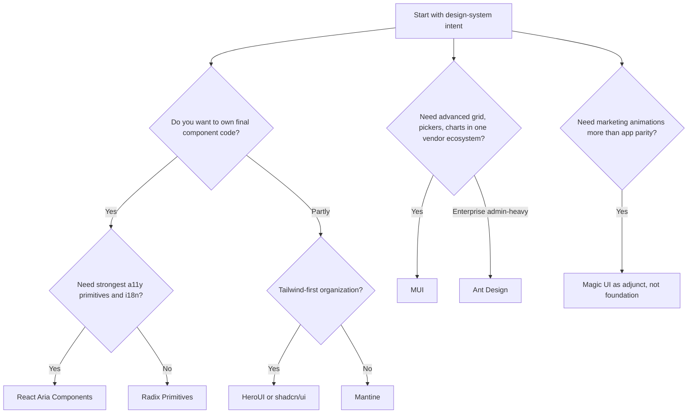
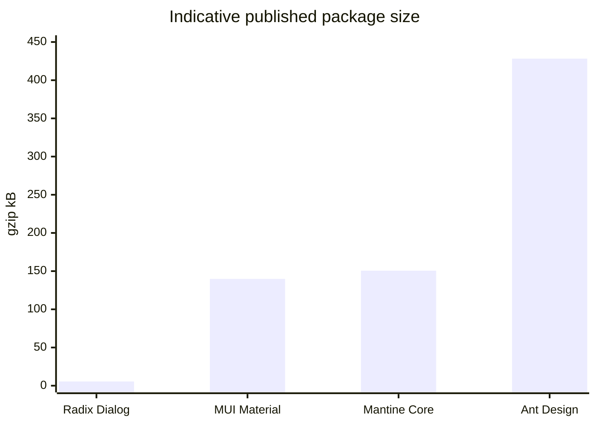
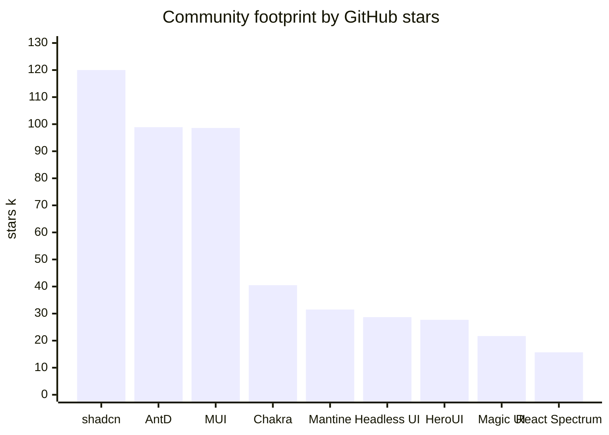

# Comparative Evaluation of Modern React UI Libraries for a Design System Foundation

## Executive summary

For a **design-system foundation**, the best choice depends less on “which library is most popular” and more on **where you want to sit on the spectrum between control and completeness**. The current React library market splits into three clear tiers: **full-suite component systems** such as MUI, Mantine, Chakra UI, HeroUI, and Ant Design; **code-distribution systems** such as shadcn/ui and Magic UI; and **headless primitive systems** such as React Aria Components, Radix Primitives, and Headless UI. Official docs reflect those differences directly: shadcn/ui explicitly says “this is not a component library” but a way to build your own; Radix and React Aria describe themselves as low-level, accessible foundations for design systems; MUI, Mantine, Chakra UI, HeroUI, and Ant Design present themselves as broad, production-ready suites. citeturn24search15turn38search11turn20view2turn28search6turn28search1turn20view3turn14search12turn42view0

If the goal is **a long-lived internal or external design-system library**, my top recommendations are these:

- **Best pure foundation for a bespoke design system:** **React Aria Components** or **Radix Primitives**. They give the most control over semantics, styling, and token architecture, with accessibility treated as a first-class concern. React Aria is stronger on formal accessibility depth and internationalization; Radix is often simpler to adopt in custom React design systems and is widely used as the substrate for modern component kits. citeturn20view2turn38search11turn37search0turn38search0
- **Best full-suite open-source foundation:** **Mantine**. It is the strongest “balanced” option if you want a large component catalog, modern theming via CSS variables, good TypeScript ergonomics, SSR friendliness, and fewer branding constraints than Material UI or Ant Design. Mantine currently advertises **120+ components** and **70 hooks**, supports modern React frameworks including Next.js, and has been shipping frequent 2026 releases. citeturn28search1turn30search5turn28search7
- **Best enterprise-ready, complete ecosystem:** **MUI**. It is still the safest choice when you need a broad catalog and especially when you also need advanced components like **Data Grid, date/time pickers, charts, and tree view** in the same ecosystem. Its theming story is materially better than it was a few years ago because of **CSS theme variables**, **CSS layers**, Next.js App Router support, and MUI’s newer **Pigment CSS** direction. The tradeoff is stronger framework gravity and more migration work if you want a design language far from Material conventions. citeturn34view2turn31search0turn31search21turn31search1turn24search10
- **Best Tailwind-native batteries-included option:** **HeroUI**. HeroUI v3 is a meaningful upgrade over the old “NextUI” positioning: it now states that components are built on **Tailwind CSS v4** and **React Aria Components**, separates styles from behavior, exposes BEM class names for global customization, and supports per-component imports. It is a compelling middle ground if your organization wants finished components without committing to CSS-in-JS. citeturn14search12turn18view2turn36search0turn34view0

The main libraries I would **not** choose as the primary foundation for a serious design-system program are **Magic UI** and, in most cases, **raw shadcn/ui**. Magic UI is excellent for animated marketing-site flourishes, but its own repo positions it around “animated components and effects you can copy and paste,” not a broad application system. shadcn/ui is outstanding as a bootstrap kit and code-distribution model, but because the code is copied into your repo, you own the maintenance, version drift, and consistency discipline. It is ideal when your team explicitly wants that ownership; it is not ideal when your design-system team wants a stable upstream package contract. citeturn23search1turn24search15turn18view1

My overall recommendation is therefore:

**Choose React Aria Components if your top priority is long-term design-system control and accessibility rigor. Choose Mantine if you want the best full open-source balance. Choose MUI if advanced enterprise components and ecosystem breadth dominate. Choose HeroUI if you want a Tailwind-first full suite. Use shadcn/ui as a bootstrap/distribution model, not as your only architectural answer, unless your team deliberately prefers owned source over upstream packages.** citeturn20view2turn28search1turn34view2turn14search12turn24search15

## Evaluation framework and market segmentation

For choosing a design-system foundation, the most important distinction is **not full-suite versus headless in the abstract**, but whether your team wants to own the final component contract or consume one. Official project positioning maps cleanly to that question. MUI calls Material UI a “fully-loaded component library” and MUI Core a set of foundational React components, while separately offering Base UI and MUI System. Mantine presents itself as a fully featured React components library. Chakra UI presents itself as a component system for building products with speed. Ant Design describes itself as an enterprise-class UI design language and React UI library. HeroUI describes itself as a modern React component library with built-in accessibility and Tailwind v4. By contrast, shadcn/ui explicitly says it is “how you build your component library,” not a traditional install-and-import package. Radix and React Aria explicitly frame themselves as low-level accessible building blocks for design systems. citeturn24search0turn24search12turn28search1turn20view3turn42view0turn14search12turn24search15turn38search11turn20view2

That leads to a practical segmentation:

| Segment | Libraries | What you get | Typical tradeoff |
|---|---|---|---|
| **Full-suite systems** | MUI, Mantine, Chakra UI, HeroUI, Ant Design | Faster product delivery, more component parity, stronger defaults | More opinionated design language, more override work, larger surface area citeturn34view2turn28search1turn20view3turn14search12turn42view0 |
| **Code-distribution systems** | shadcn/ui, Magic UI | Maximum source ownership, easy local customization, low upstream lock-in | You own maintenance, consistency, and migrations citeturn24search15turn23search1 |
| **Headless primitives** | React Aria Components, Radix Primitives, Headless UI | Best bespoke design-system control, strong composition, lean style assumptions | More assembly work, broader DS responsibilities shift to your team citeturn20view2turn38search11turn20view1 |

A second key dimension is **styling runtime model**. MUI still supports Emotion-based theming and styling, but its current direction emphasizes **CSS variables**, **CSS layers**, and the zero-runtime **Pigment CSS** initiative for better React Server Components compatibility and performance. Chakra UI’s v3 theming is now built around the **Panda CSS** API, though its installation still includes `@emotion/react`. Mantine recommends **CSS Modules** first and exports/defaults CSS variables broadly. HeroUI v3 explicitly claims **no CSS-in-JS runtime**, styles separated into `@heroui/styles`, and BEM-based global customization. shadcn/ui and Magic UI are overwhelmingly **Tailwind/CSS-variable** ecosystems. Radix, React Aria, and Headless UI are style-agnostic or class/data-attribute friendly. citeturn31search1turn31search0turn31search21turn27search1turn20view3turn31search3turn31search8turn18view2turn36search0turn33search9turn23search1turn38search0turn26search8turn25search2

A third dimension is **accessibility ownership**. React Aria gives the strongest explicit statement: behavior is implemented according to **WAI-ARIA Authoring Practices**, with wide screen-reader and device testing, plus internationalization built in. Radix positions accessibility as a core focus and exposes state through predictable attributes. HeroUI inherits React Aria Components. MUI, Chakra UI, Mantine, and Headless UI all foreground accessibility, but their suites still include places where implementers must wire labels, aria props, or composition details correctly. shadcn/ui inherits accessibility from the primitives you install, but once the code is inside your repo, you also inherit the risk of breaking it. citeturn20view2turn38search11turn38search0turn14search12turn28search6turn20view3turn28search1turn20view1turn24search15



The decision flow above reflects the central conclusion of this research: **the best “foundation” is usually either a primitive library + your tokenized styling layer, or a full-suite library whose opinions are close enough to your desired system that override cost stays bounded**. citeturn20view2turn38search11turn14search12turn28search1turn34view2turn42view0turn23search1

## Cross-library comparison tables and visuals

The table below focuses on the attributes that matter most for a design-system foundation rather than only day-one app productivity.

| Library | Catalog completeness | A11y posture | Theming and design tokens | Styling approach | Composition model | SSR and Next.js | DS foundation fit |
|---|---|---|---|---|---|---|---|
| **MUI** citeturn34view2turn28search6 | Very high, especially with MUI X | Strong and improving in v9; many component-specific a11y docs | `createTheme`, CSS variables, CSS layers, Pigment CSS direction | Emotion historically; now increasingly CSS-variable and build-time friendly | Slots and themed overrides | Strong official Next.js App Router support | **Excellent** if you want completeness and advanced components |
| **shadcn/ui** citeturn24search15turn33search9turn33search22 | Medium by default; expandable through registry/community | Depends on underlying Radix/Base UI and your edits | CSS variables + Tailwind-first theming | Tailwind, local source code, class-variance-authority patterns | Local source + primitive composition | Excellent with modern app frameworks | **Very good** if you want owned source; weaker if you want upstream package stability |
| **HeroUI** citeturn14search12turn18view2turn34view0 | High and growing | Very strong because it is built on React Aria Components | CSS variables, custom themes via `data-theme`, style/behavior split | Tailwind v4 + standalone CSS, no CSS-in-JS runtime | Compound components and BEM slots | Explicitly targets Next.js and React 19 | **Very good** for Tailwind-first teams wanting a packaged suite |
| **Mantine** citeturn28search1turn30search5turn31search3 | High: 120+ components plus 70 hooks | Good | Theme object + broad CSS variable export | CSS Modules recommended; also supports native CSS and other styling solutions | Styles API, classNames, extendable components | Strong with Next.js and modern frameworks | **Excellent** open-source balance |
| **Chakra UI** citeturn20view3turn27search1turn35search0 | High | Good to very good | Panda-style token system, recipes, semantic tokens | Token-driven styling system; current install still uses Emotion peer | Ark/Zag-style slot composition in v3 | Explicitly advertises Next.js RSC support | **Good**; strongest when you like its token-first authoring model |
| **Magic UI** citeturn23search1 | Low for app parity; high for visual effects | Variable; foundation relies on what you copy and how you edit it | Usually inherited from shadcn/Tailwind CSS variables | Copy-paste Tailwind + animation-heavy components | Source ownership | Good in Next.js/Tailwind contexts | **Weak as core foundation**, strong as a supplement |
| **React Aria Components** citeturn20view2turn29search17 | Medium-high primitives; less batteries-included than suites | Best-in-class official posture | Unstyled/customizable; atomic CSS + tree-shaking in Spectrum starter direction | Class functions, data attributes, your own CSS/Tailwind | Compositional API + hooks/state layers | Explicit SSR/RSC and performance positioning | **Excellent** if you want a custom DS with maximum rigor |
| **Radix Primitives** citeturn38search11turn38search0 | Medium primitive set | Best-in-class practical posture | Unstyled; theme via your own CSS tokens or Radix Themes/Colors | Data attributes, any CSS/CSS-in-JS | `asChild`, part-based composition | Works well in SSR setups | **Excellent** primitive substrate |
| **Ant Design** citeturn34view3turn42view0 | Very high: ~70+ core components plus broad ecosystem | Good, enterprise-focused | Theming via tokens/custom theme, CSS-in-JS | CSS-in-JS/token system | Prop-heavy with some composition | Official SSR support | **Good** for enterprise admin systems; less ideal for highly bespoke branding |
| **Headless UI** citeturn20view1turn25search2 | Narrower than Radix/React Aria suites | Strong | No official token system; intended to style with your system | Tailwind/data-attribute friendly | Headless renderless components | Generally SSR-friendly | **Good** for smaller Tailwind-centric primitive needs, but not the broadest foundation |

### Feature, bundle, accessibility, and ecosystem tables

The next table captures the most decision-relevant operational details.

| Library | License | GitHub stars | Recent release signal | Notable ecosystem |
|---|---:|---|---|---|
| **MUI** citeturn18view0turn16search4 | MIT | 98.6k | v9.1.1 released June 23, 2026; active changelog/release flow | MUI X, templates, design kits, Base UI |
| **shadcn/ui** citeturn18view1turn39search1 | MIT | 120.0k | multiple releases in July 2026 | registry model, templates, strong community remix culture |
| **HeroUI** citeturn18view2turn30search1 | Apache-2.0 | 27.7k | v3.2.2 on June 19, 2026 | Pro components, templates, React Native sibling |
| **Mantine** citeturn23search10turn28search7 | MIT | 31.5k | v9.5.0 on July 28, 2026 | extensions: charts, schedule, notifications, editor |
| **Chakra UI** citeturn20view3turn17search16 | MIT | 40.5k | 3.36.1 on July 19, 2026 | Ark UI, recipes, premium components |
| **Magic UI** citeturn23search1 | MIT | 21.7k | active OSS repo; positioned around animated copy-paste components | marketing components and effects |
| **React Spectrum / React Aria** citeturn21view0turn29search11 | Apache-2.0 | 15.7k | ongoing releases; React Aria Components launched from 2023 and continues expanding | React Aria, React Stately, Spectrum design system |
| **Headless UI** citeturn20view1 | MIT | 28.7k | active repo, insiders channel | Tailwind Labs ecosystem |
| **Ant Design** citeturn42view0turn22search0 | License file in repo | 98.9k | 6.4.2 released May 14, 2026 | Pro, Charts, Mobile, X, Motion, Web3 |
| **Radix Primitives** citeturn38search11turn28search5 | MIT | Mid-sized OSS footprint | June 6, 2026 release notes | Themes, Colors, Icons |

The next table is intentionally transparent about the limits of “bundle size comparisons.” Full suites and headless primitives are not apples-to-apples. Some projects expose a single monolithic entry package; others are per-primitive or copy-the-code systems. So the most honest comparison is a mix of **published package cost where available** plus **runtime architecture notes**. citeturn11search0turn11search1turn12search0turn38search0turn18view2turn24search15turn23search1

| Library | Indicative package cost | Runtime notes | Tree-shaking / build-output notes |
|---|---|---|---|
| **MUI** citeturn11search0turn31search1 | `@mui/material` ≈ **139.8 kB gzip** | Historically Emotion runtime; MUI is moving toward CSS variables and Pigment CSS | Better than older MUI generations; still a large full suite |
| **Mantine** citeturn11search1turn31search8 | `@mantine/core` ≈ **150.6 kB gzip** | CSS-based styling model with exported variables | Full suite with granular global CSS exports |
| **Ant Design** citeturn12search0turn42view0 | `antd` ≈ **428.2 kB gzip** | Heavy but feature-rich enterprise suite | Tree-shaking matters a lot; CSS-in-JS theming |
| **Radix Primitives** citeturn38search0 | Per-primitive; small imports are the norm | No opinionated style runtime | Excellent for selective imports |
| **HeroUI** citeturn18view2turn36search0 | Current indexed numeric size not reliably surfaced here | No CSS-in-JS runtime; styles split from behavior | Per-component imports stated as tree-shakeable |
| **Chakra UI** citeturn20view3turn27search1 | Current indexed numeric size not reliably surfaced here | Current install still includes `@emotion/react` | Token system is modernizing; runtime heavier than pure CSS-variable/Tailwind approaches |
| **shadcn/ui** citeturn24search15turn33search22 | No single package cost in the same sense | You copy source code into your repo | Runtime is whatever dependencies your chosen components bring |
| **Magic UI** citeturn23search1 | No single package cost in the same sense | Copy-paste + animation dependencies | Works best as selective additions, not global base |
| **React Aria Components** citeturn29search17turn20view2 | Current indexed numeric size not reliably surfaced here | Small-bundle/atomic CSS positioning | Aggressive tree-shaking and SSR/RSC focus in official messaging |
| **Headless UI** citeturn20view1turn25search2 | No official numeric bundle figure surfaced here | No style runtime | Narrower primitive scope keeps cost bounded |

The accessibility score below is an **analyst score out of 5**, not an external benchmark. It is based on official positioning, explicit WAI-ARIA/APG claims, documented state/ARIA APIs, and how much accessibility responsibility remains with the integrator. A top score means “excellent foundation for accessible DS work,” not “perfect in all app circumstances.” citeturn20view2turn38search11turn14search12turn28search6turn20view3turn28search1turn20view1turn24search15

| Library | Accessibility score | Why |
|---|---:|---|
| **React Aria Components** citeturn20view2 | **5.0 / 5** | Explicit APG/WAI-ARIA implementation, broad screen-reader/device testing, i18n built in |
| **Radix Primitives** citeturn38search11turn38search0 | **4.8 / 5** | Accessibility is core to the project; exposed state makes custom styling safe |
| **HeroUI** citeturn14search12turn18view2 | **4.7 / 5** | Built on React Aria Components, with accessible defaults |
| **MUI** citeturn28search6turn28search0turn28search11 | **4.4 / 5** | Strong suite-level posture; some components still require consumer aria discipline |
| **Chakra UI** citeturn20view3turn35search15 | **4.3 / 5** | Longstanding accessibility focus with composable patterns |
| **Headless UI** citeturn20view1turn25search2 | **4.2 / 5** | Fully accessible headless components, though narrower scope |
| **shadcn/ui** citeturn24search15turn18view1 | **4.1 / 5** | Inherits good primitives, but copied code means your team owns regressions |
| **Mantine** citeturn28search1turn28search20 | **4.0 / 5** | Good accessible defaults and props, less explicit APG/testing narrative than React Aria |
| **Ant Design** citeturn42view0 | **4.0 / 5** | Practical enterprise a11y, but not the strongest DS-first a11y substrate |
| **Magic UI** citeturn23search1 | **2.5 / 5** | Not built as a full accessibility-first application system |



Package-size figures above are **indicative package-level costs**, not end-to-end app benchmarks. The underlying values available from indexed Bundlephobia pages were approximately **5.5 kB gzip for a Radix dialog primitive, 139.8 kB for `@mui/material`, 150.6 kB for `@mantine/core`, and 428.2 kB for `antd`**. citeturn11search0turn11search1turn12search0



At crawl time, the largest GitHub communities in this set were **shadcn/ui (~120k stars)**, **Ant Design (~98.9k)**, **MUI (~98.6k)**, then **Chakra UI (~40.5k)**, **Mantine (~31.5k)**, **Headless UI (~28.7k)**, **HeroUI (~27.7k)**, **Magic UI (~21.7k)**, and **React Spectrum (~15.7k)**. Stars are an imperfect proxy, but in practice they help indicate discoverability, issue volume, community examples, and third-party integration density. citeturn18view1turn42view0turn18view0turn20view3turn23search10turn20view1turn34view0turn23search1turn21view0

## Library profiles

### MUI

**Verdict:** Choose MUI when you need the broadest, most enterprise-ready component surface and are willing to accept a stronger framework opinion in exchange. citeturn34view2turn24search10

MUI’s strongest advantage is **coverage**. Even the free core catalog spans conventional input, layout, feedback, navigation, and utility components, while the adjacent **MUI X** layer adds **Data Grid, date/time pickers, charts, and tree view**. That makes it unusually effective for internal-product design systems that must support dashboards, CRUD workflows, and dense data views without pulling in many third-party components. Its documentation and ecosystem are also unusually mature; the public repo alone shows **98.6k stars**, and MUI points to an extensive customization/documentation stack. citeturn34view2turn18view0turn31search19

Its biggest strategic improvement is in theming and runtime architecture. Current docs support **CSS theme variables**, official **Next.js App Router integration**, and **CSS layers**, while the Pigment CSS initiative is explicitly framed as a **zero-runtime CSS-in-JS** path with better **React Server Components** compatibility and performance. That makes modern MUI substantially easier to integrate into token-driven systems than older “Emotion-only” perceptions suggest. Still, MUI remains a relatively large suite and its component semantics, slot structure, and Material ancestry are more opinionated than a pure primitive foundation. citeturn31search0turn31search21turn31search1turn31search7

**Pros:** best-in-class breadth; advanced components in the same ecosystem; strong docs; serious Next.js support; increasingly modern token/runtime story. **Cons:** larger package/runtime footprint than leaner foundations; stronger default design language; full de-branding takes work; the best value often depends on whether you also need MUI X. citeturn34view2turn11search0turn24search10

**Theming and override example**

```tsx
import { createTheme, ThemeProvider, Button } from "@mui/material";

const theme = createTheme({
  cssVariables: true,
  palette: {
    primary: { main: "#0f62fe" },
  },
  components: {
    MuiButton: {
      styleOverrides: {
        root: {
          borderRadius: 12,
          textTransform: "none",
          fontWeight: 600,
        },
      },
    },
  },
});

export function App() {
  return (
    <ThemeProvider theme={theme}>
      <Button variant="contained">Pay</Button>
    </ThemeProvider>
  );
}
```

MUI documents theme-driven component overrides under `components`, and current Next.js integration docs explicitly show enabling `cssVariables: true`. citeturn31search2turn31search0

### shadcn/ui

**Verdict:** Choose shadcn/ui when you want to **own the source** of your design-system components and are comfortable treating upstream as scaffolding rather than as your runtime dependency. citeturn24search15turn18view1

The official shadcn position is unusually important: it says **“This is not a component library. It is how you build your component library.”** That statement is not marketing nuance; it is the architectural truth of the project. Components are added into your repository, and the system is designed around **Tailwind**, **CSS variables**, and local code ownership. Current docs also show that the newer create flow can initialize with **Base UI or Radix**, which matters because it broadens the primitive substrate beyond the historical “shadcn = Radix + Tailwind” shortcut. citeturn24search15turn33search22

This model is ideal for organizations that want a design-system team to own the exact DOM, class structure, token mapping, and release cadence. It is less ideal for teams that want a smaller maintenance surface, because **you now own every upstream drift problem**: API updates, accessibility regressions introduced by local edits, and consistency across products. In practice, shadcn/ui is superb as a **bootstrap and distribution model**, but it is not automatically a governance model. citeturn18view1turn24search15

**Pros:** best ownership model; straightforward token mapping with CSS variables; excellent Tailwind fit; massive community and registry gravity. **Cons:** no packaged upgrade contract; component completeness depends on what you install and maintain; accessibility quality depends on your edits over time. citeturn18view1turn33search9turn39search1

**Theming and override example**

```css
/* app/globals.css */
:root {
  --primary: 221.2 83.2% 53.3%;
  --primary-foreground: 210 40% 98%;
  --radius: 0.75rem;
}

.dark {
  --primary: 210 40% 98%;
  --primary-foreground: 222.2 47.4% 11.2%;
}
```

```tsx
// components/ui/button.tsx
export const buttonVariants = cva(
  "inline-flex items-center justify-center rounded-md text-sm font-medium",
  {
    variants: {
      variant: {
        brand:
          "bg-[hsl(var(--primary))] text-[hsl(var(--primary-foreground))] hover:opacity-90",
      },
    },
  }
);
```

Official theming docs describe token overrides in CSS variables and dark mode via a `.dark` selector, and the component model is intentionally local-source. citeturn33search9turn33search4turn18view1

### HeroUI

**Verdict:** HeroUI is the strongest modern choice for teams that want a **Tailwind-native packaged suite** instead of raw primitives or copy-pasted code. citeturn14search12turn18view2

HeroUI’s current positioning is much clearer and stronger than its old NextUI identity. The repo and docs state that it combines **React Aria accessibility** with **Tailwind CSS v4**, uses **compound components**, splits **styles** from **behavior**, and exposes **tree-shakeable per-component imports**. The v3 release notes also emphasize that all components were rewritten, BEM class names were introduced for global slot customization, and themes now cascade via explicit token sets and `data-theme`. citeturn18view2turn36search0turn24search6

That design is particularly attractive for design-system work because it reduces the package/runtime penalty common in CSS-in-JS suites while keeping a strong batteries-included layer. The main caveat is maturity relative to MUI or Ant Design: HeroUI is growing quickly, but its ecosystem depth, third-party packages, and organizational longevity signals are still lighter than the most established incumbents. citeturn34view0turn30search1

**Pros:** Tailwind v4-native; strong accessibility substrate; polished defaults; no CSS-in-JS runtime; highly customizable slots and themes. **Cons:** younger ecosystem than MUI/AntD; still building out the same level of broad enterprise add-ons and community conventions. citeturn18view2turn36search0turn34view0

**Theming and override example**

```css
@layer base {
  [data-theme="bank"] {
    --accent: oklch(0.45 0.15 230);
    --background: oklch(0.985 0.015 225);
    --radius: 0.75rem;
    --border: oklch(0.50 0.06 230 / 22%);
  }
}

@layer components {
  .modal__dialog {
    @apply rounded-2xl border shadow-2xl;
  }
}
```

```tsx
<html data-theme="bank">{/* app */}</html>
```

HeroUI’s docs explicitly show custom themes via `data-theme` and component customization with `@layer components` plus BEM classes such as `.modal__dialog`. citeturn24search6turn36search3turn36search9

### Mantine

**Verdict:** Mantine is the best **full open-source “middle path”** if you want a broad suite without buying into a heavy visual ideology or a CSS-in-JS runtime. citeturn28search1turn30search5

Mantine now advertises **120+ components** and **70 hooks**, and it explicitly supports modern frameworks including **Next.js**. Its extensions story is also unusually practical for design-system work: notifications, charts, schedule/calendar tooling, a TipTap editor, and other add-ons are published under the same ecosystem. It has also been shipping frequent 2026 releases, an encouraging stability signal for teams that care about active maintenance without major commercial lock-in. citeturn28search1turn30search5turn32search6turn28search7

What makes Mantine especially attractive as a foundation is its styling flexibility. The docs recommend **CSS Modules** first, but also document compatibility with native CSS and third-party solutions using `className`, `classNames`, `style`, and `styles`. Since Mantine exports theme values as CSS variables and even split out default variable CSS in newer versions, it is relatively easy to map an external token source into Mantine or vice versa. Its main limitation versus MUI is advanced enterprise depth; you can cover a lot with Mantine, but if your DS roadmap includes industrial-strength grids and adjacent enterprise widgets, MUI still has the edge. citeturn31search3turn32search1turn31search8turn31search16

**Pros:** excellent breadth-to-opinion ratio; CSS-variable friendly; no hard styling lock-in; very strong DX. **Cons:** smaller ecosystem than MUI/AntD; fewer “enterprise platform” add-ons than MUI X or the Ant ecosystem. citeturn28search1turn11search1turn32search6

**Theming and override example**

```tsx
import { createTheme, MantineProvider, Button } from "@mantine/core";

const theme = createTheme({
  primaryColor: "indigo",
  defaultRadius: "md",
  fontFamily: "Inter, sans-serif",
});

export function App() {
  return (
    <MantineProvider theme={theme}>
      <Button classNames={{ root: "rounded-xl font-semibold" }}>Pay</Button>
    </MantineProvider>
  );
}
```

Mantine’s official styling guidance recommends CSS Modules first but also explicitly supports `className`, `classNames`, `style`, and `styles`, making token-driven overrides straightforward. citeturn31search3turn32search1

### Chakra UI

**Verdict:** Chakra UI remains a strong design-system option, but today it is best for teams that like **token-first authoring** and Chakra’s ergonomics enough to accept its architectural transition. citeturn20view3turn27search1

Chakra’s current v3 theming docs say the styling system is built around the **Panda CSS API**, and the docs model tokens through `defineConfig` and `createSystem`. At the same time, the repo installation instructions still include `@emotion/react`, so Chakra currently sits in an interesting hybrid state: more modern token architecture, but not yet as clearly “zero-runtime” as HeroUI, React Aria plus your CSS, or a fully Tailwind-native stack. The library also explicitly states that it **works with Next.js RSC** and has a very broad components catalog. citeturn27search1turn20view3turn30search0turn35search0

That makes Chakra a good fit when your team values the authoring experience of layout primitives like `Box`, tokenized style props, and recipe-like system configuration. It is a weaker fit if your target is a strict separation between behavior and styling or if you want to minimize runtime styling concerns as much as possible. citeturn35search7turn27search1

**Pros:** excellent DX; broad component surface; strong tokens/recipes story; strong React/Next fit. **Cons:** still architecturally transitional; less compelling than Mantine for neutral open-source balance; less compelling than React Aria/Radix for primitive purity. citeturn27search1turn20view3

**Theming and override example**

```tsx
import {
  ChakraProvider,
  createSystem,
  defaultConfig,
  defineConfig,
} from "@chakra-ui/react";

const config = defineConfig({
  theme: {
    tokens: {
      colors: {
        brand: {
          500: { value: "#0f62fe" },
        },
      },
    },
  },
});

const system = createSystem(defaultConfig, config);

export function App() {
  return <ChakraProvider value={system}>{/* app */}</ChakraProvider>;
}
```

Chakra’s official docs describe token configuration with `defineConfig` and `createSystem`, and the current component docs show slot-level customization patterns. citeturn27search1turn35search14

### Magic UI

**Verdict:** Use Magic UI as a **secondary effects/marketing layer**, not as the base of a design-system library. citeturn23search1

Magic UI’s own repo describes it as a **UI library for design engineers** with **animated components and effects** that you can **copy and paste** into your apps. Its topics and examples place it in the shadcn/Tailwind/Framer Motion world. That makes it excellent for hero sections, marquee effects, animated reveals, and splashy product surfaces; it does not make it a complete parity foundation for application design systems. citeturn23search1

In practice, Magic UI works best **on top of** another base. If you adopt Mantine, MUI, HeroUI, or a Radix/React Aria primitive layer, you can selectively port Magic UI components into marketing or onboarding surfaces. If you try to make Magic UI your primary DS substrate, you will quickly run into gaps in form parity, accessibility consistency, and maintenance discipline. That conclusion is an inference from the project’s own positioning, not a defect in the project itself. citeturn23search1

**Pros:** beautiful visual effects; fast copy-paste workflow; strong for landing pages and showcase surfaces. **Cons:** not component-complete; not positioned as a formal DS foundation; animation-driven code can raise maintenance and performance discipline needs. citeturn23search1

**Theming and override example**

```tsx
// Example pattern: wrap a copied Magic UI component in your DS button tokens
export function MarketingCTA(props: React.ComponentProps<"button">) {
  return (
    <button
      className="rounded-[var(--radius)] bg-[hsl(var(--primary))] px-6 py-3 text-white shadow-lg"
      {...props}
    />
  );
}
```

Because Magic UI is copy-paste oriented, the “override pattern” is usually to adapt the copied component directly to your token classes rather than rely on a stable upstream theme API. citeturn23search1

### React Aria Components

**Verdict:** If your design-system team can invest in assembly and styling, React Aria Components is the most future-proof accessibility-first foundation in this field. citeturn20view2turn29search17

Adobe’s React Spectrum repo states that React Aria is a library of **unstyled components and hooks** for building accessible high-quality UI components, and it explicitly says that if you are building a component library from scratch with your own styling, **start here**. The repo also states that accessibility is implemented according to **WAI-ARIA Authoring Practices**, with screen-reader and keyboard testing across a wide variety of devices, plus baked-in internationalization support for **30+ languages**. Current React Spectrum site messaging also emphasizes **SSR**, **RSC support**, **aggressive tree-shaking**, and **small bundle**/atomic CSS performance goals. citeturn20view2turn29search17

That combination is unusually strong for a serious design-system team. The obvious downside is that React Aria is not trying to be your whole visual system. You must decide your component anatomy, slot naming, token bridge, and styling technique. But if that is what you want anyway, React Aria is hard to beat. citeturn20view2turn29search17

**Pros:** strongest official a11y posture; excellent for SSR/RSC; highly customizable; internationalization depth. **Cons:** more assembly work than suites; weaker “ready-made product UI” story out of the box. citeturn20view2turn29search17

**Theming and override example**

```tsx
import { Button } from "react-aria-components";

export function CTA() {
  return (
    <Button
      className={({ isPressed }) =>
        `rounded-xl px-4 py-2 font-medium text-white ${
          isPressed ? "bg-blue-700" : "bg-blue-600"
        }`
      }
    >
      Pay
    </Button>
  );
}
```

React Aria Components explicitly supports `className` functions based on render props/state, which is one of the cleanest APIs in the market for token-driven dynamic styling. citeturn26search8turn26search6

### Radix Primitives

**Verdict:** Radix is the most practical primitive-first choice when your team wants highly composable React parts with strong accessibility and minimal styling assumptions. citeturn38search11turn37search0

Radix describes itself as a low-level UI component library with a focus on **accessibility, customization, and developer experience**. Its styling guide explicitly documents **`data-state` attributes** for state styling, and its composition story revolves around predictable parts plus the powerful **`asChild`** prop. That combination explains why Radix became such a common substrate for custom DS work and why shadcn/ui historically built so much of its library on top of it. citeturn38search11turn38search0turn37search0

Radix is not as broad or internationally deep as React Aria, and its ecosystem is less “one vendor, everything included” than MUI or Ant Design. But as a design-system **substrate**, it is one of the strongest options available because it removes very little from your control while still handling difficult interaction and accessibility behaviors. citeturn38search11turn38search0

**Pros:** excellent primitive API; low style assumptions; strong accessibility; easy to pair with Tailwind, CSS Modules, or CSS-in-JS. **Cons:** narrower than full suites; some higher-level components still need your design-system assembly work. citeturn38search11turn38search0

**Theming and override example**

```tsx
import * as Dialog from "@radix-ui/react-dialog";

export function Example() {
  return (
    <Dialog.Root>
      <Dialog.Trigger asChild>
        <button className="btn">Open</button>
      </Dialog.Trigger>
      <Dialog.Portal>
        <Dialog.Overlay className="DialogOverlay" />
        <Dialog.Content className="DialogContent">Hello</Dialog.Content>
      </Dialog.Portal>
    </Dialog.Root>
  );
}
```

```css
.DialogContent[data-state="open"] {
  border-radius: var(--radius);
  animation: scaleIn 150ms ease;
}
```

Radix’s docs explicitly document both `asChild` composition and state styling via `data-state`. citeturn37search0turn38search2turn38search0

### Ant Design

**Verdict:** Ant Design is still one of the best choices for **enterprise admin systems**, but it is not the cleanest base if your design-system ambition is a distinctly custom brand language. citeturn42view0turn34view3

Ant Design’s catalog is exceptionally broad. Its components overview currently shows categories that add up to roughly **70+ components**, spanning layout, navigation, data entry, data display, and feedback. The repo also explicitly lists **internationalization support for dozens of languages**, **SSR support**, and “powerful theme customization based on CSS-in-JS,” while the surrounding ecosystem includes Ant Design Pro, Charts, Mobile, Motion, Web3, and other adjacent packages. The scale of the repository is reflected in its **98.9k GitHub stars** and very large contributor history. citeturn34view3turn42view0

The tradeoff is that Ant Design is more of a **full design language** than a neutral substrate. It can absolutely be customized, and v6 has been moving further into tokenization and CSS-variable-enabled modes in the broader ecosystem, but if your core requirement is to build a highly bespoke design identity, Mantine or a primitive-based stack often produces less override friction. citeturn42view0turn41search6

**Pros:** enterprise breadth, strong ecosystem, excellent admin-app acceleration, SSR and i18n support. **Cons:** heavier bundle footprint; stronger default design language; de-branding cost can be material. citeturn42view0turn12search0

**Theming and override example**

```tsx
import { ConfigProvider, Button } from "antd";

export function App() {
  return (
    <ConfigProvider
      theme={{
        token: {
          colorPrimary: "#0f62fe",
          borderRadius: 10,
        },
        components: {
          Button: {
            fontWeight: 600,
          },
        },
      }}
    >
      <Button type="primary">Pay</Button>
    </ConfigProvider>
  );
}
```

Ant Design’s repo links official custom theme documentation and describes its theme customization as CSS-in-JS based. citeturn42view0

### Headless UI

**Verdict:** Headless UI is a solid, clean choice for **smaller Tailwind-centric primitive needs**, but it is not as broad or as DS-complete a substrate as Radix or React Aria. citeturn20view1turn25search2

Headless UI describes itself as **completely unstyled** and **fully accessible**, designed to integrate beautifully with **Tailwind CSS**. Its docs lean heavily on **`data-*` attributes** for styling component state, which makes it ergonomic in Tailwind and custom CSS. For teams already standardized on Tailwind and only needing a focused set of primitives, that is a strong story. citeturn20view1turn25search2turn25search21

Where it falls behind the very best DS foundations is breadth and extensibility. It is not trying to provide the same substantive primitive coverage as React Aria or Radix, and it does not come with the broader ecosystem gravity of MUI or Mantine. That said, if your team values minimalism and can live within the available primitive set, it remains a good option. citeturn20view1turn25search2

**Pros:** very clean headless/Tailwind workflow; good accessibility posture; low styling assumptions. **Cons:** narrower catalog and ecosystem than the strongest alternatives for full DS programs. citeturn20view1turn25search2

**Theming and override example**

```tsx
import { Disclosure, DisclosureButton, DisclosurePanel } from "@headlessui/react";

export function FAQ() {
  return (
    <Disclosure>
      <DisclosureButton className="rounded-md px-3 py-2 data-[open]:bg-muted">
        Details
      </DisclosureButton>
      <DisclosurePanel className="pt-2 text-sm">Hello</DisclosurePanel>
    </Disclosure>
  );
}
```

Headless UI’s docs explicitly recommend state styling via exposed `data-*` attributes such as `data-open`. citeturn25search2

## Migration and implementation guidance

If you are choosing a design-system foundation today, the migration question is really about **token portability**, **component contract ownership**, and **how much UI behavior you want to re-assemble yourself**. Libraries with **CSS variables** and **unstyled/headless APIs** typically integrate best with existing token systems. That favors React Aria Components, Radix, shadcn/ui, HeroUI, and increasingly modern MUI. Mantine is also relatively good here because it exposes broad CSS variables and works with multiple styling solutions. Chakra is good if you are willing to model your tokens in its Panda-style system. Ant Design is workable but more coupled to its ecosystem conventions. Magic UI is best viewed as an integration target, not a system of record. citeturn20view2turn38search0turn33search9turn24search6turn31search0turn31search8turn27search1turn42view0turn23search1

A practical migration checklist looks like this:

| Migration checkpoint | Why it matters | Good fits |
|---|---|---|
| **Map your existing design tokens to CSS variables first** | Makes library evaluation reversible and reduces lock-in | shadcn/ui, HeroUI, Mantine, React Aria, Radix, modern MUI citeturn33search9turn24search6turn31search8turn20view2turn38search0turn31search0 |
| **Decide whether source ownership is a feature or a burden** | Determines whether shadcn/Magic or package-based suites are appropriate | shadcn/ui, Magic UI versus MUI/Mantine/HeroUI/Chakra citeturn24search15turn23search1 |
| **Audit parity needs** | Data grid, pickers, charts, schedule, and editor components quickly change outcomes | MUI, Mantine, AntD have the strongest adjacency coverage citeturn34view2turn32search6turn42view0 |
| **Choose a styling governance model** | CSS Modules, Tailwind, recipes, CSS-in-JS, or raw CSS produce different maintenance paths | Mantine, HeroUI/shadcn, Chakra, MUI respectively citeturn31search3turn18view2turn27search1turn31search1 |
| **Make accessibility ownership explicit** | Headless systems shift more responsibility to your team | React Aria/Radix/Headless UI/shadcn need stronger internal discipline citeturn20view2turn38search11turn20view1turn24search15 |
| **Test SSR and RSC paths early** | Style insertion and hydration behavior can become hidden migration costs | MUI, Chakra, Mantine, HeroUI, React Spectrum all explicitly discuss SSR/Next support citeturn31search0turn30search0turn30search5turn18view2turn29search17 |

A decision criteria matrix tailored to design-system foundations is below. I weighted the factors toward long-term maintainability rather than only speed of first implementation.

| Criteria | Weight | Best performers | Why |
|---|---:|---|---|
| **Accessibility substrate** | 25% | React Aria, Radix, HeroUI | Strongest official a11y architecture; HeroUI inherits React Aria citeturn20view2turn38search11turn14search12 |
| **Catalog completeness** | 20% | MUI, AntD, Mantine | Broadest component parity and adjacent packages citeturn34view2turn34view3turn28search1 |
| **Token portability** | 20% | React Aria, Radix, shadcn/ui, HeroUI, Mantine, modern MUI | CSS-variable and unstyled/slot-friendly architectures migrate best citeturn20view2turn38search0turn33search9turn24search6turn31search8turn31search0 |
| **Runtime/build efficiency** | 15% | HeroUI, React Aria, Radix, Headless UI | Minimal or no CSS-in-JS runtime assumptions citeturn18view2turn29search17turn38search0turn20view1 |
| **Developer experience** | 10% | Mantine, Chakra, MUI, shadcn/ui | Strong docs and ergonomic APIs, each in different styles citeturn28search1turn20view3turn31search19turn24search15 |
| **Ecosystem safety** | 10% | MUI, AntD, Chakra, shadcn/ui | Larger communities, stronger discoverability, more examples/integrations citeturn18view0turn42view0turn20view3turn18view1 |

### Suggested starter stack combinations

**For a bank-grade internal product system with many data-heavy workflows:**  
**Next.js App Router + TypeScript + MUI + CSS variables + TanStack Query + React Hook Form.** This combination is strongest when you need DS tokens plus adjacent components like grids and pickers with official support. citeturn31search0turn34view2

```tsx
// src/theme.ts
"use client";
import { createTheme } from "@mui/material/styles";

export const theme = createTheme({
  cssVariables: true,
  palette: { primary: { main: "#0f62fe" } },
});
```

**For a custom branded system with long-term correctness and accessibility priority:**  
**Next.js App Router + React Aria Components + Tailwind or CSS Modules + your own token package.** This is the cleanest “own the contract” stack. citeturn20view2turn29search17

```css
:root {
  --color-brand: #0f62fe;
  --radius-md: 12px;
}
```

```tsx
<Button className="rounded-[var(--radius-md)] bg-[var(--color-brand)] text-white">
  Pay
</Button>
```

**For a Tailwind-first product team that still wants a packaged component suite:**  
**Next.js + Tailwind v4 + HeroUI + your tokenized `data-theme` strategy.** This is the best compromise between batteries included and runtime leanness. citeturn14search12turn24search6

```css
@layer base {
  [data-theme="bank"] {
    --accent: oklch(0.45 0.15 230);
    --radius: 0.75rem;
  }
}
```

**For a broad open-source program with minimal visual lock-in:**  
**Next.js + Mantine + CSS Modules + internal tokens exported as CSS variables.** This is arguably the best all-around OSS stack if you do not need MUI X-style heavy enterprise widgets. citeturn30search5turn31search3turn31search8

```tsx
import { MantineProvider } from "@mantine/core";

<MantineProvider theme={{ primaryColor: "indigo", defaultRadius: "md" }}>
  {children}
</MantineProvider>;
```

## Recommendation and final ranking

If your prompt is interpreted literally — **choose a foundation for a design-system UI library**, not just for a single application — then the ranking changes compared with most “best React UI library” lists.

**Best overall for an actual design-system foundation:** **React Aria Components**. It gives the strongest explicit accessibility base, clear “build your own component library” positioning, good SSR/RSC story, and the least visual lock-in. The cost is that you must invest in your own visual layer and component assembly. citeturn20view2turn29search17

**Best pragmatic open-source package foundation:** **Mantine**. It is the best balance of completeness, styling flexibility, token friendliness, and active maintenance without forcing you deep into one design language. If your organization wants to ship quickly but still keep control over brand identity, Mantine is the safest default answer. citeturn28search1turn30search5turn28search7

**Best if advanced enterprise components are decisive:** **MUI**. When the system roadmap includes dense data tables, pickers, charts, and adjacent platform widgets, MUI’s ecosystem advantage is real and still unmatched among mainstream React suites. Modern theming and CSS-variable work significantly reduce former objections. citeturn34view2turn31search0turn24search10

**Best Tailwind-native packaged suite:** **HeroUI**. If your team likes Tailwind, wants polished default visuals, and does not want to fully assemble a DS from primitives, HeroUI is now a serious contender rather than a niche aesthetic choice. citeturn14search12turn18view2turn36search0

**Best if your team explicitly wants source ownership as policy:** **shadcn/ui**, preferably with a conscious token-governance model and a clear update process. It is not the easiest system to govern, but it is the easiest system to truly own. citeturn24search15turn18view1

A concise final ranking for **design-system foundation suitability** is:

| Rank | Library | Best for |
|---|---|---|
| **Top tier** | React Aria Components | Bespoke, accessibility-first design systems citeturn20view2turn29search17 |
| **Top tier** | Mantine | Broad OSS foundation with low override pain citeturn28search1turn30search5 |
| **Top tier** | MUI | Enterprise breadth and adjacent advanced components citeturn34view2turn24search10 |
| **Strong tier** | HeroUI | Tailwind-first packaged suite citeturn14search12turn18view2 |
| **Strong tier** | Radix Primitives | Custom DS primitive substrate citeturn38search11turn38search0 |
| **Conditional tier** | shadcn/ui | Owned-source DS bootstrapping citeturn24search15turn18view1 |
| **Conditional tier** | Chakra UI | Token-first ergonomics and Chakra-style authoring citeturn27search1turn20view3 |
| **Conditional tier** | Ant Design | Enterprise admin systems with strong parity needs citeturn42view0turn34view3 |
| **Niche tier** | Headless UI | Smaller Tailwind-centric primitive needs citeturn20view1turn25search2 |
| **Adjunct only** | Magic UI | Animated marketing layers, not core DS substrate citeturn23search1 |

The shortest defensible answer is therefore this: **if you are building a real design-system foundation, start with React Aria Components or Radix; if you want a complete open-source suite, pick Mantine; if you need enterprise-adjacent power components, pick MUI; if your team is Tailwind-native and wants a packaged suite, pick HeroUI; and use shadcn/ui as a distribution/bootstrap model rather than a substitute for architectural decisions.** citeturn20view2turn38search11turn28search1turn34view2turn14search12turn24search15