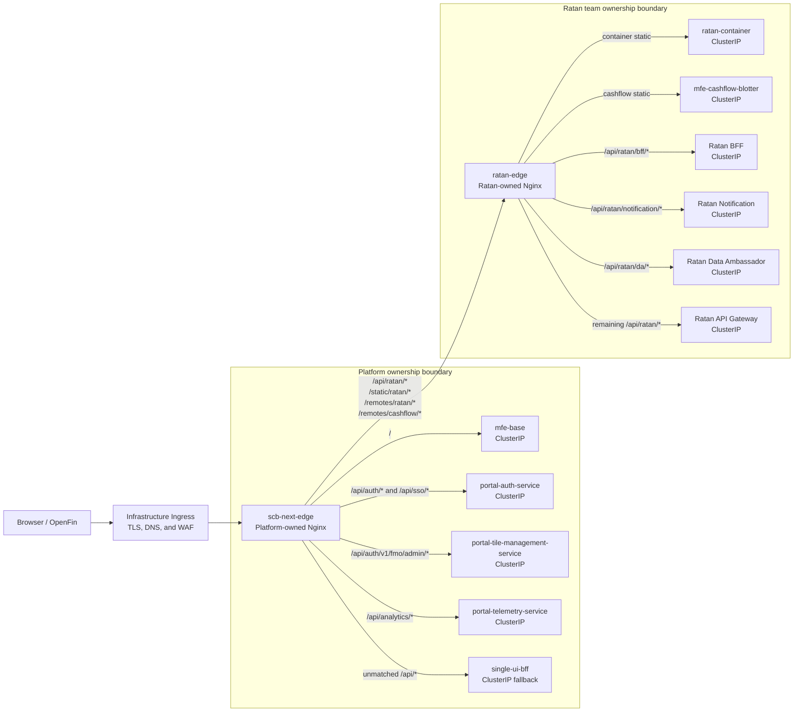

# SCB Next Kubernetes proof

This proof uses a platform-owned Nginx edge followed by a separately operated Nginx edge for each tenant. The infrastructure Ingress has one catch-all backend, every application Service is `ClusterIP`, and the platform edge cannot route directly to Ratan workloads.

## Architecture



The platform owns only the `/api/ratan/*`, `/static/ratan/*`, `/remotes/ratan/*`, and `/remotes/cashflow/*` delegation contract. The Ratan team owns all route precedence, rewrites, WebSocket handling, caching, upstream names, health, rollout, and availability inside that boundary.

## What this proof establishes

- production builds for Base, Ratan container, and Cashflow;
- separate platform edge, Ratan edge, platform, and tenant Deployments;
- three independently deployed portal domain services alongside the retained `single-ui-bff` fallback;
- route identity and failure containment for auth, tile-management, telemetry, fallback, and tenant paths;
- Ingress to platform edge to tenant edge to owning upstream routing;
- platform and tenant HTTP paths, federation assets, cache policy, and WebSocket upgrade;
- non-root workload controls, probes, resources, disruption configuration, and independent edge rollouts;
- Ratan edge outage containment and recovery without a platform edge restart;
- fixture-backed Cashflow browser composition.

The three portal Deployments initially use compatible `single-ui-bff` artifacts under distinct image coordinates. This proves routing and runtime lifecycle isolation, not Java source, session, database, or integration decomposition. The proof does not certify real corporate identity, authorization, databases, messaging, notification infrastructure, secrets, external tenant services, TLS/WAF, observability, capacity, or disaster recovery.

## Quick verification

Prerequisites are Docker, Minikube, `kubectl`, Node/npm dependencies, and the Playwright Chromium browser. Run from `scb-next`:

```bash
npm run k8s:minikube:start
npm run k8s:minikube:build
npm run k8s:minikube:deploy
npm run k8s:minikube:verify
```

The build command builds images directly in the selected Minikube profile so a mutable local `:dev` tag cannot silently reuse a stale containerd image. The verify command uses port `9083` by default. A passing run proves service identity, per-service outage/recovery, tenant-edge isolation, HTTP probes, and the fixture-backed browser journey. A browser failure caused by an unavailable external URL is still a failed gate: retain the Playwright trace and classify the external dependency instead of suppressing the console error.

The dedicated profile defaults to 2 CPUs and 3072 MB. Override `SCB_NEXT_MINIKUBE_CPUS` or `SCB_NEXT_MINIKUBE_MEMORY` when the workstation has more capacity. Use the isolated `MINIKUBE_HOME` and `KUBECONFIG` procedure in [the manual verification guide](../../docs/VERIFICATION_GUIDE.md) when the tools are not installed globally.

## NetworkPolicy prerequisite

Kubernetes accepts NetworkPolicy objects even when the CNI does not enforce them. Minikube's default bridge CNI does not prove runtime isolation. The rendered policies restrict the platform edge to platform workloads and tenant edges, restrict `ratan-edge` to pods carrying `scb-next.io/tenant: ratan`, and allow Ratan workloads to accept traffic only from `ratan-edge`. Use Calico, Cilium, or the intended enterprise CNI and run the positive and negative checks in the manual guide before claiming runtime enforcement.

## Cleanup

Cleanup removes only the `scb-next-minikube` overlay resources. Set `SCB_NEXT_DELETE_MINIKUBE_PROFILE=true` only when the dedicated profile should also be deleted:

```bash
npm run k8s:minikube:cleanup
```

See [MINIKUBE_EVIDENCE.md](MINIKUBE_EVIDENCE.md) for the latest recorded run and [the manual verification guide](../../docs/VERIFICATION_GUIDE.md) for the complete reproducible procedure.

## Production adoption gates

Before creating a production overlay, approve and record:

- ingress controller, TLS/certificate ownership, DNS, WAF, and trusted proxy behavior;
- immutable registry paths, signatures, provenance, SBOM, scanning, and workload identity;
- secret provider/CSI integration and prohibition of secret values in ConfigMaps;
- tenant namespace/RBAC model, team ownership, platform-to-tenant path contracts, Ratan backend placement, prefix rewrites, and external egress;
- network-policy implementation and DNS/telemetry/database/message-broker allowances;
- logs, metrics, traces, release dimensions, synthetic journeys, alerting, and audit retention;
- replica counts, requests/limits, autoscaling, zone spread, disruption budgets, and capacity tests;
- backup, artifact retention, RPO/RTO, regional failover, rollout, and VM fallback procedures;
- real-BFF authentication, authorization, API, notification, and Cashflow browser certification.

The Kubernetes base contains placeholder image names and no production Secret. Enterprise overlays must replace every image tag by immutable digest, publish the compatible initial artifact under the three portal coordinates, and attach tenant backend implementations to the declared Services. Java code extraction and durable data/session ownership require a later architecture change.
