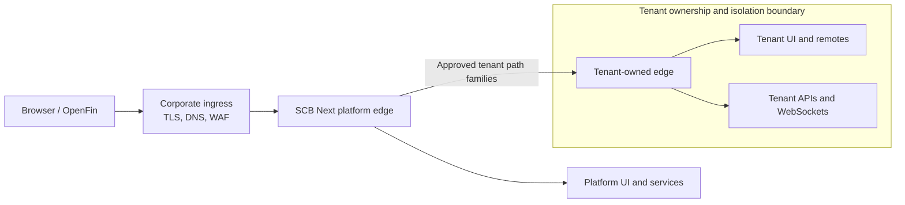

# SCB Next tenant onboarding guide

This guide takes an independently owned business application from intake to an
SCB Next portal production decision. It applies to a Ratan-style application
tenant with its own frontend and backend workloads. A customer that only needs
configuration, identity groups, entitlements, and data partitioning should use
the lighter business-customer process instead of provisioning another tenant
edge and Kubernetes boundary.

The onboarding processor is generate-only. It creates a reviewable tenant
descriptor, rerunnable public input file, and tenant-specific checklist. It does
not create repositories, identities, secrets, namespaces, routes, workloads,
DNS, or production resources.

## Architecture contract



The platform owns ingress, the platform edge, and the small delegation contract.
The tenant owns route precedence, rewrites, caching, WebSockets, upstream names,
health, releases, and support inside its boundary. Tenant application services
remain private `ClusterIP` services and must not bypass either edge.

## Roles

| Role                    | Accountable for                                                                             |
| ----------------------- | ------------------------------------------------------------------------------------------- |
| Business owner          | Business capability, users, funding, criticality, go-live, and data obligations             |
| Tenant engineering      | Application source, remote contract, APIs, tests, releases, and support                     |
| Platform engineering    | Portal composition, path allocation, platform-edge delegation, and compatibility            |
| SRE                     | Namespace or cluster controls, capacity, observability, availability, rollout, and recovery |
| Security/IAM            | Identity, entitlements, workload identity, secrets, network policy, audit, and approvals    |
| Data/integration owners | Databases, messaging, downstream APIs, retention, backup, and connectivity                  |

One named person or approved group must accept each role before production
activation. A shared chat channel alone is not accountable ownership.

## Before starting

Run from `scb-next`. Install Bash 3.2 or newer. For non-interactive generation,
copy the public example outside the generated directory and replace every value:

```bash
cp devops/tenant-onboarding/tenant.env.example /tmp/alpha-payments.env
npm run tenant:onboard -- --non-interactive \
  --input /tmp/alpha-payments.env \
  --output-dir /tmp/scb-next-tenants
```

For the guided eight-stage journey:

```bash
npm run tenant:onboard
```

Interactive progress is saved under the ignored
`devops/tenant-onboarding/generated/` directory. The wizard never asks for a
credential. `SECRET_REFERENCES` accepts approved provider references such as
`vault:path`, `externalsecret:name`, or `csi:object`; use `none` when the tenant
has no secret dependency.

## Stage 1: Tenant identity and business ownership

Choose one immutable lowercase tenant ID. It becomes the Kubernetes label,
namespace suffix, path component, observability dimension, and evidence key.
Record the display name, business owner, technical owner, support contact,
business capability, criticality, expected users, funding, and data
classification in the onboarding ticket.

Exit criterion: ownership and the distinction between an application tenant and
a configured business customer are approved.

## Stage 2: Environment and Kubernetes isolation

Choose `namespace-per-tenant` by default for production. A shared namespace is
valid only when platform governance accepts the same administrative and data
trust boundary. Use a dedicated cluster when regulation, blast radius, or
administrative isolation requires it.

The environment overlay must eventually define RBAC, workload identities,
quotas, limit ranges, admission policies, default-deny NetworkPolicy, approved
DNS and egress, secret-provider bindings, cost labels, and audit retention.

Exit criterion: platform, SRE, and security approve the isolation model and
resource ownership.

## Stage 3: Portal routes and frontend composition

Reserve `/api/<tenant-id>/` and `/static/<tenant-id>/` as same-origin path
families. The platform edge delegates those families without learning tenant
internal service names. Define the Module Federation remote name and canonical
`remoteEntry.js` path, navigation entry, feature flags, entitlements, OpenFin
behavior, and any FDC3 intents or contexts.

Remote entry responses must require revalidation or disable storage. Only
versioned or content-hashed assets receive immutable caching.

Exit criterion: platform engineering approves unique paths, remote compatibility,
navigation, entitlements, and cache behavior.

## Stage 4: Frontend and backend workloads

Publish UI and API images by immutable digest with provenance, signatures,
SBOMs, and vulnerability results. Define the tenant edge, frontend remote, API
service, WebSocket paths, probes, resource requests and limits, replicas,
topology spread, disruption budgets, autoscaling, and shutdown behavior.

Exit criterion: each release unit can deploy and roll back independently without
restarting the platform edge or another tenant.

## Stage 5: Identity, entitlements, and secrets

Map authenticated identity claims to approved tenant groups and feature-level
entitlements. Define service-to-service workload identities and least-privilege
RBAC. Store only secret-provider references in Git; create and rotate secret
values through the enterprise provider and dual-control process.

Exit criterion: authenticated positive and negative authorization cases pass,
including cross-tenant denial and audit evidence.

## Stage 6: Data and external dependencies

Inventory databases, schemas, caches, object stores, Kafka/Solace/MQ topics,
notification systems, downstream APIs, certificates, DNS, and egress. Assign an
owner, environment, data classification, timeout, retry policy, health behavior,
and recovery procedure to each dependency. Prove tenant data segregation at the
storage and API layers.

Exit criterion: every runtime dependency is approved, observable, and exercised
without using fixture evidence as a production substitute.

## Stage 7: Service objectives and operations

Agree availability and latency objectives, traffic and storage forecasts,
alert thresholds, on-call rotation, dashboards, synthetic journeys, audit
retention, backup schedule, RTO, RPO, regional behavior, and incident routing.
All telemetry must carry the tenant ID without exposing protected data.

Exit criterion: load, failover, backup/restore, alert, and diagnostic evidence is
reviewed by SRE and the tenant team.

## Stage 8: Review, activation, and handoff

Generate the bundle and review `tenant.yaml` as the source contract. Complete the
tenant-specific checklist with links to unedited evidence. Provision and verify
tenant resources before changing shared routing. Activate platform-edge
delegation last, then run authenticated browser, API, remote, WebSocket, and
business journeys through the public entry point.

Rollback proceeds in the opposite order: remove or restore platform delegation
first, verify platform and other tenants, then roll back or remove tenant
resources. Record hypercare dates and do not close onboarding until steady-state
support accepts ownership.

## Required verification

The existing SCB Next gates remain mandatory:

```bash
npm run ops:verify-static
SCB_NEXT_K8S_OVERLAY=<tenant-aware-production-overlay> npm run k8s:validate:production
```

Additionally retain evidence for real identity and authorization, data
segregation, production-CNI positive and negative policies, image admission,
WebSockets, authenticated portal journeys, load, multi-zone failure,
backup/restore, tenant-edge outage containment, rollback, and support alerts.
Minikube and mocks are learning and routing evidence only.

## Offboarding

Offboarding is designed during onboarding. Freeze new access, remove platform
delegation, preserve required data and audit records, revoke identities and
secret access, stop workloads, remove DNS and alerts, release infrastructure,
and close cost allocation. Destructive actions require the same production
change controls as activation.

Use [TENANT_ONBOARDING_CHECKLIST.md](TENANT_ONBOARDING_CHECKLIST.md) as the
master checklist and the generated checklist as the tenant-specific evidence
record.
