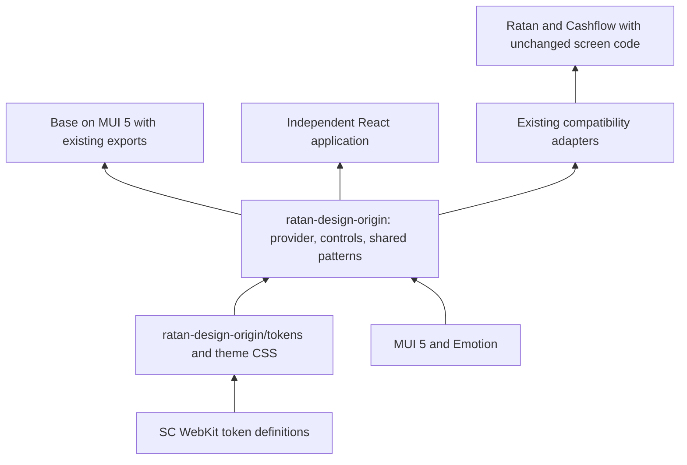

# Standalone SCB UI package: analysis and migration plan

Status: Stage 1 MUI 5 restoration and Stage 2 package foundation / first
vertical slice implemented. Shared patterns, remote-adapter integration and
release governance remain pending. Current verification and limitations are recorded in
[UI_PACKAGE_IMPLEMENTATION.md](UI_PACKAGE_IMPLEMENTATION.md).

Source inspected: `scb-next/web/mfe-base-origin`, sibling SCB applications,
workspace dependency policy, Storybook, and existing theme/token code.
Plan date: 2026-09-16. Decisions updated: 2026-09-17.

## Goal and decisions

Create an independently consumable React design-system library that owns shared
visual styles, component behavior, and UX conventions. Applications should use
the library without importing the Base application or requiring its store,
authentication, services, router, analytics, or federation runtime.

Confirmed decisions:

- Ship one standalone package named **`ratan-design-origin`**, proposed location
  `scb-next/packages/ratan-design-origin/`. Tokens and React UI have separate
  entry points within this package rather than separate published packages.
- Use **Material UI 5** in the library and **downgrade Base from MUI 9 to MUI 5**.
  Existing MUI 5 consumers must not need a MUI major upgrade.
- Make extraction transparent to existing consumers: preserve their imports,
  props, exported types, callbacks, defaults, and observable behavior. Central
  integration changes are owned by this migration, not delegated to app teams.
- **SC WebKit tokens are the long-term source of design values; preserve legacy
  styling during migration.** Do not force a visual redesign or flag change.

MUI version alignment is necessary but does not prove transparency. Existing
compatibility adapters differ from Base's implementation; preserve those
contracts and verify unchanged consumer fixtures before claiming completion.

Working assumptions pending the other questions:

- Preserve the current appearance and behavior during extraction; introduce
  visual changes as separately reviewed token/component changes.
- Target SCB applications first, but prove consumption by an independent React
  application installed from a packed package.
- Use versioned package releases and controlled application upgrades. Central
  ownership does not mean every deployed application changes immediately.
- Confirm registry and release owner before release; package name is decided.

Runtime-wide immediate updates remain a separate distribution decision. Package
installation, adapter wiring, builds, and deployment still happen centrally;
transparency means existing application code and behavior remain compatible.

## Findings from the repository

| Evidence | Finding | Consequence |
| --- | --- | --- |
| `web/mfe-base-origin/src/root.tsx` | UI exports coexist with mounting, services, dispatchers, router, analytics, and application state. | A standalone package needs a new entry point; publishing this barrel would publish the application contract. |
| `web/mfe-base-origin/vite.config.ts` | This source is a Vite federation host sharing React and ReactDOM, not the root repository's older SystemJS setup. | Plan against SCB's current build and deployment configuration. |
| `web/mfe-base-origin/src/components/` | 42 nonempty component directories contain both reusable controls and portal features. | Classify by dependency and behavior, not directory name. |
| `web/mfe-base-origin/src/components/Button/index.tsx` | Button currently passes through MUI props and children. | Central styling belongs primarily in the theme; avoid manufacturing wrapper logic with no shared behavior. |
| `web/mfe-base-origin/src/theme/Config.ts` | Central MUI defaults and overrides already exist. | Extract and refine this existing design policy. |
| `web/mfe-base-origin/src/theme/index.tsx` | Theme selection reads user/token state and changes document classes/body styles during memoized computation. | Keep authentication policy in Base; give the library explicit theme inputs and controlled style effects. |
| `web/mfe-base-origin/src/theme/config/utils.ts` | `getTheme` reads `window.location.search` for `new-layout`. | Parse application URLs outside the library; make the theme factory pure. |
| `web/mfe-base-origin/src/new-styles/` and `theme/config/color*.ts` | Semantic aliases use SC WebKit variables; legacy aliases are retained. | Reuse this migration path; do not invent a competing color palette. |
| `web/mfe-base-origin/src/theme/config/light.ts` and `dark.ts` | MUI palette and many overrides still use literals; token adoption is partial. Baseline styles also lock body scrolling and text selection. | Full central control requires auditing remaining literals and separating portal-wide CSS from library defaults. |
| `web/mfe-base-origin/src/@types/index.d.ts` | Custom MUI theme types refer back into Base. | Ship declarations with the package; keep portal-only theme extensions in a temporary adapter. |
| `web/mfe-base-origin/src/components/Dialog/common/useController.ts` | Dialog reads workspace state, sends analytics, queries portal tab containers, and manipulates modal stacking. | Extract dialog presentation/interaction behind explicit props; leave workspace and telemetry decisions in Base. |
| `web/mfe-base-origin/src/components/Table/common/interface.ts` | Table uses `AdminRecord` plus verify/deactivate/save workflows. | This is an admin feature, not yet a generic data-grid component. |
| `web/mfe-base-origin/src/components/Snackbar/index.tsx` | A ReactNode-typed message is stringified and sanitized as HTML. | Specify text/React content versus legacy HTML behavior before publishing a public contract. |
| `web/mfe-base-origin/src/components/ScWebkit/index.tsx` | Web components use dynamic registration and browser globals. | Keep registration out of the core entry point; treat wrappers as an optional integration. |
| `scripts/verify-dependency-isolation.mjs`, `.npmrc`, application manifests | Before this migration, Base uses MUI 9; Ratan/Cashflow use MUI 5 with nested installation. | Downgrade Base; verify supported MUI 5 versions and update the check after downgrade. Do not infer compatibility from major alignment alone. |
| Ratan/Cashflow `vite.config.ts` and `src/compat/base.tsx` | `@fm/base` resolves to local compatibility implementations; Cashflow imports Base theme source directly, while Ratan constructs a simpler theme. | Updating Base exports alone will not migrate consumers or unify their UI. |
| `web/mfe-alpha-payments-origin/package.json` and `src/styles.css` | Alpha uses React and custom CSS with host theme-variable fallbacks. | It is a possible second consumer without a MUI 5 migration, but adds a MUI dependency and requires deliberate UX comparison. |
| `web/mfe-base-origin/stories/`, `.storybook/`, `vitest.config.ts` | Storybook and component tests already exist; coverage thresholds are 90% lines/branches. | Move relevant stories/tests and add public-interface checks rather than rebuilding documentation from scratch. |
| `scb-next/package.json` | Workspace membership and build order are explicit. WebKit dependencies use local `file:` overrides. | Add package workspaces and dependency-ordered builds; prove release artifacts work without sibling-source paths. |

The repository also contains an independent `@fm/ratan-design-legacy` package in
`mvp/two-layer-federation/realworld/packages/ratan-design`. Its current manifest
uses React Aria rather than MUI. Reuse useful packaging/testing conventions, but
do not merge these design systems as an incidental part of extraction.

### Analysis limitations

During the documentation-only analysis, GitNexus reported a stale index.
The required refresh was attempted but failed
with an inconsistent `const_fts` index; a flow query also failed. Findings above
are based on direct source and import inspection, not a validated graph blast
radius. Repair/rebuild the index and run symbol impact analysis before editing
functions, classes, or methods. This repair and rebuild subsequently succeeded
before implementation; see the implementation record for current impact and
verification evidence. Historical audit test results are not treated as
current verification.

## Target design

Ship one package containing two modules with separate interfaces:

1. **`ratan-design-origin/tokens`**: framework-independent semantic color, typography, spacing,
   radius, shadow, focus, and layering roles; explicit light/dark theme CSS.
   SC WebKit owns primitive values. This module owns the application-facing
   semantic mapping and only adds centrally defined roles where WebKit has gaps.
   Legacy aliases live in a clearly marked compatibility export.
2. **`ratan-design-origin`**: React provider, branded MUI 5 theme, selected controls,
   and reusable interaction patterns. MUI 5 and Emotion remain supported
   implementation dependencies. Preserve existing consumer contracts through
   adapters and expose useful MUI 5-compatible props; do not promise
   that consumers can later switch rendering libraries without API migration.

Date pickers and Pro date ranges use dedicated entry points with appropriate
optional peers; core consumers must not load those integrations. Keep the first
release as one package. Do not expand the published package set without a
demonstrated packaging need and a revised plan.

The important seam is **explicit presentation inputs and interaction callbacks**.
For example, a dialog receives open state, content, actions, close callbacks, and
an optional container. Base translates workspace state and records telemetry.
Do not move the Base store into a new shared provider merely to make extraction
compile.

### Theme and styling contract

- The library receives explicit mode and design-generation inputs. Base retains
  login-dependent dark-mode selection, query flags, persistence, and appearance
  subscriptions. Preserve the existing `newStyles=false` default in its adapter.
- Maintain `legacy` and `webkit` visual baselines during migration. An adapter
  maps existing flags to the new interface; choose the new package's default
  explicitly in the specification rather than silently changing Base.
- Make date localization independent of the core theme provider; ordinary
  buttons must not load date-picker code.
- Scope theme CSS to a documented root. Application-wide reset/body rules are
  explicit opt-ins owned by the host. Do not erase unrelated document classes.
- Define how portal-rendered menus/dialogs inherit theme variables, how a
  container is selected, and how multiple themed roots coexist.
- Replace `process.env.MFE_APP_PREFIX_STYLE` dependencies with stable package
  classes and internal slot names. Keep old selectors in compatibility adapters
  only where consumer inspection proves they are needed.
- Move theme augmentation into emitted declarations and test it in an external
  TypeScript consumer. Do not expose Base-derived types through the package.
- Audit MUI color manipulation before feeding CSS variable strings into palette
  operations. Use a supported theme-variable approach for the installed version;
  validate contrast, hover, disabled, and alpha-derived colors in both modes.
- Keep tokens canonical; application overrides use documented slots/variants
  and semantic roles. Review exceptions so raw `sx` values do not recreate drift.

MUI supports centralized defaults/overrides and brand themes; the proposed theme
module follows those existing mechanisms rather than duplicating them.
[Themed components](https://mui.com/material-ui/customization/theme-components/),
[Extensible themes](https://mui.com/material-ui/guides/building-extensible-themes/).

### Packaging and runtime contract

- Publish ESM and TypeScript declarations with an explicit export map and stable
  documented imports. Only add CommonJS if an identified consumer needs it.
- Keep React/ReactDOM, MUI, and Emotion external to the library build; declare
  tested peer ranges for React 18 and MUI 5, including the existing consumers'
  resolved versions. Do not silently require an untested newer MUI 5 minimum.
  Externalize subpath imports too; do not bundle a second React or MUI runtime.
- Expose CSS explicitly and mark its side effects correctly. Root imports must
  not mount applications, register web components, read storage, or access DOM
  globals. Core imports must not pull in Pro pickers, admin code, or services.
- Resolve WebKit distribution: consume approved published token assets, or
  produce a versioned stylesheet from the canonical WebKit build. The packed
  UI package must not depend on repository-relative `file:` paths or an
  unpublished sibling checkout. Include required fonts/assets reproducibly.
- Build packages before applications; plain workspace iteration is not a
  substitute for dependency ordering. Keep the lockfile and isolation check.
- Keep UI libraries application-local initially, matching the existing SCB
  policy. Each application configures its provider from explicit appearance
  data. Do not rely on React singleton sharing to imply shared MUI/Emotion
  context identity. Test style insertion and portal theming across remotes.
- If runtime sharing is selected later, treat it as a separate distribution
  adapter with compatible dependency versions, rollout rules, and rollback.
  MUI 5 and MUI 9 must not be forced into one singleton share.

Vite library mode supports the build shape and external dependencies; Module
Federation's shared configuration controls dependency negotiation separately.
[Vite library build options](https://vite.dev/config/build-options),
[Federation shared dependencies](https://module-federation.io/configure/shared).

## Extraction inventory

| Group | Candidates | Required work |
| --- | --- | --- |
| First slice | Theme/tokens, Button, LoadingButton, Input, Select | Remove application environment assumptions; specify defaults, refs, labels, loading, errors, and disabled behavior. |
| Next controls | SearchInput, SearchButton, ResetButton, ToggleButton, Label | Align with core control contracts; retain useful composed behavior and centralize redundant styling. |
| Search patterns | SearchGrid, SearchCondition, SearchConditionContainer, BuilderButton | Document state ownership, wrapping/responsiveness, keyboard behavior, and composition. |
| Feedback | Loader/PageLoader, Snackbar | Replace portal types with package-owned types; define accessible status and notification content contracts. |
| Date controls | DatePicker, DateTimePicker, TimePicker; DateRangePicker separately | Own localization configuration and date types; avoid imposing Pro imports on core consumers. |
| Requires separation | Dialog, ErrorBoundry/FallbackError, Splash, Empty, TabItem/TabPanel | Extract reusable presentation only; retain workspace, error reporting, navigation, and loading orchestration in adapters. |
| Remain in Base initially | AppBar, Avatar/Profile, Drawer/NewTile/Tile, Switch/SwitchTime, Time, Timeout, Survey/SurveyButton, Version | These names represent portal-specific behavior. Pure visual pieces may move when a second use case is demonstrated. |
| Remain feature modules | Table, TableDetail and admin editors/actions | Preserve admin workflows; design a generic table interface separately if required. |
| Optional integration | ScWebkit wrappers and ReactWrapper | Specify explicit custom-element registration/events and browser-only loading independently of core UI. |

Retain old Base namespace/default exports and existing `@fm/base` resolution
through adapters. The new standalone entry point can use named exports without
requiring existing consumers to change imports. Preserve existing typos, prop
translations, and exported types in the compatibility interface. Do not remove
these supported interfaces as part of extraction.

## Delivery stages and exit criteria

| Stage | Deliverables | Exit criteria |
| --- | --- | --- |
| 0. Specify and baseline | Confirm remaining decisions; record component contracts, consumer imports, dependency versions, visual states, and release ownership. Repair GitNexus and inspect impact for selected symbols. | First-slice scope is explicit; current tests/typecheck/build/Storybook results and known failures are recorded; legacy/WebKit screenshots captured. |
| 1. Restore Base to MUI 5 | Select a compatible Material/icons/MUI X/Emotion matrix; adapt current Base source using pre-upgrade history as a reference; retain unrelated improvements. | Base typecheck, tests, production build, Storybook, and integrated flows pass; consumer dependency versions and screen code are unchanged. |
| 2. Package foundation and first vertical slice | Scaffold `ratan-design-origin` with token/UI entry points, CSS/assets, declarations, Storybook, and clean-install fixtures. Extract theme, Button, LoadingButton, Input, Select behind existing adapters. | Package works without Base; unchanged consumer fixtures and a standalone app render the controls; legacy/WebKit light/dark baselines and type/ref contracts pass. |
| 3. Shared patterns | Feedback/search/date controls in batches; decouple Dialog with explicit container and event contracts. | Each promoted component has public-interface tests and documented states; existing Base behavior remains verified. |
| 4. Transparent application integration | Redirect existing Base exports and Ratan/Cashflow adapters to the library; replace cross-app theme imports centrally; preserve application-facing contracts. | No business-screen/import/prop changes or consumer MUI upgrade; old contracts compile and behave identically in standalone and federated flows. |
| 5. Release and governance | Versioning/changelog process, ownership, contribution guide, visual review, dependency constraints, deprecations, and upgrade instructions. | A reproducible versioned release can be consumed and rolled back; each migrated surface has one maintained implementation. |

The first useful implementation milestone is **Stage 2**, not extraction of all
42 directories. It proves central visual policy, reusable behavior, packaging,
and real adoption before tackling portal-specific complexity.

Use specification-first, test-first implementation for changed behavior. Run
GitNexus impact before symbol edits, report high-risk findings, and perform
change-scope analysis plus a focused commit for each verified stage.

### Base downgrade and compatibility proof

Use commit history to identify MUI-specific upgrades and adapt the current code
selectively. Do not revert the Base directory wholesale: subsequent changes
include token support, typing improvements, and other unrelated fixes.

The pre-upgrade manifest at `54319977` declared Material/icons `^5.15.0`,
MUI X Data Grid/Pro pickers `^6.18.7`, and React `^18.2.0`. Existing Ratan and
Cashflow manifests declare Material `^5.10.13` and icons `^5.10.9`. These are
historical/declaration references, not a verified final dependency matrix.
Inspect lockfile resolutions and actual API usage before selecting versions.
MUI X has its own compatibility history: choosing Material 5 does not mean
setting every `@mui/*` dependency to major 5.

Inventory Base's newer slot APIs, Grid usage, icons, theme types, and date/grid
callbacks. Adapt them inside Base and the new package. Preserve modern Vite,
Vitest, Storybook, SC WebKit integration, and existing consumer behavior.

Create unchanged-consumer fixtures before rewiring. Cover named and namespace
exports, prop/type compatibility, refs, callback arguments, loading/disabled
states, dialog sizing/close behavior, theme extensions, and relied-on selectors.
Where existing Ratan/Cashflow adapters intentionally differ from Base, retain
their behavior in small adapters rather than impose Base's defaults.

Update dependency-isolation expectations from Base 9/remotes 5 to the verified
MUI 5 matrix after downgrade. Do not change federation sharing merely because
the majors now match. Test provider identity, style ordering, portal containers,
and supported browsers in the actual integrated applications.

Any case requiring a consumer API edit fails this migration's acceptance
criterion. Resolve it centrally or record it as an unresolved blocker; do not
quietly reclassify it as a required consumer migration.

## Verification and central UX ownership

- **Public behavior:** accessible labels, keyboard/focus movement, dialog
  Escape/close/drag behavior, input validation states, select interaction,
  loading/disabled controls, and notification announcements. Maintain the
  repository's greater-than-90% line and branch coverage requirement for the
  extracted implementation; coverage is not a substitute for these checks.
- **Transparent consumption:** compile captured consumer usages without edits;
  run their interaction tests through the preserved adapters; inspect the diff
  for business-screen or consumer API changes. Matching MUI majors alone does
  not satisfy this gate.
- **Visual regression:** legacy/WebKit × light/dark; narrow/wide layouts;
  hover/focus/disabled/error/loading; overlays and multiple themed roots. Fix
  focus visibility explicitly: current theme overrides suppress outlines. Any
  intentional accessibility correction must be specified and tested separately
  from the extraction baseline rather than hidden in the downgrade.
- **Packaging:** clean tarball installation, declaration checking, explicit CSS
  loading, packaged fonts/assets, import without DOM globals, and bundle checks
  proving that a Button import excludes date/grid/admin/WebKit registration code.
- **Integration:** run the SCB stack at `http://localhost:8001`; sign in, open
  New Tile, render a tile, switch theme, exercise a form/dialog, and remove the
  workspace tab. Extend `tests/e2e/federation.spec.ts` for adopted surfaces.
  Verify production builds as well as development rendering.
- **Compatibility/performance:** run dependency isolation after installation,
  test separate MUI roots, record bundle/render baselines, and use representative
  interactions to validate the repository's performance targets. Set numeric
  bundle budgets from measured baselines rather than inventing them now.
- **Governance:** move reusable documentation into package Storybook. Assign
  design and engineering owners; review token and interaction changes centrally;
  document allowed variants, error/empty/loading states, and responsive rules.
  Enforce the library's independence from application source. Existing consumer
  import paths remain supported through adapters; new usages can import the
  standalone package directly.
- **Rollback:** pin a previous package version and rebuild the affected app;
  preserve existing style flags and legacy adapters until adoption is verified.
  Do not retire compatibility exports under the transparent-migration scope.

## Remaining decisions

The following were asked during analysis and remain assumptions until answered:

1. SCB-first reusable library or multi-repository release infrastructure from day one?
2. Versioned upgrades, runtime-wide updates, or both distributions?

Before release, also select the registry and accountable owners.
Before optional extraction, confirm whether Pro date ranges, admin grids, and
portal-shell presentation belong in the initial supported catalog. These do not
block specifying or validating the initial theme-and-controls slice.
