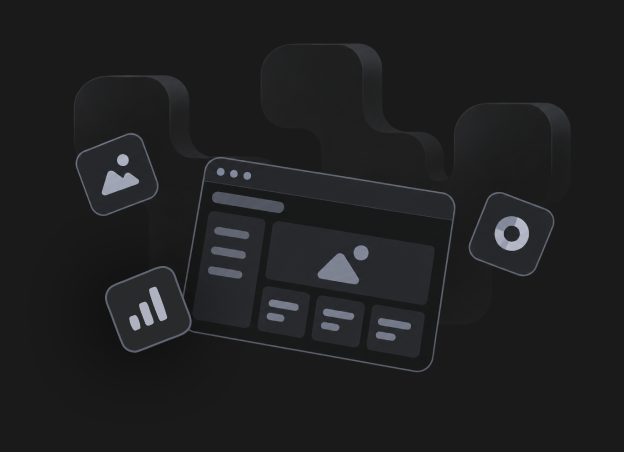

# Portal prototype asset catalog

Prepared: 2026-10-05. Stage 1 asset preparation. All 14 supplied PNGs were inspected at their native **1512 × 982** dimensions. This catalog separates usable complete assets from partial decorative reference regions so an incomplete raster cannot silently become a claim of 1:1 fidelity.

The [machine-readable manifest](../src/new-styles/assets/manifest.json) records every reference filename, SHA-256, dimensions, crop rectangle, output SHA-256, and decoded-pixel hash. Coordinates are source pixels; rectangles are **[left, top, width, height]**, with exclusive right/bottom bounds. Extracted PNGs preserve source pixels exactly: no resizing, retouching, recoloring, masking, inferred pixels, or generated artwork was used. Controls, labels, and other interactive content remain real UI.

## Existing assets to reuse

| Role                       | Existing source                                                                                | Dimensions / use                                                                                                                                                                             |
| -------------------------- | ---------------------------------------------------------------------------------------------- | -------------------------------------------------------------------------------------------------------------------------------------------------------------------------------------------- |
| MO1 logo on light surfaces | `src/components/AppBar/mo1_logo_light.svg`                                                     | 1411 × 233 SVG viewport; dark wordmark and colored icon. Use for the white login pane.                                                                                                       |
| MO1 logo on navy surfaces  | `src/components/AppBar/mo1_logo_dark.svg`                                                      | 1411 × 233 SVG viewport; white wordmark and colored icon. Use for the navy shell in both themes.                                                                                             |
| Navy shell gradient        | `src/theme/config/background-light.png`                                                        | 5600 × 384. The filename is a legacy mode mapping; the image is navy. The supplied dark shell uses a different navy tint, which must be verified when applying its semantic theme treatment. |
| Dashed shell edge pattern  | `src/theme/config/pattern.png`                                                                 | 428 × 536 transparent PNG. Preserve its aspect ratio and existing edge placement/mirroring behavior.                                                                                         |
| SC Prosper Sans            | `scb-next/packages/ratan-design-origin/assets/fonts/SCProsperSans-{Regular,Medium,Bold}.woff2` | Reuse shared font assets and verify the real font URLs load before fixing typography measurements. PNGs do not identify their original font metadata.                                        |

The MO1 SVGs contain vector wordmark paths and an embedded raster brand icon; scaling the SVG does not make that embedded icon an original vector. Do not use the existing `portal-text-*.png` wordmarks, which say “FMO Post Trade Portal”. The existing `background-dark.png` is white/grey and does not match either supplied branded shell. The old login SVG, empty-state SVG, and root-config tile artwork differ from the prototypes.

## Complete native decorative crops and fixture

Files below are in [`src/new-styles/assets`](../src/new-styles/assets/).

| Output                           | Source frame | Rectangle            | Readiness                                                                                                                                                                   |
| -------------------------------- | ------------ | -------------------- | --------------------------------------------------------------------------------------------------------------------------------------------------------------------------- |
| `empty-workspace-dark.png`       | 04           | [450, 180, 624, 452] | Complete illustration and shadow, with native surrounding space on opaque `#1a1a1a` workspace backing. All four crop edges equal the flat backing; no shadow was cut.       |
| `tile-chevron-light.png`         | 18           | [760, 302, 152, 75]  | Complete visible Trade Blotter chevron motif on the light card backing. Title, action, and bottom border excluded. Place at bottom-right at native size inside a real card. |
| `tile-chevron-dark.png`          | 17           | [760, 302, 152, 75]  | Complete visible Trade Blotter chevron motif on the dark card backing. Same placement as light.                                                                             |
| `profile-portrait-reference.png` | 08           | [382, 314, 118, 120] | Fixture only: reference photo with baked circular border and outside-corner pixels. Clip circularly for visual tests. Production must retain live photo/fallback behavior.  |

The extracted portrait improves the available 80 × 80 fixture to its native profile dimensions. It is still a raster fixture, not a sufficiently large production photo or a transparent portrait export. In the dark profile reference the ring is dark; use the fixture as photo content inside the profile’s real theme-aware clipping/ring rather than treating its baked light ring as production styling.

## Exact partial decorative regions

These contain unobscured decorative pixels and no interactive content. They are reference details, not complete export replacements. Incomplete areas cannot be stretched, repeated, or inferred while claiming a direct 1:1 match.

| Output(s)                                     | Source frame(s) | Rectangle             | Coverage and placement                                                                                                                               |
| --------------------------------------------- | --------------- | --------------------- | ---------------------------------------------------------------------------------------------------------------------------------------------------- |
| `login-hero-light-top.png`                    | 11              | [690, 0, 822, 736]    | Clean top of the 822 × 982 login hero. The bottom 246 pixels include live copy in the source and cannot be recovered as a complete clean background. |
| `profile-banner-{light,dark}-center.png`      | 08 / 14         | [356, 242, 800, 72]   | Clean full-width band at local banner offset (0, 39), within the reference’s 800 × 156 banner.                                                       |
| `profile-banner-{light,dark}-lower-right.png` | 08 / 14         | [500, 242, 656, 117]  | Clean lower-right rectangle at local banner offset (144, 39). Top title/close and lower-left overlapping portrait prevent a complete export.         |
| `drawer-pattern-{light,dark}-upper-right.png` | 18 / 17         | [912, 154, 588, 290]  | Clean drawer-body rectangle at local offset (295, 0). Body begins at (617, 154); scrollbar is excluded.                                              |
| `drawer-pattern-{light,dark}-lower-right.png` | 18 / 17         | [1190, 760, 310, 222] | Clean body rectangle at local offset (573, 606). Category/card content obscures other regions.                                                       |
| `tile-wave-{light,dark}.png`                  | 18 / 17         | [782, 451, 123, 140]  | Wave detail from Cashflow [FX & Equity]. Top/right pixels are omitted to avoid the baked card corner; this is not the complete pattern.              |
| `tile-dots-{light,dark}.png`                  | 18 / 17         | [1094, 451, 89, 140]  | Dotted detail from Cashflow [Open Search]. Top/right pixels are omitted to avoid the baked card corner; some lower-left dots fall outside the crop.  |
| `tile-rings-{light,dark}-upper.png`           | 18 / 17         | [817, 617, 88, 92]    | Clean upper arc from Group Blotter. Its lower arc is covered by location controls in every supplied example.                                         |

Every card fragment keeps its opaque reference card backing. Its placement depends on the same card surface color; no transparency or missing pattern has been invented. CSS controls and a clipped semantic bottom accent must supply the card shape, title, launch affordance, and border. The location-enabled chevron card covers part of its motif with controls; its clean Trade Blotter counterpart supplies the unobscured visible chevrons.

## Reference state mapping

| Frames       | State                                     | Asset basis                                                                                                                        |
| ------------ | ----------------------------------------- | ---------------------------------------------------------------------------------------------------------------------------------- |
| 11           | Login, light form pane                    | Existing light-surface logo; partial light login hero. No dark login counterpart supplied.                                         |
| 04           | Empty workspace, dark despite filename    | Existing navy shell assets; complete dark illustration crop. No light empty counterpart supplied.                                  |
| 05           | Cashflow workspace, dark                  | Existing shell assets; Cashflow remains real tenant content.                                                                       |
| 06 / 17 / 18 | Drawer dark / dark / light                | Theme-specific background and card decorative regions. Drawer assets in 06 match the visible set in 17; tenant backgrounds differ. |
| 07 / 13      | Avatar menu, light / dark                 | Existing shell assets and real UI menu; no screenshot imagery required.                                                            |
| 08 / 09 / 10 | Profile light, collapsed / role / actions | Light banner details and photo fixture; banner relative geometry is shared across collapsed and expanded states.                   |
| 14 / 15 / 16 | Profile dark, collapsed / role / actions  | Dark banner details and same identity photo; real dark ring and UI surfaces.                                                       |

## Responsive and theme readiness

The logos, shared fonts, and transparent dashed shell pattern can support responsive layouts. The 5600px shell gradient has enough native width for the reference and wider desktop layouts, but its placement/tint still needs direct source comparison. The complete empty illustration can scale down with its aspect ratio intact; enlarging beyond native size cannot provide additional detail. Its flat backing is exactly `#1a1a1a`; a different dark surface or light theme exposes a rectangle unless the original transparent artwork is supplied or a documented visual adaptation is accepted.

Only light login art, dark empty art, and desktop references were supplied. There is no original source for dark login, light empty, or mobile artwork. Theme variants must be documented adaptations using semantic surfaces; they must not be described as direct prototype matches. Partial login/profile/drawer crops do not provide clean full-size backgrounds for any viewport. Do not fill missing regions with unrelated shell gradients and call the result pixel-exact.

The remaining source dependencies for complete 1:1 artwork are:

1. Original clean login hero background, covering the full 822 × 982 reference region, preferably a vector or higher-resolution export.
2. Original clean 800 × 156 profile banner in light and dark variants, without title, close icon, or overlapping portrait.
3. Original clean drawer body artwork in both themes, covering the 883 × 828 visible decorative body excluding its scrollbar.
4. Full clean wave, dotted, and ring card patterns in both themes. Rounded corners, borders, titles, and actions should remain CSS/UI.
5. Original transparent empty illustration plus a light counterpart, or an explicitly documented light adaptation. A larger original photo would improve enlarged visual fixtures if exact profile scaling is required.

These dependencies do not prevent implementing the appearance resolver, semantic tokens, responsive geometry, interactions, or the shell/header. They do prevent honestly marking obscured/scalable artwork as fully matched.

## Inspection and verification

- Confirmed all 14 source images are 1512 × 982 at native pixel scale; their independent file hashes are recorded.
- Extracted 19 PNGs and checked every output’s decoded RGBA bytes against its source rectangle: exact equality for every pixel.
- Inspected all supplied frames and output decorative regions; title/action content is excluded from decorative crops. The photo fixture intentionally includes its native baked clipping/ring and is explicitly fixture-only.
- Confirmed the complete empty crop includes its full visible artwork and shadow by bounding non-backing pixels: source bounds x=461…1020, y=223…622; every crop edge stays the flat `#1a1a1a` surface.
- Existing source files and symbols were not modified. Production imports and browser rendering are verification work for the stages that consume these assets.

Manifest integrity is independent of the visual screenshot suite: the suite must compare real UI regions to supplied source frames and must never update source references from application output.
