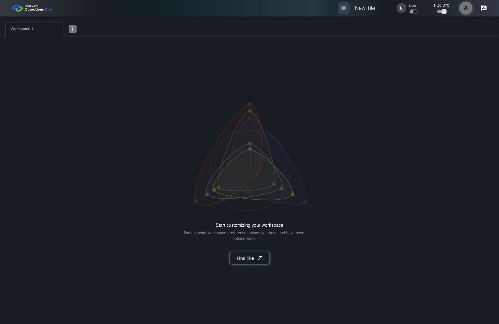
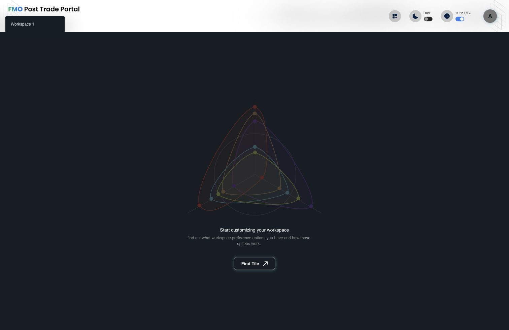
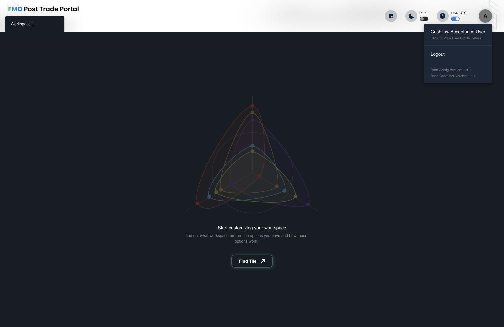
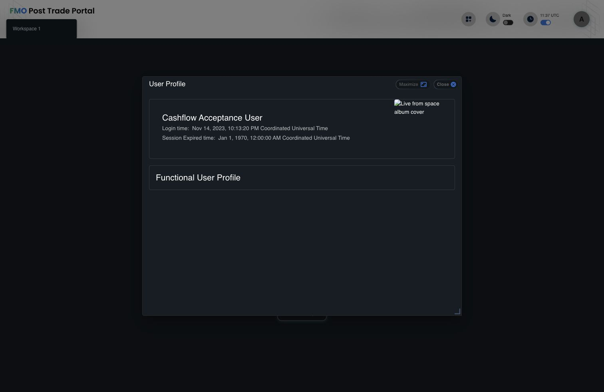
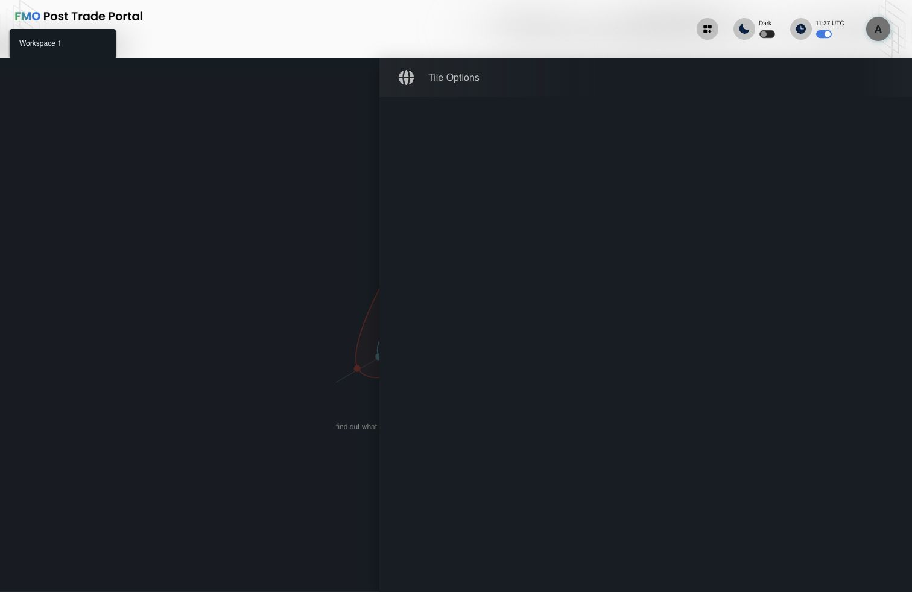
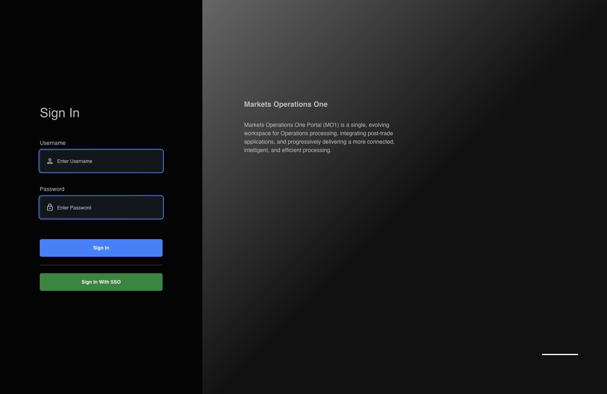

# Portal prototype comparison and implementation plan

Date: 2026-10-05. Status: proposed; application code has not been changed.

## Outcome and scope

Recreate the supplied [14 prototype frames](new-styles-prototypes/) in SCB Next Base at their native **1512 × 982** viewport, then adapt the same composition for smaller screens. The existing shell is a partial starting point. Login, empty workspace, avatar menu, profile, and tile drawer require composition changes as well as styling.

Implementation belongs in `scb-next/web/mfe-base-origin`. Base owns the login, workspace navigation, and portal overlays; `scb-next/packages/ratan-design-origin` supplies reusable primitives, icons, and tokens. Keep business-MFE dashboards and Cashflow content as integration backgrounds and regression checks. The Flowzero dashboard/sidebar in these frames is tenant content, not a new Base home screen.

The requested scope includes the tile drawer because Frames 06, 17, and 18 specify it. Authentication, entitlement enforcement, workspace persistence, telemetry, remote loading, and theme/time preferences continue to use their existing controllers.

## Reference inventory

Use rendered content rather than filename suffixes to classify the frames. In particular, **Frame 04 is a dark empty workspace despite its “Light” filename**. There is no supplied light empty-workspace or mobile reference; those adaptations must be documented rather than claimed as direct pixel matches.

| Frames  | Reference state                                | Acceptance surface                                         |
| ------- | ---------------------------------------------- | ---------------------------------------------------------- |
| 11      | Login                                          | White credential/SSO pane, MO1 logo, patterned navy hero   |
| 04      | Empty workspace, dark                          | Shared header, illustration, title, description, Find Tile |
| 05      | Cashflow workspace, dark                       | Header and content boundary; preserve tenant rendering     |
| 06      | Drawer over Cashflow, dark                     | Drawer composition and overlay layering                    |
| 07 / 13 | Avatar menu, light / dark                      | Pointer, identity action, logout, version footer           |
| 08 / 14 | Profile collapsed, light / dark                | Banner, portrait, identity, role rows                      |
| 09 / 15 | Profile role expanded, light / dark            | Scroll region, selected role, nested subjects              |
| 10 / 16 | Profile subject/actions expanded, light / dark | Nested selection and action chips                          |
| 18 / 17 | Drawer over Flowzero, light / dark             | Category/card grid, artwork, launch actions                |

## Current implementation: findings

### Header: partly implemented, still needs completion

[`Home`](../src/pages/Home/index.tsx) already composes a patterned 96px header under `?new-layout=true`. [`AppBar`](../src/components/AppBar/index.tsx) already includes New Tile, theme, UTC/local time, and avatar controls. [`TabItem`](../src/components/TabItem/index.tsx) already substitutes close icons for delete icons in that layout. These actions can be retained.

It does not yet match the supplied header:

- The flagged header imports `portal-text-light.png` / `portal-text-dark.png`, which say **FMO Post Trade Portal**. Correct **Markets Operations One** SVGs exist in AppBar, but that logo is hidden in the flagged layout.
- Prototype header/content boundary is approximately y=94. Current header hardcodes 96px and adds an 18px divider plus an 18px main margin.
- The workspace **+** is explicitly hidden under `new-layout`; every prototype shows it beside the tabs.
- Tabs use fixed 176px width and 12px text. Prototype tabs have content-dependent widths, approximately 14px type, and different active/inactive surfaces.
- Dark-mode flagged controls use dark text/icon colors on the intended navy header. New Tile is circular rather than the prototype rounded square; avatar size/shadow also differs.
- The existing `background-light.png` is navy, while `background-dark.png` is white/grey. Current mode-to-image selection therefore also needs correction; the prototype uses navy branding in both themes.
- The 60% tabs / 40% toolbar split, 360px toolbar minimum, wrapping, and hidden overflow need explicit responsive layout rules.

There is no separate `AppShellHeader` component in this target. Previous prototype-alignment commits `f856db5b` and `3cf6a512` affect the separate `apps/base` app. Its `src/new-layout` can supply implementation ideas, but is not completion of this SCB Next work.

### Screen-by-screen gaps

Measurements below are approximate raster measurements, to be finalized as design tokens during implementation.

| Surface           | Current Base                                                                                                              | Prototype target                                                                                                                                                                                                   | Main files                                                                                          |
| ----------------- | ------------------------------------------------------------------------------------------------------------------------- | ------------------------------------------------------------------------------------------------------------------------------------------------------------------------------------------------------------------ | --------------------------------------------------------------------------------------------------- |
| Login             | 1/3–2/3 split, dark form pane, approximately 306px form, no logo, green filled SSO button, old illustration/tab indicator | Left pane ends at x=690; 490px form at x=100; white pane, large black title, approximately 49px inputs and 48px pill buttons; labeled divider and outlined SSO; hero copy near bottom                              | `pages/Login/index.tsx`, `pages/Login/common/style.ts`, `theme/index.tsx`                           |
| Empty workspace   | Wireframe SVG, small neutral heading, narrow wrapped description, outlined glowing button with arrow                      | Large dark dashboard illustration; blue title; single-line description at desktop; 320 × 48px blue pill “Find Tile” without arrow                                                                                  | `components/Empty/index.tsx`, `components/Empty/common/style.ts`, `pages/Home/common/style.ts`      |
| Avatar menu       | Intrinsic narrow menu, small text, no pointer                                                                             | Approximately 548 × 232px at x=952/y=71; 24px inset, pointer aligned to avatar; three sections with dividers                                                                                                       | `components/Avatar/index.tsx`, `components/Avatar/common/style.ts`                                  |
| Profile collapsed | 800 × 600px resizable dialog, bordered cards, right rectangular photo, Maximize/Close pills                               | Approximately 800 × 576px centered dialog; 156px banner, 116px circular portrait overlapping at left, compact icon-led identity, striped approximately 54px role rows, single close X                              | `components/Profile/index.tsx`, `components/Profile/common/style.ts`, `components/Dialog/index.tsx` |
| Profile expanded  | Legacy nested accordions and “Subject:” label                                                                             | Approximately 800 × 800px centered dialog; stable banner/identity area, scrolling entitlement body, guide line, selected blue role/subject rows, compact action chips                                              | `components/Profile/index.tsx`, `components/Profile/util.ts`                                        |
| Tile drawer       | Approximately 883px fixed content width, 65px title, four-column grid, old cards, no title close X                        | Approximately 895px panel beginning at x=617; approximately 56px title below shell; patterned scroll body; three columns of approximately 262 × 150px cards with 16px gaps; round plus and optional location pills | `components/Drawer/*`, `components/Tile/*`, `components/NewTile/*`                                  |

### Token and theme integration

[`NEW_STYLES_TOKENS.md`](NEW_STYLES_TOKENS.md) explicitly excludes layout/component changes. `newStyles` / `?new-styles=true` enables WebKit aliases and mode classes; `?new-layout=true` separately enables the existing preview composition. Enabling both today does not produce the supplied design.

Base's [`Theme`](../src/theme/index.tsx) forces unauthenticated users into dark mode. Frame 11 requires an explicit white login appearance when the new Portal design is active, without overwriting the user's saved authenticated theme.

The shared [`portal-theme/Config`](../../../packages/ratan-design-origin/src/portal-theme/Config.ts) currently calls `getThemeOptions(props)` using its default legacy generation. Token aliases alone do not select all WebKit control options. Resolve generation consistently in a narrow Base theme adapter, retaining required host overrides; do not replace the historical package-wide Portal theme by accident.

### Evidence captured in this comparison

Live captures were taken from `http://localhost:8001` at 1512 × 982. Flagged captures use `new-styles=true&new-layout=true&show_normal_login=Y&survey=no`. The browser returned JPEG captures; these are diagnostic evidence, not lossless visual-regression baselines.

| Step | Current screen and health                                                                  | Evidence                                                                    |
| ---- | ------------------------------------------------------------------------------------------ | --------------------------------------------------------------------------- |
| 1    | Default empty workspace renders; old composition                                           | [Default workspace](new-styles-comparison/01-current-default-workspace.jpg) |
| 2    | Flagged workspace renders; wrong brand/header surface and old empty state                  | [Flagged workspace](new-styles-comparison/02-current-flagged-workspace.jpg) |
| 3    | Avatar menu opens; old dimensions/type                                                     | [Avatar menu](new-styles-comparison/03-current-avatar-menu.jpg)             |
| 4    | Profile opens/closes; old composition; live photo and role fixture unavailable             | [Profile](new-styles-comparison/04-current-profile.jpg)                     |
| 5    | Drawer opens/closes; chrome renders, but current local session returned no tile categories | [Drawer chrome](new-styles-comparison/05-current-drawer.jpg)                |
| 6    | Login renders after local logout; old split, controls, and hero treatment                  | [Login](new-styles-comparison/06-current-login.jpg)                         |

The live session exposed an expired-session prompt, an unavailable profile photo, no role rows, and no drawer categories. These captures establish the current chrome/composition only. Expanded profile and populated drawer comparisons use inspected source and the supplied references, not a claim that those live states were verified. Current source still declares the old login SVG, although it did not render in this capture. Full accessibility and responsive behavior remain implementation acceptance work.

## Implementation decisions

1. **Keep Portal composition in Base.** Reuse `ratan-design-origin` primitives, icons, controls, and semantic tokens. Add Base-specific layout/branding tokens where the package has no appropriate role. Define measured dimensions as tokens; avoid scattered literal colors and spacing.
2. **Use one explicit appearance decision.** Recommended rollout: `newStyles=true` selects the complete prototype appearance, including shell layout. Keep default false during implementation. Preserve the existing `new-layout` preview for callers with `newStyles=false`. This deliberately expands the token-only contract and must update its specification/docs and tests before code changes. Do not silently make all hosts default to the new design.
3. **Treat login as its own branded surface.** Render Frame 11's white pane/navy hero for the new appearance while preserving stored workspace theme and the production SSO-only policy.
4. **Keep new profile presentation narrow.** Use the package Dialog directly in a Base-owned profile composition, or narrowly add explicit presentation hooks to the Base adapter with contract tests. The core package supports custom header/content/paper hooks, but the current Base adapter overwrites those props with its legacy chrome. Avoid changing all generic dialogs to match this one screen. New profile omits legacy maximize/resize chrome.
5. **Keep real data dynamic.** Names, country, photo, versions, session times, categories, entitlements, action chips, and location options come from existing data or defined optional metadata. Prototype strings/photos become visual-test fixtures only.
6. **Preserve launch semantics.** Location pills need explicit optional launch metadata/callbacks if existing tile records cannot express them. Do not repurpose entitlement `Tile.entity` values as locations. Document the mapping to actual launch parameters before implementing these controls.

Proposed flag acceptance matrix:

| `newStyles` | `new-layout` | Expected appearance after this change               |
| ----------- | ------------ | --------------------------------------------------- |
| false       | false        | Existing legacy Portal                              |
| false       | true         | Existing layout preview, retained for compatibility |
| true        | false        | Full prototype Portal                               |
| true        | true         | Full prototype Portal; same result as above         |

## Assets and fidelity prerequisites

| Asset                                  | Available now                                                                                                                          | Required next step                                                                                                                                                        |
| -------------------------------------- | -------------------------------------------------------------------------------------------------------------------------------------- | ------------------------------------------------------------------------------------------------------------------------------------------------------------------------- |
| MO1 logo                               | `src/components/AppBar/mo1_logo_light.svg` / `mo1_logo_dark.svg`                                                                       | Reuse appropriate high-contrast versions in shell/login                                                                                                                   |
| Fonts                                  | SC Prosper Sans Regular/Medium/Bold in `scb-next/packages/ratan-design-origin/assets/fonts`                                            | Verify font against reference; ensure production font URLs load before locking metrics                                                                                    |
| Existing shell images                  | Navy `background-light.png`, white/grey `background-dark.png`, matching 428 × 536px dashed edge `pattern.png` under `src/theme/config` | Reuse navy gradient/motif and correct mode mapping, crop and scale                                                                                                        |
| Curved login/profile/drawer artwork    | No matching source asset identified                                                                                                    | Catalog clean native-resolution decorative crops from supplied PNGs; obtain original SVG/high-resolution export for regions obscured by content and for scalable fidelity |
| Empty workspace dashboard illustration | Current `components/Empty/common/bg.svg` is different                                                                                  | Extract the clean illustration region from Frame 04 for desktop matching; prefer original transparent export and light variant for scaling/theme adaptation               |
| New tile card patterns                 | Existing root-config tile images are legacy artwork                                                                                    | Identify clean decorative regions or obtain matching light/dark exports; map them to tile presentation metadata                                                           |
| Reference portrait                     | `apps/base/src/new-layout/assets/profile/prototype-avatar.png` has the same face but is only 80 × 80 with a baked border               | Use production photo/fallback behavior; obtain a sufficient-resolution fixture for exact profile comparison                                                               |

Do not implement interactive screens as full screenshot backgrounds. Extract only decorative artwork, with content still rendered as real controls and text. PNGs establish layout and colors but cannot reveal original font metadata, layer geometry, assets, hover/focus states, or responsive rules. Clean raster crops can support native-size reproduction; original artwork is needed where cropping cannot recover an unobscured/scalable asset. Implementation can proceed on composition while asset preparation is resolved.

Standalone tile image paths also need validation: current tile URLs use `/image/...`, while legacy artwork lives in root-config's `public/image/lightIcons` and `darkIcons`. Put new Base-owned assets in its own build/public asset pipeline, preserving existing server route contracts where required.

## Delivery sequence

Each stage follows specification → behavior tests where needed → implementation → visual/quality verification → isolated commit. Run GitNexus upstream impact on every existing function/class/method before editing it; report callers/processes/risk and warn on HIGH/CRITICAL. Run `detect_changes` before each commit. Graph coverage must be checked against source imports when relationships are missing.

### Stage 1 — Lock references, assets, appearance contract, and test fixtures

- Update the new-styles specification with the flag matrix, Base ownership, login policy, and per-frame acceptance states. Supersede the token-only layout non-goal in `NEW_STYLES_TOKENS.md` for this next phase.
- Catalog exact assets, theme mappings, typography, shell/content offsets, menu/dialog/drawer measurements, and responsive defaults.
- Build deterministic fixtures: reference-like identity, adequate portrait, four functional roles, nested subjects/actions, separate data-entitlement group, long labels/versions, representative tile categories and location variants, fixed clock/timezone and workspace tabs.
- Add a separate prototype screenshot suite rather than overwriting old migration-parity expectations. Establish source-reference comparisons before UI work.
- Exit: every frame maps to a fixture and owned component; missing asset and launch metadata requirements are explicit.

### Stage 2 — Complete theme selection and shell/header

- Resolve Base theme generation and prototype tokens without changing legacy shared defaults. Reuse correct MO1 logo.
- Centralize the Base appearance resolver used by `Home/index.tsx`, `hooks/model/root.ts` (`useIsNewLayout`) and `theme/config/utils.ts`, which currently read `new-layout` independently. Test both props-only embedded `App`/`MountComponent` with no query string and standalone query selection. Preserve the Cashflow `ThemeUtil` legacy query bridge unless a separately tested compatibility change is required.
- Replace reverse-flex percentage layout with explicit logo/actions and tabs rows. Match desktop shell boundary; derive remote viewport and drawer offsets from that same token.
- Restore workspace +; match tab sizing, typography, active surfaces, close icons, New Tile geometry/states, switches/clock, and avatar ring. Add optional workspace icon/flag presentation only from supported metadata; use a defined fallback.
- Preserve tab add/rename/close/refresh/focus and cached admin-grid sizing. Allow horizontal tab overflow and keep controls reachable on narrow screens.
- Exit: light/dark shell matches relevant frames; overflowing tabs and 390/768/1280px layouts remain usable; existing controllers/contracts pass.

### Stage 3 — Recreate login

- Implement white form pane/navy patterned hero, logo/title placement, field metrics/icons, pill Sign In, labeled divider, outlined SSO and bottom hero copy.
- Remove the visible single-tab indicator only in the new appearance. Define narrow-screen stacking and SSO-only/error/loading states.
- Preserve username normalization, password whitespace, Enter submission, loading/validation, Entra/OpenAM continuations, SSO URLs, and `show_normal_login=Y` behavior.
- Exit: Frame 11 matches at 1512 × 982; auth controller tests and responsive/SSO states pass; saved authenticated theme is unaffected.

### Stage 4 — Recreate empty workspace

- Replace illustration; match title/description typography, vertical rhythm, and blue 320 × 48px Find Tile pill. Remove arrow/glow in the new appearance.
- Make layout use available workspace height rather than independent hardcoded viewport subtraction. Scale artwork and text without overlap on shorter/narrower screens.
- Preserve drawer dispatch, loading completion, analytics, and zero-workspace/container behavior.
- Exit: Frame 04 matches in dark mode; documented light adaptation and small-screen states pass; Find Tile opens the tile drawer.

### Stage 5 — Recreate avatar dropdown

- Match wide menu, avatar-aligned pointer, spacing, typography, dividers, copy, and light/dark surfaces. Clamp width to viewport; wrap long versions/names predictably.
- Preserve profile action, outside-click/Escape close, focus return, logout confirmation, analytics and real version data.
- Exit: Frames 07/13 match; keyboard and long-content cases pass.

### Stage 6 — Recreate profile and all entitlement states

- Add banner, simple close X, overlapping circular portrait, identity icons/metadata, session text, section header, striped role rows, nested guide, selection states and action chips.
- Use content-driven collapsed height and an approximately 800px expanded desktop maximum with the hierarchy scrolling below stable identity/banner content. Clamp the dialog to small viewports.
- Preserve current role/subject expansion policy, all entitlement groups, timezone formatting, optional `oud.title`, photo endpoint policy and robust missing-photo fallback. Do not hide data entitlements simply because they are absent from the prototypes.
- Exit: all six profile frames match; nested actions, scrolling, close/focus, long identity, missing photo and data-entitlement cases pass.

### Stage 7 — Recreate tile drawer and cards

- Match panel width/offset, header, close X, patterned background, category spacing, three-column grid, artwork, bottom accents and circular plus/location pills.
- Derive scroll height from shell + drawer-title geometry; use fewer columns at narrower widths and full available width on mobile.
- Connect optional location actions to defined launch parameters; preserve entitlements, disabled state, tile launch/loading/error behavior and analytics. Keep keyboard access/focus/Escape behavior.
- Exit: Frames 06/17/18 match with populated fixtures; launch variants open the intended tenant, and tab removal works.

### Stage 8 — Whole-Portal acceptance and rollout readiness

- Compare every supplied frame with native-size screenshots and overlays/diffs, including action-expanded profile and populated drawer states. Correct geometry/type/assets rather than simply approving screenshots generated from the implementation.
- Verify remote Cashflow/Ratan/Alpha rendering, theme propagation, cached admin layouts, timeout/logout/survey overlays and loading/error states. Match shared token styling where appropriate; document states for which no reference exists.
- Complete localhost:8001 login → New Tile → launch a tile → remove its workspace tab; repeat key overlay flows in both themes and at smaller widths.
- Prepare an opt-in release with appearance matrix and rollback behavior documented. Enabling the default for all deployments is a separate rollout decision.

Stages 3–5 can proceed independently after Stage 2's tokens/geometry stabilize. Profile and drawer are larger stages because they alter composition and expose nested/data-driven states.

## Verification gates

Run commands from `scb-next` unless stated otherwise:

| Gate                              | Checks                                                                                                                                                                                                                      |
| --------------------------------- | --------------------------------------------------------------------------------------------------------------------------------------------------------------------------------------------------------------------------- |
| Base behavior                     | `npm run test --workspace @fm/base-origin`; focus auth, workspace, avatar/profile and launch requirements; maintain repository-required >90% line/branch coverage for changed logic                                         |
| Base quality                      | `npm run typecheck --workspace @fm/base-origin`, `npm run lint --workspace @fm/base-origin`, `npm run build --workspace @fm/base-origin`, `npm run verify:base-design-imports`; targeted formatting check for changed files |
| New visuals                       | New prototype suite at 1512 × 982, device scale 1, fixed locale/timezone/clock, loaded fonts/assets, deterministic photos/data; light/dark and 390/768/1280 responsive checks                                               |
| Legacy compatibility              | Retain old-generation migration-parity expectations and explicit flag combinations; separate intentional new-appearance deltas from the pinned pre-migration source comparison                                              |
| Shared package changes, if needed | Package unit/type/lint/build gates and `design-origin-host.spec.ts` / consumer checks; verify no incidental tenant-wide visual changes; check Storybook and packaged assets when public exports or packaged styling change  |
| Manual integration                | Required localhost:8001 login, New Tile drawer, launch and tab removal; both themes, profile nesting, logout/timeout and keyboard focus                                                                                     |
| Commit scope                      | GitNexus `detect_changes`; stage/commit only the completed stage, excluding existing unrelated user changes                                                                                                                 |

Existing `base-ui-migration.spec.ts`, `base-ui-auth-parity.spec.ts`, `base-ui-extra-parity.spec.ts` and related tests intentionally preserve pre-migration visuals across legacy/WebKit and old/new layouts. Their current zero-diff baselines are compatibility evidence, not proof of these new prototypes. Keep the historical parity harness available and give the new appearance its own reference-grounded acceptance gate.

For source-prototype comparisons, use aligned full-screen or Base-region crops with identical data; tenant content should not create irrelevant diffs when accepting a Base overlay. Require zero unintended layout/asset differences. Explain any font-rasterization tolerance explicitly; do not inflate a global screenshot threshold to hide mismatches. Keyboard focus and interactions need behavioral checks because static references cannot prove them.

GitNexus was refreshed to comparison HEAD `29591e4`. Preliminary upstream analysis reports `Home`: LOW, 0 indexed direct callers/processes; shared Portal `Config`: LOW, 2 direct callers (Base theme callback and `PortalThemeDemo`), 3 impacted symbols, 0 indexed processes. `Profile` context locates date formatting, role composition and store access, but no incoming JSX relationships. These results are incomplete for React component consumers; source imports and host integration tests determine the practical scope. Repeat symbol-specific analysis against the implementation revision before edits.

## Definition of done

- Every supplied frame has a corresponding passing comparison or a specific unresolved source-asset dependency; 1:1 completion requires those dependencies resolved.
- Header, login, empty workspace, avatar menu, all profile levels and tile drawer follow the new appearance in both themes where references exist.
- No overlaps or inaccessible controls at supported viewports; unauthenticated appearance does not corrupt saved theme.
- Real identity, entitlement and tile-launch contracts remain functional; tenant rendering and cached workspace behavior remain correct.
- Relevant test, coverage, type, lint, build, visual and manual gates pass; remaining environment limitations are reported accurately.
- Each verified stage is committed separately, and the appearance/rollout documentation matches delivered behavior.

## Captured current screens

These are comparison evidence, not proposed designs. See the evidence table for state limitations.

### 1. Default workspace

### 2. Flagged workspace

### 3. Avatar menu

### 4. Profile

### 5. Drawer chrome

### 6. Login

