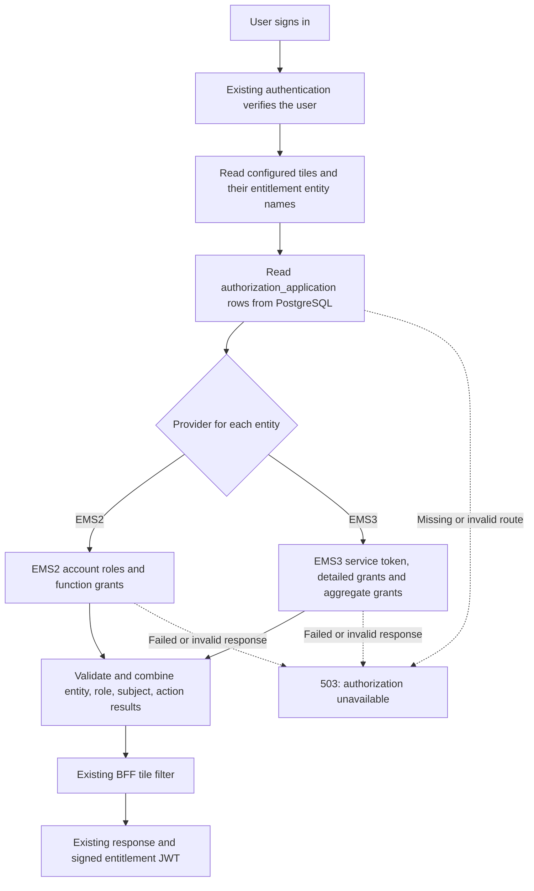

# EMS3 support in the actual Single UI BFF

The BFF now chooses EMS2 or EMS3 separately for each application entitlement
entity. The choice comes from PostgreSQL. A login can use both systems; once all
requested applications select EMS3, that login does not call EMS2.

This is a local integration using the actual BFF code. Live EMS3 registration,
accounts and production switching have not been performed.

## Follow one login



For example, `X_RATANONE` can stay on EMS2 while `FMO PORTAL ADMIN` uses EMS3.
Each provider receives only the applications selected for it. Ratan does not
need to exist in EMS3 at this point. If the portal-admin EMS3 call fails, the
whole request fails; the router does not retry portal-admin through EMS2.

The route rows are read again on each authorization request. A provider change
therefore applies to the next login, validation, relogin or token renewal.
Changes made during a lookup apply to a later lookup; each request uses one
snapshot of the mappings it read.

## What changed in the database

Existing category, tile and import-map tables continue supplying the UI layout.
`application_tile.ems2_entities` remains the source of BFF entity names, including
comma-separated names. The column keeps its old name for compatibility.

The new migration is
[`V1_0_10__authorization_application.sql`](../src/main/resources/db/migration/V1_0_10__authorization_application.sql).

| Table | Purpose |
| --- | --- |
| `authorization_application` | One route per BFF entitlement entity. |
| `authorization_application_audit` | A snapshot for every route insert, update and deletion. |

The route table contains:

| Columns | Meaning |
| --- | --- |
| `id`, `bff_entity_name` | Row ID and unique existing BFF entity name. |
| `provider` | Exactly `EMS2` or `EMS3`. |
| `bff_entity_id` | The existing entity ID to return when mapping EMS3 results. |
| `ems3_app_name`, `ems3_app_id`, `ems3_app_uid`, `ems3_itam_id` | The application's registered EMS3 identity. |
| `subject_long_names` | Optional JSON map from feature names to existing tile subject paths. |
| `active` | Whether the mapping can be used. An inactive requested mapping fails authorization. |
| `mapping_version` | Starts at zero; increments for each update, including direct SQL. |
| `created_at`, `updated_at`, `created_by`, `updated_by` | Change metadata. |

The audit table stores the route ID, operation, version, time, application actor,
database user and full JSON configuration snapshot. PostgreSQL triggers maintain
the audit history and versions. Hibernate's `@Version` rejects stale JPA updates.
Direct SQL should include the expected `mapping_version` in its `WHERE` clause
when the operator needs the same stale-update protection.

The migration splits and trims all existing tile entity names and inserts their
routes as EMS2. It does not switch an application to EMS3. New tile entities need
a route before they are used. There is no automatic fallback for missing rows.

The database requires complete EMS3 identity fields when `provider='EMS3'` and
prevents two active routes from claiming the same EMS3 application name or UID.
It does not contain user-role assignments or cached user permissions.

## What the code does

- [`AuthConfig`](../src/main/java/com/scb/sso/singleuibff/config/AuthConfig.java)
  constructs the database router and the actual EMS2 and EMS3 adapters.
- [`RoutingAuthorizationService`](../src/main/java/com/scb/sso/singleuibff/service/v2/implementation/RoutingAuthorizationService.java)
  reads routes, validates them before provider calls, calls the selected systems
  and combines only complete valid results.
- [`EMS2AuthorizationImplementation`](../src/main/java/com/scb/sso/singleuibff/service/v2/implementation/EMS2AuthorizationImplementation.java)
  preserves the old response shape while rejecting API errors, wrong users,
  incomplete counts and inconsistent application/role/subject/action identities.
  Permissions are matched using both application identity and role ID.
- [`EMS3AuthorizationImplementation`](../src/main/java/com/scb/sso/singleuibff/service/v2/implementation/EMS3AuthorizationImplementation.java)
  fetches a service token and both grant responses, verifies selected application
  identities and checks that the aggregate roles/grants equal the detailed ones.
- [`JwtAuthenticationController`](../src/main/java/com/scb/sso/singleuibff/controller/v2/JwtAuthenticationController.java)
  fetches permissions before returning a successful login or renewal. Authorization
  failures produce a sanitized error without new token headers.

The returned structure remains:

```text
Entity: X_RATANONE
  Role: FMO_COO_SUP
    Subject: RATAN_TRADE_BLOTTER
      Action: ACCESS_FMO_POST_TRADE_PORTAL
```

The entitlement JWT keeps the existing string claim containing JSON shaped as:

```json
{
  "X_RATANONE:FMO_COO_SUP": {
    "RATAN_TRADE_BLOTTER": ["ACCESS_FMO_POST_TRADE_PORTAL"]
  }
}
```

Tile visibility still uses the existing exact entity-name match and
case-insensitive subject-name or subject-path match. A blank-subject tile requires
an assigned entity. Templates retain their current behavior after a successful
authorization. Different roles remain separate and never borrow each other's
subjects or actions.

EMS3 role, feature and action IDs come from EMS3. The configured BFF entity ID is
preserved. `action.entitlementId` is null for EMS3 because the supplied API has no
per-grant ID. Consumers that require old numeric role/subject/action/grant IDs
need a separately agreed crosswalk before their application switches.

## Settings and local verification

EMS3 settings are under `scb.ems3`, with these environment variables:

```text
EMS3_TOKEN_URL
EMS3_DETAIL_URL
EMS3_AGGREGATE_URL
EMS3_CLIENT_ID
EMS3_CLIENT_SECRET
EMS3_SCOPE
```

The detail and aggregate URLs are bases before the encoded `/userId` suffix.
The supplied sample uses `/fmces/v1/entitlement/user` and
`/fmces/v1/entitlement/user-response`. The token URL is the complete OAuth
endpoint and receives no user suffix.
Optional token proxy and timeout settings are in `application.yml`. Only the
token request uses the configured token proxy. Defaults are two seconds to
connect and five seconds per complete response. EMS3 responses are capped at
one MiB, and redirects and automatic retries are disabled. HTTP is allowed only
with an explicit local test setting for loopback endpoints. Tokens and grants
are fetched afresh; reused HTTP connections do not cache permissions.

An EMS2-only installation needs no EMS3 credentials. Configuration is checked
when an EMS3 route is actually used. A selected EMS3 route with missing settings
fails authorization.
EMS3 URLs, credentials and transport settings take effect through a service
restart. Application provider choices in the database take effect on the next
authorization request.

Run the [verification build](../verification/README.md) for the actual BFF source.
It exercises the new migration and JPA against an isolated PostgreSQL cluster,
the provider adapters against synthetic HTTP fixtures, and the BFF APIs and JWTs.
The original [standalone POC](../poc/ems3-functions/README.md) remains useful as a
small demonstration; its in-memory route table is separate from this integration.

## Recorded verification result

On 2026-10-05, `mvn clean verify` in `verification/` passed with Java 17 and
PostgreSQL 18: **747 tests, zero failures, zero errors and zero skipped tests**.
Coverage for the authorization adapters, router and JWT controller was
**99.87% lines and 97.20% branches**, above the enforced 90% thresholds.

| Test area | Passing cases | What was observed |
| --- | ---: | --- |
| Database schema and repository | 8 | EMS2 backfill, JSON aliases, constraints, audit snapshots and stale-write rejection. |
| Database → providers → BFF response/JWT | 9 | Mixed routing, database switch to all EMS3, unchanged permission claims/tiles, revocation and failures across all six APIs. |
| Production bean wiring | 1 | The BFF uses the router, and EMS2 works with no EMS3 credentials. |
| EMS2 adapter | 52 | Valid grants, scope separation, wrong-user/incomplete/malformed responses and API failures. |
| EMS3 HTTP adapter | 322 | Identity and completeness checks, multiple roles/apps, timeouts, response limits, concurrency and no stale grants. |
| Database router | 60 | Provider selection, mapping validation, result validation, switching and no fallback. |
| JWT controller suites | 77 | Existing success responses, fresh renewal checks, invalid JWT rejection and sanitized authorization errors. |

The remaining 218 passing tests cover existing BFF behavior. These results use
actual BFF code with local provider fixtures and isolated databases. They do not
demonstrate the corporate deployment build, live EMS3 policy semantics or browser
behavior.

## What still needs a live check

1. EMS3 access and real test accounts with known assignments, using FlowZero or
   a small registered test application.
2. EMS3 confirmation that the chosen APIs return complete effective function
   permissions, including no-access, paging and inactive-role behavior. The
   implementation currently requires one aggregate record for every selected
   EMS3 app, with explicit empty lists when the user has no grants. Agreement
   between two endpoints cannot detect a permission omitted by both.
3. Agreed production application identities and any required subject-path or
   numeric-ID mappings, followed by checks in the normal corporate build and
   deployed frontend/backend environment.

Provider changes and failed rechecks do not revoke already signed JWTs. Existing
tokens retain their current validity rules; the existing entitlement JWT lifetime
is 12 hours. Fresh authorization and renewal are
checked against current permissions. This work does not claim immediate
distributed token revocation or browser-side clearing of an already rendered UI.
