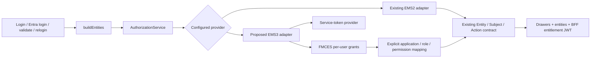

# EMS2 to EMS3 migration assessment for Single UI BFF

Investigated 2026-09-27 against the checked-out `scb/services/new-auth-service` and `scb/services/single-ui-bff` sources. This is a source-based migration assessment, not an implemented migration or a verified FMCES API specification. The supplied samples establish example payloads; endpoint availability, permissions and completeness still need confirmation from the EMS3 squad.

Planning update, 2026-10-02: the user confirmed that the goal is to plan migration of every application in the supplied production setup, preserving existing access. FlowZero is the only EMS3 pilot; other apps have yet to be onboarded. Their EMS3 definitions, assignments and paired test responses are outputs of migration work. Follow the [all-application migration plan](ems3-migration-plan.md) for sequencing and ownership; this assessment supports its BFF implementation workstream.

## Recommendation

Add an EMS3 implementation behind the existing `AuthorizationService.getEntitlements(userId, requestEntities)` boundary. Initially preserve the BFF's `Entity → Subject → Action` response, drawer filtering, and signed entitlement-token format. Reuse the reference service's OAuth and FMCES integration approach, but adapt its data to the Single UI authorization contract.

The migration team must design the mapping from the BFF's existing entity names, roles, subjects and actions into the new EMS3 application setup. The aggregate per-user EMS3 payload does not provide enough information to prove that mapping lossless: it does not associate each effective feature/action grant with an individual entitlement name. The detailed endpoint below is a candidate to investigate while designing the adapter.

The BFF serves multiple applications. Configuring only `RATAN_ENTITLEMENT_RULE` would not establish parity for all configured tiles or `FMO PORTAL ADMIN`. The subsequently supplied production CSVs and five EMS2 XML exports now provide a starting inventory; see the plan for their coverage. Complete that inventory with user assignments, remaining application definitions and downstream consumers before switching each app. [B1, B3, B4, B7]

## How EMS3 is used in the new service

The complete reference investigation is in [EMS3 integration research](../../new-auth-service/docs/ems3-integration-research.md).

| Step | Observed implementation | Implication for the BFF |
| --- | --- | --- |
| Obtain a service token | Form POST to `https://login.microsoftonline.com/{tenantId}/oauth2/v2.0/token`, using `grant_type=client_credentials`, `client_id`, `client_secret`, and `scope=api://{FMCES client ID}/.default`. | This token authenticates the BFF to FMCES; the authenticated human user's ID remains the entitlement lookup key. |
| Cache the token | Static Caffeine cache with a fixed 55-minute expiry; token parser returns only `access_token`. | Use a cache scoped to the configured credentials/audience and actual token expiry, with clock skew and bounded refresh after a 401. |
| Fetch users | Bearer-authenticated GET of the configured user URL, returning entitlement groups with `user_ids`. | Used for the reference service's local user synchronization; unnecessary for ordinary BFF per-user authorization. |
| Fetch effective grants | Bearer-authenticated GET of `entitlementUrl + "/" + userId`, decoded as `List<EntitlementBean>`. | Use an agreed app-scoped or multi-app endpoint and explicitly validate user, application and ITAM identity. |
| Persist permissions | Sync jobs update local users/roles; entitlement names become local roles, data grants become a key/value map, feature/action pairs become `Entity.flowzero_feature_action`. | These are FlowZero conventions, not the Single UI response contract. The BFF can initially fetch grants on demand without adopting the sync tables or gateway stack. |

Sources: [R1–R6]. The reference uses a proxy-configured `RestTemplate` for the Entra token request and a separate ordinary `RestTemplate` for FMCES. Neither factory explicitly sets connect/read timeouts. The BFF already uses configurable timeouts for EMS2 and should retain bounded timeouts for both new clients. [R7, B2]

The supplied samples show these endpoint shapes, not a confirmed deployment contract:

| Sample route under `/fmces/v1` | Example purpose |
| --- | --- |
| `/entitlement/app/{itamId}/{appName}/user/{userId}` | Effective entitlements for one user and application. |
| `/entitlement/user-response/{userId}` | A list containing multiple application records for one user. |
| `/entitlement/app/{itamId}/{appName}` | App entitlement catalog, including entitlement names/IDs, feature/action details and user membership. |
| `/entitlement/user/{userId}` | Entitlement-specific records with application metadata and nested `featureActionDtos`, including feature/action IDs. |
| `/entitlement/{entitlementId}/app/{itamId}/{appName}` | Definition of a single entitlement with feature/actions, policies and profiles. |

The configured `EMS3_ENTITLEMENT_ENDPOINT` must end immediately before the user ID because the client appends it. `fetchUserList()` can consume the app catalog's membership shape, but its `UserEntitlement` DTO drops `role_entitlements`; there is no implemented catalog client exposing complete per-entitlement feature/action attribution. [R2, R8]

For the BFF, investigate `/entitlement/user/{userId}` first as a source of role-associated grants: its sample preserves feature/action association per entitlement, unlike the aggregate response. It needs a separate DTO and client operation, plus confirmation that these records represent the effective grants required for authorization, including applicable policy restrictions. Its numeric `appId` and `appUID` are different concepts; the sample has two apps sharing `appId` but different `appUID` values, and `itamId` is null in the detailed records. Confirm the correct app identity fields for each endpoint rather than assuming the schemas match. These IDs are not proof of EMS2 ID equivalence. [R8]

## Current BFF contract and affected flows

`AuthConfig.buildAuthorizationService()` currently always constructs `EMS2AuthorizationImplementation`. Its lookup first retrieves an account/role response from `/ems2/rest/account/{userId}`, parses the pipe-delimited `uniqueName` into entity and role identifiers, filters by the requested tile entities, then POSTs `{userId: [entityNames]}` to `/ems2/rest/entitlements/entitlementList`. It groups returned permissions by role and subject. A null or empty entity filter currently means all returned entities. [B1, B2]

`JwtAuthenticationController.buildEntities()` derives requested entities from configured drawers, calls this service and produces three permission-bearing outputs: [B3]

1. `entities`: the public nested entity/role/subject/action DTOs.
2. `drawers`: tiles filtered using entity name and optional subject name or `longName`.
3. `entitlementsToken`: a BFF-signed JWT whose `entitlements` claim is a JSON **string** with keys `entityName:roleName` and values mapping subject names to action-name arrays.

That same path is used by v2 login, v3 Entra login, v2 validate and v2 relogin. The extend and refresh-token endpoints do not fetch entitlements. User profile data comes from OUD/MFA/Entra, separately from the authorization provider. The controller only reads `entities` from `Ems2Result`; the other account metadata fields are not used by this path. [B3]

Admin APIs additionally extract the role from the first entitlement-token key starting with the configured admin entity (`FMO PORTAL ADMIN` in the checked-in config). Category, tile and import-map records carry role ownership; maker/checker separation also uses the modifying user's identity. A change to role names, application boundaries or multi-role ordering can change admin access even when the same feature/action union is returned. Define deterministic multi-role behavior and regression-test it. [B4, B5, B7]

The frontend independently selects the first entity named exactly `FMO PORTAL ADMIN`. It decodes and parses the string-valued entitlement claim, stores the nested entities, and renders profile permissions by indexing `entitlements[entity.name + ":" + entity.roleName][subject.name]`. The entity response and token projection must therefore agree. Its TypeScript interfaces require numeric IDs, and the profile uses entity/subject IDs in element identifiers; missing IDs are not automatically compatible. Existing maker/checker backend checks enforce role ownership and different modifying/approving users, rather than evaluating distinct maker/checker action grants. Preserve that behavior explicitly, and treat any new action-based enforcement as a separate policy change. [B4, B5, B12]

GitNexus's upstream impact result for `EMS2AuthorizationImplementation.getEntitlements` was **CRITICAL**: 4 reported direct dependencies, 15 impacted symbols and 7 affected process entries. These are monorepo graph counts, not isolated BFF counts: the graph mixed `scb`, `scb-next` and `services/backend` copies, and its interface/getter resolution included spurious links. Direct source review confirms the target BFF's `buildEntities` caller and the four controller paths above. Treat the graph as a discovery aid, not a complete or exact runtime dependency analysis.

## Mapping that must be agreed

| Existing BFF concept | EMS3 candidate | Required decision |
| --- | --- | --- |
| `Entity.name`, tile `ems2_entities` | `user_data.app_name`, `itam_id`, or an explicit app-to-entity mapping | Names need not match. One BFF entity might require a distinct app registration or compatibility mapping. Confirm all business apps and portal administration are covered. |
| `Entity.roleName`, admin `ems2_role` | `entitlements.entitlement_name[]` | The reference treats names as roles locally. Agree exact legacy aliases/renames and whether each named entitlement represents one BFF role. Never infer an admin role from a broad feature grant. |
| `Subject.name`, `Subject.longName` | `role_entitlements[].feature` | Agree names, case rules and hierarchical paths. Prefixing every feature with `/` is not sufficient evidence for existing nested subject paths. |
| `Subject.actions[].name` | `role_entitlements[].action` | Map action vocabulary explicitly; verify effective permission behavior for every migrated feature. |
| Role-specific subject/action lists | User's effective `role_entitlements[]` plus named entitlements | The per-user payload does not say which grant belongs to which role. Use a validated catalog/role mapping or an explicit effective-permission contract. Do not assign the full union to every role without proving equivalent semantics. |
| Numeric entity, role, subject, action and entitlement IDs | App catalog IDs, if available, or a controlled legacy crosswalk | IDs are absent from the effective per-user DTO. Catalog IDs are not proven equal to EMS2 IDs or even the same concepts. Establish consumer requirements before retaining old IDs, making fields optional, or evolving the API; do not invent numeric IDs. |
| Data restrictions | `data_entitlements`, `data_policies`, `data_profiles`, `data_entitlements_logical_indicator` | Existing subject/action DTOs cannot express arbitrary policy/profile or AND/OR semantics. Confirm the enforcing downstream service, preserve the restrictions there, or explicitly extend the contract. Ignoring them can widen access. |
| Account metadata/status | `user_data.user_id` plus existing authenticated profile | Per-user EMS3 DTO has only user/app/ITAM identifiers. Keep profile identity from the authentication flow and agree account disablement/revocation semantics separately. Do not fabricate an active account status. |

Sources: [R3, R5, R8, B1, B3, B4, B6]. No claim is made that the current per-user JSON alone supports a lossless conversion.

## Proposed implementation stages

These are proposed work items; no Java/configuration behavior is changed by this assessment.

1. **Design the mapping and provision test applications.** Derive the proposed EMS3 application/role/feature/action model from the EMS2 definitions, assignments and data restrictions. Agree the API, mapping and policy enforcement owner with the EMS3/app teams, and update the migration specification. Create synthetic contract fixtures for initial adapter tests; create paired EMS2/EMS3 user fixtures after the relevant EMS3 application and assignments exist. Application setup and assignment migration are explicit work in the all-application plan.
2. **Add a small EMS3 transport boundary.** Introduce `EMS3ConfigProperties`, `EMS3TokenProvider`, `EMS3Client`, and DTOs for the actually selected response. Configure token URL, client credentials, audience/scope, FMCES URLs, application mapping, proxy and bounded timeouts. Encode path segments; validate configuration when EMS3 is selected. Keep service credentials in the deployment secret mechanism. Derive cache expiry from `expires_in` or a validated equivalent; refresh at most once on authentication rejection and restrict retries to transient failures within the request budget.
3. **Implement the compatibility adapter with tests first.** `EMS3AuthorizationImplementation implements AuthorizationService` can initially return the existing `Ems2Result` type to contain the change. A dedicated mapper applies the approved crosswalk, requested-entity filter, stable grouping and deduplication. Validate the returned user/app/ITAM; reject unexpected or incomplete responses. Handle a documented valid empty result as no grants and an upstream failure as a failure, rather than successful partial authorization.
4. **Add explicit provider routing in `AuthConfig`.** The [migration plan](ems3-migration-plan.md#step-4-connect-the-applications) requires one authoritative provider for each application's entities during staged rollout. A global `ems2|ems3` setting alone cannot support that rollout; define complete per-application/entity ownership and routing, including shared entities and users with roles in several apps. Existing checked-in `EMS3_HOST`, `EMS3_APP_ID` and `EMS3_APP_NAME` values do not switch the provider: no EMS3 Java integration is present and the factory constructs EMS2 directly. Retain or move `adminModuleEntity` deliberately because `AdminModuleUtil` currently reads it from `EMS2ConfigProperties`. [B2, B4, B8]
5. **Produce paired fixtures and compare decisions before cutover.** Once each app is set up, collect EMS2/EMS3 results for no access, one/several roles, multiple apps, admin maker/checker, hierarchical subjects, revoked grants and data-restricted users. In a controlled test/shadow mode, keep EMS2 authoritative and compare the EMS3 result after canonicalization: visible tiles, effective feature/actions, per-role mappings, admin access and data restrictions. Ensure a shadow failure cannot affect the live decision. Log counts/differences without tokens, secrets or complete entitlement payloads.
6. **Cut over by configured application scope.** A whole-provider switch requires all required apps to be ready. If the organization migrates apps separately, define explicit per-application routing/ownership; do not silently fall back to EMS2 on an EMS3 denial or error, or union providers' grants. Rollback should be an explicit deployment/configuration choice with entitlement-token invalidation or expiry handling.

No WebFlux or Spring Cloud Gateway adoption is needed for the initial BFF adapter: the reference's EMS3 integration itself uses `RestTemplate`, and the BFF is already a servlet-based Spring Boot service. No user/role synchronization database is required for an on-demand adapter. Existing `ems2_*` database columns can remain compatibility names when their values stay valid; any value conversion needs a separate reviewed migration. [R1, R2, B2, B7, B9]

## Behaviors to improve rather than copy

- **First-record selection:** reference sync takes `dataEntitlementList.get(0)` without checking identity or application. A supplied sample contains multiple applications. Select and validate the intended record(s), and define behavior for duplicates and missing apps. [R4, R8]
- **Revocation:** `syncEntitlements` retains an old function-permission value when the new function list is empty; failed or empty-list fetches also leave prior sync state. A valid empty permission result must revoke grants according to the agreed contract. Failures must remain distinguishable from an empty successful response. [R4, R5]
- **Data-policy loss:** the coordinator overwrites duplicate data keys in a map and does not apply policies, profiles or the logical indicator. Do not copy this flattening into a general entitlement migration. [R3, R5]
- **Token handling:** the fixed 55-minute cache ignores actual expiry, has no 401 invalidation, and retries all exceptions. The token and data methods both retry, potentially multiplying requests. Use measured expiry and bounded error-specific behavior. [R1, R2]
- **Existing BFF failure behavior:** EMS2 transport/parse failures are swallowed into empty role/grant responses; an entitlement-detail failure can leave entities with empty subjects, and a tile with no configured subject only checks entity membership. Do not preserve this partial-success behavior as a compatibility requirement. [B1, B4]
- **Outstanding signed grants:** BFF entitlement tokens last 12 hours. New lookups during validate/relogin do not invalidate a previously issued token, and extend/refreshtoken do not fetch new grants. Agree the revocation deadline and token/session invalidation plan before cutover. Provider switching alone does not revoke old signed permissions. [B3, B10]

## Verification required for implementation

| Area | Meaningful acceptance checks |
| --- | --- |
| OAuth/client | Correct form/audience/proxy; missing credentials; token expiry/skew; concurrent refresh; one refresh after 401; bounded timeout/retry; no secret/token logging. |
| Response validation | Wrong user/app/ITAM; several app records; missing app; duplicates; null/empty/malformed payloads; documented pagination and completeness behavior. |
| Permission mapping | Legacy entity and role aliases; requested entities including empty-filter semantics; role-specific grants; duplicate subjects/actions; hierarchical paths; numeric-ID policy; unknown feature/action behavior. |
| Authorization safety | No-access and revoked users; upstream failure distinct from no grants; no silent fallback/union; data constraints retain AND/OR/profile semantics at their enforcement point. |
| BFF API contract | v2 login, v3 login, validate and relogin return compatible entities/drawers/entitlement JWT; authentication user remains the human; extend/refresh behavior is documented. |
| Admin | Role ownership across categories/tiles/import maps; correct `FMO PORTAL ADMIN` mapping; multi-role selection; maker cannot approve own modification; invalid session/token cases. |
| End to end | Verify login, permitted/forbidden tiles, opening/deleting a tile, admin operations and revocation against the deployed configuration. Include downstream MFEs that consume IDs, paths or action names. |

Existing EMS2 tests provide fixtures and grouping coverage, but their assertions alone are not EMS3 parity evidence. Add contract and failure tests from the agreed requirements and paired fixtures, following the repository's specification/TDD workflow. [B11]

## Decisions for the EMS3 squad during migration

1. Which endpoints and application/ITAM registrations cover every BFF entity, including portal administration? Is `user-response` complete for the BFF's service principal, and how are pagination, inaccessible apps and partial failures signaled?
2. What are the authoritative legacy-to-EMS3 entity, role, feature, action and ID mappings? Does a catalog preserve role-to-feature attribution, and how are its versions kept consistent with effective user responses?
3. What do empty/missing entitlement records, disabled users, profiles/policies and AND/OR data indicators mean? Which component must evaluate each restriction?
4. What service-principal permissions, token lifetime, network/proxy/certificate requirements, rate limits and latency targets apply in each environment?
5. What revocation deadline and staged application cutover/rollback behavior must the BFF support, including already-issued entitlement tokens?

The EMS3, BFF and application teams resolve these decisions during the plan's design, setup and validation steps. Existing EMS3 registrations and comparison responses for unmigrated apps are not prerequisites for planning.

## Evidence and verification limits

- Read the implementation, DTOs, configuration, tests, sample payloads and BFF consumers. No EMS3 live endpoint was called and no credentials were used.
- A narrow offline test attempt for the reference service stopped before compilation because private parent POM `com.scb.ratan:ratanone-dependencies:8.0.10` is unavailable locally. No runtime test passed or failed; execution was blocked at dependency resolution.
- The GitNexus index reported itself stale. `analyze --index-only` was attempted to preserve existing documentation, but failed during LadybugDB WAL checkpoint rotation. Queries/context/impact worked against the existing index; source line references here come from the files, not stale index positions.
- Only research documentation is delivered. No application code, database configuration or deployed service has been migrated.

## Source index

Links are relative to this document; line anchors identify the inspected entry points.

- **R1:** [EMS3TokenService](../../new-auth-service/src/main/java/com/scb/ratan/flowzero/auth/service/ems3/EMS3TokenService.java#L20), token request and parsing.
- **R2:** [EMS3DataFetchService](../../new-auth-service/src/main/java/com/scb/ratan/flowzero/auth/service/ems3/EMS3DataFetchService.java#L29), caching, retries and GET response parsing.
- **R3:** [Entitlements](../../new-auth-service/src/main/java/com/scb/ratan/flowzero/auth/entity/ems3/Entitlements.java#L9), [UserData](../../new-auth-service/src/main/java/com/scb/ratan/flowzero/auth/entity/ems3/UserData.java#L7), [RoleEntitlement](../../new-auth-service/src/main/java/com/scb/ratan/flowzero/auth/entity/ems3/RoleEntitlement.java#L6).
- **R4:** [EM3DataSyncService](../../new-auth-service/src/main/java/com/scb/ratan/flowzero/auth/service/ems3/EM3DataSyncService.java#L47), user sync and first-record entitlement sync.
- **R5:** [EMS3DataCoordinator](../../new-auth-service/src/main/java/com/scb/ratan/flowzero/auth/service/ems3/EMS3DataCoordinator.java#L40), role/data/function transformations and empty-grant behavior.
- **R6:** [EMS3Properties](../../new-auth-service/src/main/java/com/scb/ratan/flowzero/auth/properties/EMS3Properties.java#L11), [application.yml](../../new-auth-service/src/main/resources/application.yml#L67), provider configuration.
- **R7:** [ApplicationConfig](../../new-auth-service/src/main/java/com/scb/ratan/flowzero/auth/configuration/ApplicationConfig.java#L45), proxy and ordinary HTTP clients.
- **R8:** [EMS3 Samples.json](../../new-auth-service/EMS3%20Samples.json), supplied endpoint/payload examples; includes multiple separately labeled JSON sections, not one JSON document.
- **B1:** [EMS2AuthorizationImplementation](../src/main/java/com/scb/sso/singleuibff/service/v2/implementation/EMS2AuthorizationImplementation.java#L34), current provider calls/filter/grouping/error behavior; [AuthorizationService](../src/main/java/com/scb/sso/singleuibff/service/v2/AuthorizationService.java#L7), extension boundary.
- **B2:** [AuthConfig](../src/main/java/com/scb/sso/singleuibff/config/AuthConfig.java#L127), provider construction; [EMS2ConfigProperties](../src/main/java/com/scb/sso/singleuibff/config/EMS2ConfigProperties.java#L11), timeouts and admin entity.
- **B3:** [JwtAuthenticationController](../src/main/java/com/scb/sso/singleuibff/controller/v2/JwtAuthenticationController.java#L94), response/token construction; v3 login at line 195, validation at line 245, extend at line 275, refresh at line 303, relogin at line 328.
- **B4:** [AdminModuleUtil](../src/main/java/com/scb/sso/singleuibff/util/AdminModuleUtil.java#L38), token role extraction, tile filtering at line 97 and role comparisons at line 176.
- **B5:** [ApplicationCategoryController](../src/main/java/com/scb/sso/singleuibff/controller/v1/ApplicationCategoryController.java), [ApplicationTileController](../src/main/java/com/scb/sso/singleuibff/controller/v1/ApplicationTileController.java), [ImportMapController](../src/main/java/com/scb/sso/singleuibff/controller/v1/ImportMapController.java), role ownership and maker/checker enforcement.
- **B6:** [Ems2Result](../src/main/java/com/scb/sso/singleuibff/dto/ems2/v2/Ems2Result.java#L10), [Entity](../src/main/java/com/scb/sso/singleuibff/dto/ems2/v2/Entity.java#L10), [Subject](../src/main/java/com/scb/sso/singleuibff/dto/ems2/v2/Subject.java#L10), [Action](../src/main/java/com/scb/sso/singleuibff/dto/ems2/v2/Action.java#L8), compatibility DTOs.
- **B7:** [Schema](../src/main/resources/db/migration/V1_0_0__fmo_schema_init.sql#L133), tile entity/role/subject columns; [seed data](../src/main/resources/db/migration/V1_0_1__fmo_data_import.sql), application-domain examples.
- **B8:** [application.yml](../src/main/resources/application.yml#L33), existing EMS3 variables; [EMS2 configuration](../src/main/resources/application.yml#L311), active URLs and admin entity. Equivalent EMS3 variables exist in dev, fmrp2 and prod profiles but do not wire a provider.
- **B9:** [pom.xml](../pom.xml), Java 17/Spring Boot 3.3.4 servlet dependencies.
- **B10:** [JwtTokenUtil](../src/main/java/com/scb/sso/singleuibff/util/JwtTokenUtil.java#L58), 12-hour entitlement JWT issuance.
- **B11:** [EMS2AuthorizationImplementationTest](../src/test/java/com/scb/sso/singleuibff/service/v2/EMS2AuthorizationImplementationTest.java#L47), existing provider tests.
- **B12:** [Frontend login projection](../../../web/mfe-base-origin/src/utils/login.ts#L67), [frontend DTOs](../../../web/mfe-base-origin/src/hooks/model/root.ts#L43), [profile lookup](../../../web/mfe-base-origin/src/components/Profile/index.tsx#L97), [admin role selection](../../../web/mfe-base-origin/src/admin/common/utils/index.ts#L4).
