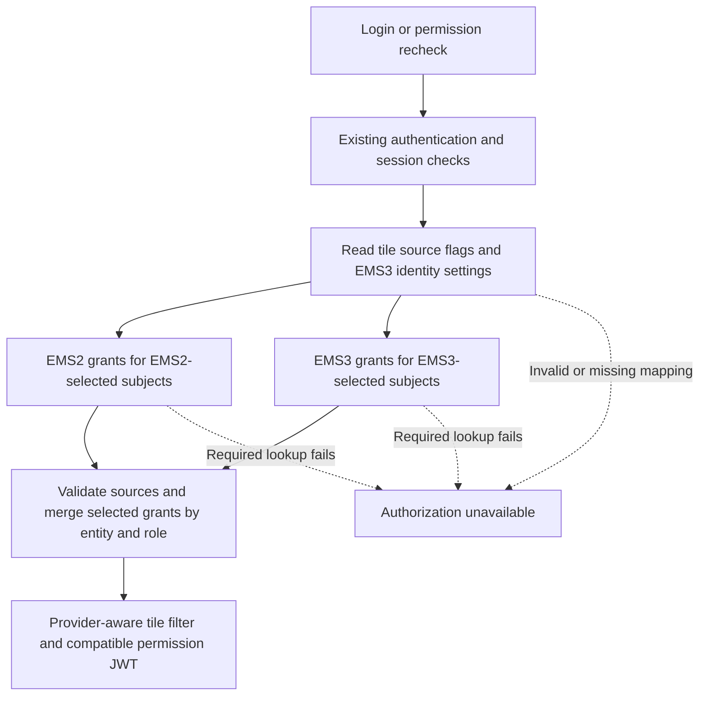

# EMS3 Support and Application Rollout Report

Prepared: 6 October 2026. Revised: 8 October 2026. All dates refer to 2026, using Singapore time.

This revision reviews the earlier estimate against the latest **tile-source proposal**. Existing provider adapters and whole-entity tests can be reused, but tile flags, same-RATAN mixed-provider routing and the required browser fixes are not implemented. The dates below are planning targets, subject to the checkpoints and staffing assumptions in this report.

## Review Of The Earlier Estimate

| Earlier assumption | Refined estimate |
| --- | --- |
| Apply each application's choice in the BFF configuration table. | Apply source choices in `application_tile.entitlement_source`; reuse `authorization_application` for EMS3 identities and untiled-permission defaults. No additional subject-routing table for the basic case. |
| The next work is mainly connecting to live EMS3. | Also build tile/audit/admin/import support, provider isolation, same-role merge and shared-subject validation. Budget browser fixes and deployed regression tests. |
| Every application switches independently. | Different subject groups can proceed independently. Tiles sharing the same entity/subject must switch together while retaining the current function-token format. |
| FlowZero login works by 16 October. | 16 October gate: real service access and known grants work, with the tile-routing core passing local tests. Complete deployed integration is the 23 October gate. |
| FlowZero UAT finishes during 26-30 October. | Start UAT only after integrated checks pass; allow fixes and final sign-off through 6 November. |
| Rollback is a simple provider change. | Restore the complete approved flag group and applicable defaults, recheck sessions, and verify usable EMS2 definitions/assignments. FlowZero's old EMS2 matrix is not supplied, so this rollback path still needs proof. |
| No application code changes normally. | Keep this as the aim, subject to permission-name, numeric-ID, multi-role and actual application-control checks. Shared-shell changes are already required. |

## 1. Goal and Delivery Targets

Add EMS3 support to Single UI with as little change as possible for each
application. During the transition, application owners choose EMS2 or EMS3
through tile configuration. Both systems remain supported while application subject groups move
at their own pace. EMS2 retirement is a later milestone after the final
application has moved.

| Milestone | Working target | Expected result |
| --- | --- | --- |
| First production pilot with FlowZero | **13 November** | FlowZero uses EMS3 through Single UI; existing applications continue using EMS2. |
| Ready for parallel application onboarding | **4 December** | Independent subject groups can use a tested process; shared-subject tiles follow one coordinated switch. |

The original planning window is **6-9 October**; as of this revision only **8-9 October** remains in that window. Earlier local POC work is recorded evidence, while live access and deployment readiness are not confirmed. The dates depend on that access, owner participation, the new tile implementation and staffed test/release windows.

**Production sequence:** FlowZero tile 108 is the first pilot. All RATAN settlement tiles, other RATAN tiles and Stamp remain EMS2 during that pilot. Selected RATAN settlement subjects and Stamp are proposed as the two concurrent staging cohorts in November. Their production switches require later owner approval. The partial-RATAN example in the [three-application report](/Users/lushevol/.codex/worktrees/ems3-single-ui-bff/fdc3-broker-next/services/single-ui-bff-ems3/docs/ems3-three-application-report.md) explains the capability, not a promise to launch settlements with FlowZero.

Scope covers function permissions, mainly who can see tiles, and the existing
function-permission response/JWT contract. Country, booking-entity and other
data entitlement policies remain outside this rollout scope.

## 2. Approach: Make the Change in the Shared BFF

The implementation lives in `services/single-ui-bff-ems3` on branch
`codex/ems3-single-ui-bff`. The original `scb/services/single-ui-bff` remains at
its pre-migration version.

1. Implement the tile flag and provider-aware lookup, then deploy the fork with all tile sources initially EMS2. Check existing behavior before opting any tile group into EMS3.
2. Keep the existing APIs, tile configuration, permission names and JWT claim
   format. The BFF translates EMS3 responses into the existing permission
   structure used by Single UI and application consumers.
3. Let each application owner approve the migration of its selected subject groups. An authorized operator updates `application_tile.entitlement_source` through an audited process. Existing tile administration/import/export must preserve the new field; a new entitlement administration product is not part of this estimate.
4. Apply provider changes on the next login or permission recheck, without a
   new application build or a BFF redeployment for the provider choice itself.
   EMS3 endpoint and credential changes still require service configuration
   and a restart.
5. Keep strict failure handling: a failed or invalid required provider response
   rejects the whole authorization attempt. The BFF does not return partial
   grants, reuse cached grants for a failed request, or automatically fall back
   from EMS3 to EMS2. Existing browser state and signed tokens need the separate
   session checks below.
6. Provide a deliberate, tested rollback. Restore all tiles sharing the affected entity/subject together, along with any changed untiled-permission defaults. EMS2 definitions/assignments must remain usable. If FlowZero cannot prove an EMS2 baseline, agree and rehearse a compatible service/gateway rollback before launch rather than promise an untested flag reversal.

The aim is no application code change for most applications. This needs checking
for each consumer: EMS3 numeric role, feature and action IDs can differ, and its
per-grant `action.entitlementId` is currently null.

The current implementation routes per entity; the proposal routes tiles by their source flags. Non-template tiles sharing the same legacy entity and subject must use the same provider, including variants that may later be activated. This protects their shared function claims. One reused application mapping supports one EMS3 logical app per legacy entity. Multiple logical apps emitting the same entity need a tile-to-mapping reference and further adapter/constraint changes, which require a separate estimate.

FlowZero belongs to RATAN but tile 108 uses the launch key `FLOW_ZERO / FLOW_ZERO_RAISE REQUEST` in the dump. RATAN's separate `RATAN_FLOW_ZERO` functions have no tile row. Confirm the pilot binding explicitly; ownership does not make these definitions interchangeable.

### Data Flow

Reuse `authorization_application` for EMS3 identities and the default for untiled permissions, with its existing audit table. Add `entitlement_source` to the tile and tile audit storage; preserve it through administration and CSV import/export. The BFF continues to store no user-role assignments or cached grants. Those remain in the entitlement administration process.

## 3. Starting Point and Evidence

The earlier whole-entity router, EMS3 adapter, application configuration migration and strict renewal checks are locally tested. The new tile-level changes are design work only, and the following test results must not be described as proof of that design.

| Recorded evidence | What it demonstrates |
| --- | --- |
| 747 BFF tests passed on 5 October; no failures, errors or skips | Actual BFF source works with isolated PostgreSQL and synthetic HTTP providers. |
| 244 standalone POC tests passed; five test accounts and seven demo results | Selected permissions and tiles from the supplied exports follow the proposed migration pattern. |
| Database-backed integration tests | Earlier mixed routing across separate entities preserves fixture tiles and claims. It does not prove EMS2 and EMS3 subjects inside the same RATAN entity. |
| Failure tests across all six login/renewal APIs | Failed, malformed or partial provider responses do not produce successful grants, tiles or new tokens, and do not trigger EMS2 fallback. |
| Scoped authorization coverage: 99.87% lines and 97.20% branches | The measured adapters, router and JWT controller exceed the 90% coverage gate. |
| Full-dump replay recorded on 6 October: 113 candidate tiles, 1,044 requested entities, 1,048 backfilled mappings, 40 role/provider combinations and 50 individual-role cases | The exported catalogue and selected role grants retain predicted tile visibility when providers change, using synthetic accounts/providers. |

These results establish local behavior. Live EMS3 policy completeness, the
corporate build, the full production database upgrade and deployed browser
behavior still need verification. The tests use synthetic accounts; the
production user-to-role assignment source has not been supplied.

FlowZero tile 108 and its EMS3 pilot catalogue are supplied. A later report calculates access with an illustrative pilot role, but neither that calculation nor the earlier replay proves live FlowZero access. Confirm its real identities, launch-feature alias, expected function keys and allowed/denied accounts.

### New Platform Work Before Live Acceptance

| Work | Required proof |
| --- | --- |
| Tile source column, audit storage and admin/import/export support | Existing rows default to EMS2; source changes are validated and audited. |
| Lookup plan based on tile entity/subject/source | One RATAN entity can use both providers without repeated EMS3 registration fetches. |
| Provider isolation and no fallback | An EMS2 grant cannot restore an EMS3-selected subject, including when EMS3 validly returns no grants. |
| Canonical role/subject merge and numeric-ID compatibility | Mixed results do not overwrite each other in JWT/body records, or alter expected names. |
| Shared-subject, template and blank-subject validation | Conflicting source flags are rejected; existing explicit rules remain controlled. |
| All six login/renewal paths and partial-RATAN tests | New routing rules apply to every permission recheck, not only fresh login. |

### Shared Shell Work Required Before the Pilot

The [screen-flow review](ems3-user-screen-flow.md) identified existing frontend
gaps. Plan fixes in the shared shell and browser tests before FlowZero acceptance:

- Apply an empty drawer response as the new menu, removing the previous cards.
- Recheck open and saved panels when grants change; consider all matching roles
  when restoring an allowed panel.
- Show the agreed restricted state after an authorization failure during
  renewal, without continuing to offer old protected tiles. Preserve the outage
  reason on the login or blocked screen.
- Clear user permission/token state on logout or account change, including
  another open browser tab. Clear or isolate saved workspace state per user.
- Make the timeout popup's Extend action wait for renewal to complete and show
  the failed state when renewal is rejected.
- Agree and test consistent no-grants behavior for the supported login methods.

These fixes are planned work, not completed proof. Blocking old browser state
also does not revoke a previously signed token at downstream services.

## 4. Revised Delivery Schedule

Backend development, testing, EMS3 administration and deployment preparation
must run in parallel. Other application owners should begin preparing their
definitions and user assignments during October.

| Dates | Work | Required outcome | Suggested lead |
| --- | --- | --- | --- |
| **6-9 Oct; remaining work 8-9 Oct** | Confirm staffing, live EMS3 access/contract, FlowZero identity and both permission keys, test accounts, production assignment owner and rollback baseline. Agree tile/shared-subject scope and start build/DB/gateway preparation. | Named owners, known allow/deny cases and a dated dependency list; do not assume access is already available. | BFF, EMS3 and RATAN / FlowZero owners |
| **12-16 Oct** | Build tile/audit/admin/import changes and core source selection/merge tests. In parallel connect to real EMS3, prepare test DB/gateway and start shell fixes. | **16 Oct gate:** service access returns known FlowZero grants and the routing core passes local tests. | BFF, frontend and platform teams |
| **19-23 Oct** | Complete and deploy tile routing and shell fixes. Run all six login/renewal paths, EMS2 baseline checks, same-RATAN mixed tests, JWT/name checks, multi-role/empty-menu/failure cases and saved/open/multiple-tab sessions. | **23 Oct gate:** deployed FlowZero flow and mixed-RATAN source isolation are demonstrated; critical gaps closed before UAT. | BFF, frontend, QA and owners |
| **26-30 Oct** | FlowZero UAT and fixes, denied-user/revoked-role checks and deployed function compatibility. Prepare selected RATAN settlement and Stamp definitions for later staging. | Owner-reviewed UAT results and a short remaining release list. | FlowZero owner, QA and follow-on owners |
| **2-6 Nov** | Finish UAT fixes/sign-off; rehearse production DB/flag/default changes, gateway/sessions and rollback. Verify production assignments, monitoring, alerts and support ownership. | **6 Nov gate:** accepted pilot, tested rollback and release approval; otherwise postpone launch. | FlowZero owner, QA, platform and support |
| **9-13 Nov** | Deploy shared dual support and switch FlowZero to EMS3. Observe real users and keep other applications configured for EMS2. | **FlowZero production pilot live by 13 Nov.** | Release team and FlowZero owner |
| **16-27 Nov** | Stabilize FlowZero. Stage selected RATAN settlement subjects and Stamp concurrently, keeping other RATAN subjects EMS2; verify shared-subject switches, no-grant/failure cases, rollback and load/response-size budgets. Revise pilot instructions for follow-on teams. | Both staging groups have evidence and owners; scope, definitions, users and IDs must be ready by 13 Nov. No extra production switch is assumed. | BFF, QA, RATAN and Stamp owners |
| **30 Nov-4 Dec** | Close staging findings and review configuration/audit procedures, operator capacity and support readiness. | **Parallel onboarding ready by 4 Dec**, subject to passing both staging cohorts. | Platform and application owners |

**Date rule:** keep 13 November and 4 December as conditional targets. Review dates immediately if the 16 October access/core gate or 23 October integrated gate is missed; do not compress the UAT, failure or rollback checks to keep a date. Only release after the 6 November acceptance gate. If RATAN/Stamp inputs are not ready by 13 November, revise the staging start and 4 December target. The readiness milestone enables later migrations; it is not the date all applications finish migrating.

## 5. What Each Application Needs

| Requirement | What the application team provides | Completion check |
| --- | --- | --- |
| Owner and migration choice | A named owner, EMS2/EMS3 choice and preferred switch window. | Owner confirms the plan and support contact. |
| Existing permission baseline and scope | Current entities, roles, subjects, actions and expected tiles. List complete shared-subject tile groups, untiled functions and which groups stay EMS2. | Allowed/denied results and coordinated switch groups are agreed before mapping. |
| EMS3 application setup | Registered application name/IDs and the required roles, features and actions. Preserve existing names where possible. | EMS3 team confirms the registered definitions. |
| User assignments | Known test users first; the process and responsible owner for assigning real users to EMS3 roles. | Intended users receive the correct roles, including removal/change cases. |
| Compatibility review | Identify consumers of the BFF response, JWT and numeric IDs; supply any required subject-path or ID mapping. | No incompatible consumer remains unresolved. |
| BFF configuration | Approved tile flags, application identities/defaults and aliases. | Shared-subject flags agree; required EMS3 identities are complete; defaults cannot restore migrated grants. Changes are audited and tested. |
| Acceptance testing | Users with access, without access and with multiple roles; expected results after permission changes. | Tiles, claims, sessions and failure behavior match the agreed expectations. |
| Switch and rollback | Owner approval, release window, monitoring contact and a usable EMS2 baseline if rollback is required. | Switch and rollback have been rehearsed and signed off. |

The normal sequence is: **agree the tile/subject group -> prepare EMS3 definitions and users -> configure identities and test flags -> test -> owner approval -> switch the whole group -> observe**.

An application staying on EMS2 keeps its existing permissions and assignments.
It still participates in regression checks when the shared shell moves to the
forked BFF, because authorization failure handling and renewal checks have changed.

## 6. Effort Estimates and Team Availability

One **person-day** means one person's working day. Five people spending one day each is five person-days. These figures count work across engineering, testing, platform support and application owners; they do not include time spent waiting for access or approvals. They are planning allowances, not measured results or delivery promises.

### Work To Reach The First Production Pilot

| Work still to do | Combined person-days | What is included |
| --- | ---: | --- |
| Confirm scope, identities and mappings | 2-3 | FlowZero launch key, untiled functions, shared-subject rules and live API contract. |
| Tile flag, database and administration | 3-5 | Schema and audit changes, EMS2 defaults, maker/checker flow, CSV import/export and validation. |
| Tile routing and compatible permission merge | 5-7 | Provider isolation within RATAN, role merge, required-identity checks and tests across all six paths. |
| Shared browser fixes and checks | 4-6 | Empty menus, open/saved panels, multiple roles, account changes, failed renewal and timeout Extend. |
| Live integration and regression testing | 6-8 | Real EMS3 grants, all-EMS2 baseline, mixed access, JWT/key/ID checks, revoked roles and failures. |
| Environment, monitoring and release rehearsal | 5-7 | Corporate build, DB/gateway, credentials/signing, alerts, session behavior, deployment and rollback. |
| Support instructions and operator handover | 2-3 | Mapping/switch checklist, troubleshooting, escalation and configuration records. |
| **Shared platform subtotal** | **27-39** | Reuses the existing POC; implements and verifies the new tile proposal. |
| FlowZero owner participation | 3-6 | Business expectations, test-user assignments, UAT and approval. Testing execution is counted above; these days cover the owner's participation. |
| **First pilot total** | **30-45** | Shared platform work plus FlowZero participation. |

This assumes the proposed schema and existing administration flows can be extended without a new administration UI, the service contract is compatible, and no major application rewrite is discovered. Preparing every production user's assignment, copying every application's matrix and immediate token revocation are outside this total. Confirm the effort after the 16 October access/core checkpoint.

### Work After The Pilot

A **cohort** below means one application or a selected group of tiles and permission subjects. These are additional days after the first pilot, with initial operator handover already counted above.

| Work | Combined person-days | Calendar expectation and assumptions |
| --- | ---: | --- |
| Shared stabilization and multi-application readiness checks | 3-5 | Revise instructions using pilot findings and add multi-application load/readiness checks during 16 November-4 December. Significant pilot defects require a new estimate. |
| One straightforward application or selected subject cohort | 5-12 | Usually one to two elapsed weeks with normal review windows, after its scope, definitions, users and IDs are ready. Includes mapping/configuration, testing, owner acceptance and a switch/rollback rehearsal. |
| Two straightforward staging cohorts plus shared readiness work | **13-29 total** | 3-5 shared days plus 5-12 for each cohort. RATAN settlements and Stamp proceed concurrently. This includes their staging preparation/testing, not their later production releases. |
| A more complicated cohort | 10-20 or more | Re-estimate after finding shared logical-app routing, numeric-ID translation, missing assignments or consumer fixes. Do not book the straightforward allowance as well. |

For a staged cohort's later production release, allow a further 0.5-1.5 person-days for the approved switch and smoke checks if staging evidence/configuration remain current. A material change requires renewed testing. Full registration or bulk assignment work that has not already been done needs its own estimate.

The follow-on figures use the same process for both ownership models. They allocate work to different teams; central ownership does not establish a shorter delivery time.

### People Needed To Keep The Dates

| Responsibility | Planning availability |
| --- | --- |
| BFF engineer | One focused developer during the tile implementation and integration. |
| Frontend engineer | About half to one person's capacity during shared-shell fixes and browser verification. |
| QA/tester | About half to one person's capacity during deployed checks and UAT. |
| EMS3 administrator and platform/release contacts | Available in the same week for identities, service access, deployment and rollback. |
| FlowZero, RATAN and Stamp owners | Named people with time for permissions, test accounts and acceptance in their scheduled windows. |

These are availability assumptions, not confirmed staffing or five full-time roles. Responsibilities may be combined. If one person performs all engineering, testing and environment work sequentially, re-estimate the November target. Leave, change freezes and central administration queues can add calendar time.

## 7. Maintenance: Application Teams Or Portal?

Both options use the same BFF, tile flags, database, gateway and EMS3 service. They mainly change who maintains the EMS3 definitions and assignments. The central option means one parent Portal ID with distinct logical app names/UIDs, subject to EMS3 confirmation; one combined logical application would need extra design work.

| Maintenance work | Each application manages its registration | Portal manages registrations centrally |
| --- | --- | --- |
| Roles, features and grant changes | Each team's EMS administrator applies its owner's approved matrix. | Portal's EMS administrator applies the matrix; the application owner still defines, approves and tests it. |
| User-role assignment/removal | Each application's approved access process. | Central access process, with the same application-owner approval. |
| BFF aliases, identity settings and tile source changes | Platform applies validated, audited changes with the application owner. | Platform applies the same changes with Portal and the application owner. |
| Audit, training and permission incidents | More teams need EMS3 skills and supply evidence; preparation can run in parallel. | Fewer administrators need EMS3 skills; consistent evidence is easier, but requests share a queue and shared changes need careful review. |
| BFF/shell updates, credentials, monitoring, sessions and rollback | Shared platform/operations work. | The same shared platform/operations work. Registration ownership alone does not establish separate credentials. |

| Recurring event | Rough combined person-days | What to plan separately |
| --- | ---: | --- |
| Change grants for an existing feature | 0.5-1.5 | Owner approval, EMS edit and allow/deny checks included; waiting time excluded. |
| Add a new feature or permission subject | 1-3 | Definition, EMS configuration, mapping and checks; application feature development excluded. |
| Execute an approved source switch or rollback | 0.5-1.5 | Whole flag group/defaults, configuration review, fresh-check smoke tests and monitoring. Full UAT must already be current. |
| Routine user-role requests | Not estimated yet | Need actual request volume, access workflow and approval rules. |
| Audit reviews, incidents, training and credential changes | Not estimated yet | Need review frequency, support hours, service access design and actual workload. |

**Example, not a staffing commitment:** ten applications with two existing-feature grant changes each per month means twenty changes. At 0.5-1.5 person-days each, allow **10-30 combined person-days per month**. Under application ownership, those days are distributed across teams; under central ownership, much of the administration sits in Portal's queue. Owner checks and platform support still take time in both. User requests, incidents, audits and new features are additional.

**Suggested responsibility split:** application owners define and accept the business permissions; platform controls the BFF and audited source switches. EMS3 edits may be performed by each team's administrator or a delegated central administrator. Choose that administration owner based on team capability and request volume, and agree a turnaround time before parallel onboarding.

The [three-application report, Section 11](ems3-three-application-report.md#11-maintenance-effort-who-does-the-work) gives the full responsibility comparison with RATAN, FlowZero and Stamp examples.

## 8. Dependencies and Operational Decisions

| Item | Required action |
| --- | --- |
| Live EMS3 API contract | Confirm complete effective permissions, paging, inactive roles, no-access representation and identity fields. The current adapter checks detail/aggregate consistency and expects an explicit aggregate record for each selected app. |
| Registration ownership and administration access | Confirm who maintains RATAN, FlowZero and Stamp, actual logical-app separation under any shared Portal ID, delegated rights, approval records and request turnaround. This does not change tile routing. |
| FlowZero scope and untiled functions | Confirm tile 108's launch mapping and how the pilot's non-tile functions are retained. Separately decide whether `X_RATANONE / RATAN_FLOW_ZERO` is in scope; a tile flag does not migrate it. |
| Assignments and follow-on inputs | Target FlowZero pilot users must be assigned and verified before the 6 November release check; size any bulk assignment work separately. RATAN/Stamp staging scope, definitions, known users and IDs must be ready by 13 November to start on 16 November. |
| Tile flags and shared subjects | Implement and test the full group switch, audit/admin/CSV support, source isolation and canonical merge. Saved whole-entity tests are not evidence that this work is done. |
| Deployment and database | Verify the corporate build, full database upgrade, current tile/import-map configuration, gateway routing, signing keys and existing sessions. Plan how portal configuration stays current in the fork's database. |
| Mixed-provider failures | Keep the agreed restrictive policy: any required provider failure rejects the whole authorization request. An EMS3 outage can therefore affect a login containing EMS2 applications. Verify browser behavior and alert the support owner. |
| Existing signed tokens | Provider changes apply to fresh checks. Previously signed tokens are not automatically revoked; the current entitlement-token lifetime is 12 hours. Agree and test session behavior before launch. |
| Manual rollback | Prove a usable EMS2 FlowZero baseline or rehearse the agreed service/gateway alternative. Restore whole subject groups and changed untiled defaults. Keep role removals consistent in both systems so rollback cannot restore revoked access. A reversal affects the next check and does not invalidate existing tokens. |
| Consumer compatibility | Resolve numeric-ID dependencies, null per-grant IDs, subject-path aliases and shared entity ownership before the affected application's switch. |

Bulk migration of every application's permissions and users, an administration
UI, data entitlement controls and immediate distributed token revocation are
separate work items. A discovered dependency on one of these must be estimated
for the affected application rather than silently included in the pilot schedule.

## 9. Milestone Acceptance

### FlowZero Pilot: 13 November

- Real FlowZero permissions are returned through the deployed Single UI BFF; tile 108 and the agreed untiled functions use the confirmed EMS3 identities/keys.
- Intended users see the correct tiles; unauthorized users do not see protected tiles.
- RATAN settlements, other RATAN subjects and Stamp stay EMS2 in production and pass regression checks. Test accounts separately prove that the revised BFF can split selected subjects within RATAN.
- Login, validation, relogin, extension and refresh behavior is accepted.
- Any required provider error rejects the whole authorization attempt, including a mixed EMS2/EMS3 login; no fallback or new successful permission response/tokens. Browser error handling is verified.
- Empty menus, changed grants, saved/open panels, logout/account changes, multiple tabs and the timeout Extend flow pass the shared-shell checks above.
- Production build, database/configuration changes, gateway routing, sessions and monitoring are verified.
- FlowZero owner and operations approve the release, tested rollback and treatment of already issued tokens.

### Parallel Application Readiness: 4 December

- FlowZero has an accepted period of stable production operation.
- Shared production support can serve applications configured for either provider.
- Selected RATAN settlement subjects and Stamp pass concurrent staging onboarding and configuration checks, including shared-subject consistency and denied/revoked users. This is not their production approval.
- Load tests show acceptable behavior for the expected application/user volumes.
- Owners have a reusable mapping checklist, test steps, configuration procedure and rollback instructions.
- Each application has a clear approval/support owner, an EMS3 administrator with an agreed request turnaround, and can schedule its approved subject-group switch once its prerequisites pass.

Full migration completion will depend on the remaining application owners,
definitions and assignments. This report sets the dates for the shared
capability and initial rollout process.

## 10. Supporting Evidence

- [Current matrices, tile proposal and maintenance comparison](ems3-three-application-report.md)
- [Actual BFF data flow, schema and recorded verification](ems3-bff-integration.md)
- [Database routing design and contracts](ems3-transition-design.md)
- [POC scope and migration background](ems3-migration-plan.md)
- [Standalone POC and test-account results](../poc/ems3-functions/README.md)
- [How the actual BFF verification build runs](../verification/README.md)
- [User screen flow and rollout limits](ems3-user-screen-flow.md)
- [Recorded replay scenario results](evidence/ems3-scenario-results.json)
