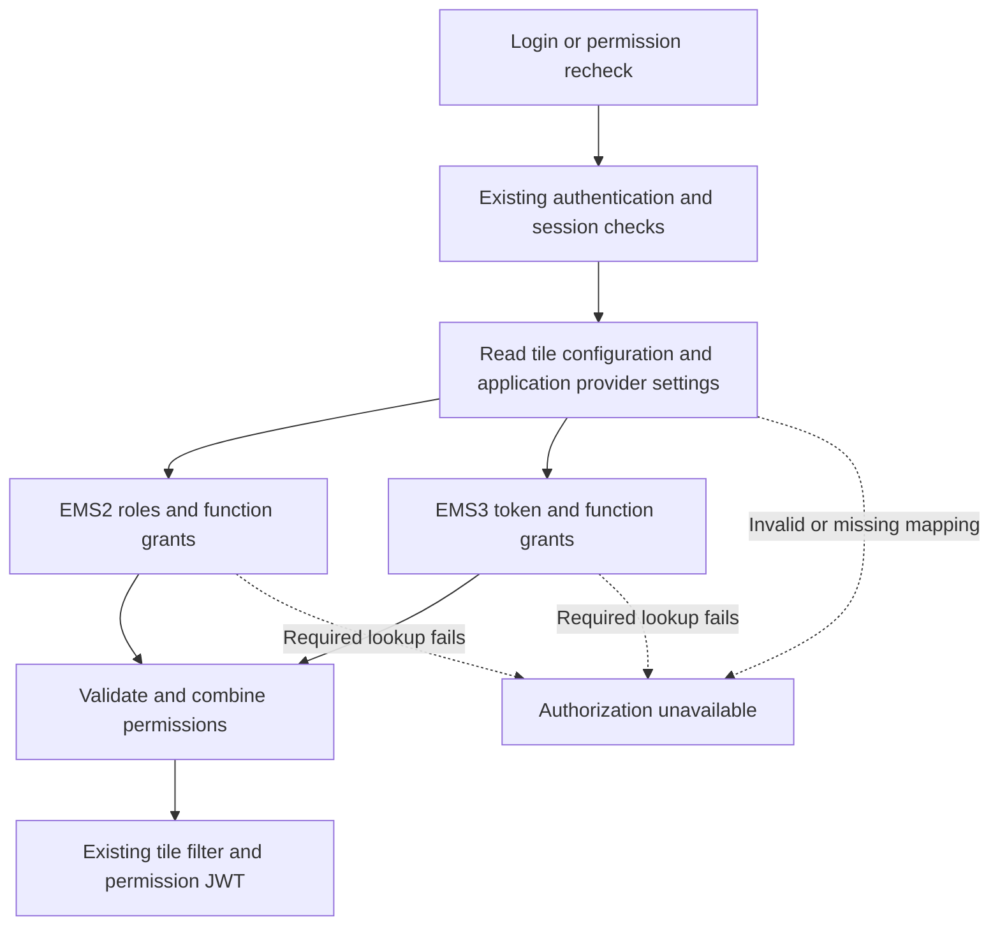

# EMS3 Support and Application Rollout Report

Prepared: 6 October 2026. All dates refer to 2026, using Singapore time.

## 1. Goal and Delivery Targets

Add EMS3 support to Single UI with as little change as possible for each
application. During the transition, application owners choose EMS2 or EMS3
through configuration. Both systems remain supported while applications move
at their own pace. EMS2 retirement is a later milestone after the final
application has moved.

| Milestone | Working target | Expected result |
| --- | --- | --- |
| First production pilot with FlowZero | **13 November** | FlowZero uses EMS3 through Single UI; existing applications continue using EMS2. |
| Ready for parallel application onboarding | **4 December** | Several application teams can prepare and switch independently using a tested, documented process. |

Work starts this week, **6-9 October**. These are delivery targets supported by
the existing local implementation. They depend on live EMS3 access, application
owner participation and the deployment environment being available on schedule.

Scope covers function permissions, mainly who can see tiles, and the existing
function-permission response/JWT contract. Country, booking-entity and other
data entitlement policies remain outside this rollout scope.

## 2. Approach: Make the Change in the Shared BFF

The implementation lives in `services/single-ui-bff-ems3` on branch
`codex/ems3-single-ui-bff`. The original `scb/services/single-ui-bff` remains at
its pre-migration version.

1. Deploy and validate the forked BFF with existing application routes set to
   EMS2. Check existing behavior before opting any application into EMS3.
2. Keep the existing APIs, tile configuration, permission names and JWT claim
   format. The BFF translates EMS3 responses into the existing permission
   structure used by Single UI and application consumers.
3. Let each application owner choose its migration timing. An authorized
   operator applies the approved choice in the BFF configuration table, with
   version checks and audit history. A new administration screen is not needed
   for the first release.
4. Apply provider changes on the next login or permission recheck, without a
   new application build or a BFF redeployment for the provider choice itself.
   EMS3 endpoint and credential changes still require service configuration
   and a restart.
5. Keep strict failure handling: a failed or invalid required provider response
   rejects the whole authorization attempt. The BFF does not return partial
   grants, reuse cached grants for a failed request, or automatically fall back
   from EMS3 to EMS2. Existing browser state and signed tokens need the separate
   session checks below.
6. Provide a deliberate, tested configuration rollback. Returning an application
   to EMS2 requires valid EMS2 permissions and owner-approved mappings to remain
   available during its pilot period.

The aim is no application code change for most applications. This needs checking
for each consumer: EMS3 numeric role, feature and action IDs can differ, and its
per-grant `action.entitlementId` is currently null.

Configuration is stored per existing entitlement entity. If multiple applications
share one entity, they currently share its provider choice. Identify these groups
early; coordinate a group switch or implement and retest separated entitlement
identities before promising independent switches for those applications.
Changing the owner alone does not separate their provider settings.

### Data Flow

The new `authorization_application` table stores provider choices and EMS3
application identities. `authorization_application_audit` records changes.
Existing category, tile and import-map tables continue supplying portal
configuration. The BFF does not store user-role assignments or cached grants in
these new tables; user assignments must be maintained through the appropriate
entitlement administration process.

## 3. Starting Point and Evidence

The shared routing code, EMS3 adapter, database migration and strict renewal
checks are already implemented and locally tested.

| Recorded evidence | What it demonstrates |
| --- | --- |
| 747 BFF tests passed on 5 October; no failures, errors or skips | Actual BFF source works with isolated PostgreSQL and synthetic HTTP providers. |
| 244 standalone POC tests passed; five test accounts and seven demo results | Selected permissions and tiles from the supplied exports follow the proposed migration pattern. |
| Database-backed integration tests | Mixed EMS2/EMS3 routing can change to all EMS3 while preserving tested tile lists and permission claims. |
| Failure tests across all six login/renewal APIs | Failed, malformed or partial provider responses do not produce successful grants, tiles or new tokens, and do not trigger EMS2 fallback. |
| Scoped authorization coverage: 99.87% lines and 97.20% branches | The measured adapters, router and JWT controller exceed the 90% coverage gate. |
| Full-dump replay recorded on 6 October: 113 candidate tiles, 1,044 requested entities, 1,048 backfilled mappings, 40 role/provider combinations and 50 individual-role cases | The exported catalogue and selected role grants retain predicted tile visibility when providers change, using synthetic accounts/providers. |

These results establish local behavior. Live EMS3 policy completeness, the
corporate build, the full production database upgrade and deployed browser
behavior still need verification. The tests use synthetic accounts; the
production user-to-role assignment source has not been supplied.

FlowZero tile 108 is present in the supplied catalogue, but the synthetic users
do not have its grant. FlowZero's real application identities, feature-to-tile
mapping and allowed/denied test users are therefore required this week; the
existing replay is not evidence of real FlowZero access.

### Shared Shell Work Required Before the Pilot

The [screen-flow review](ems3-user-screen-flow.md) identified existing frontend
gaps. Plan fixes in the shared shell and browser tests before FlowZero acceptance:

- Apply an empty drawer response as the new menu, removing the previous cards.
- Recheck open and saved panels when grants change; consider all matching roles
  when restoring an allowed panel.
- Show the agreed restricted state after an authorization failure during
  renewal, without continuing to offer old protected tiles. Preserve the outage
  reason on the login or blocked screen.
- Clear user permission/token state on logout or account change, including
  another open browser tab. Clear or isolate saved workspace state per user.
- Make the timeout popup's Extend action wait for renewal to complete and show
  the failed state when renewal is rejected.
- Agree and test consistent no-grants behavior for the supported login methods.

These fixes are planned work, not completed proof. Blocking old browser state
also does not revoke a previously signed token at downstream services.

## 4. Compressed Delivery Schedule

Backend development, testing, EMS3 administration and deployment preparation
must run in parallel. Other application owners should begin preparing their
definitions and user assignments during October.

| Dates | Work | Required outcome | Suggested lead |
| --- | --- | --- | --- |
| **6-9 Oct** | Confirm EMS3 connectivity, service access, FlowZero identities/tile mappings, known test assignments and complete-permission API behavior. Start corporate build and environment preparation. Assign shared-shell work and identify two follow-on applications. | Inputs for live integration are available; test expectations and frontend ownership are agreed. | BFF, EMS3 and FlowZero teams |
| **12-16 Oct** | Connect to real EMS3. Build and deploy the fork in test. Prepare its database with current portal configuration and configure gateway routing. Start shared-shell fixes in parallel. | Real FlowZero login works through the deployed BFF. | BFF, frontend and platform teams |
| **19-23 Oct** | Complete shared-shell fixes. Compare expected permissions and tiles; test mixed providers, sessions, JWTs, login/renewal, account changes, multiple tabs and browser failure handling. Check EMS2 applications against their baseline. | Compatibility and failure behavior demonstrated in the deployed environment. | Frontend, QA and application owners |
| **26-30 Oct** | Run FlowZero user acceptance testing, correct issues and check consumer ID assumptions. Follow-on owners prepare their EMS3 definitions. | FlowZero owner accepts the pilot results. | FlowZero owner and QA |
| **2-6 Nov** | Rehearse production database/configuration changes, gateway switch, session handling and rollback. Finish monitoring, support ownership and release approval. | Release is ready; rollback is tested. | Platform, BFF and support teams |
| **9-13 Nov** | Deploy shared dual support and switch FlowZero to EMS3. Observe real users and keep other applications configured for EMS2. | **FlowZero production pilot live by 13 Nov.** | Release team and FlowZero owner |
| **16-27 Nov** | Stabilize FlowZero. Test two additional applications concurrently in staging, including mixed providers and all-EMS3 requests within a defined test scope, plus load/response-size checks. Finish reusable onboarding instructions. | Other teams can use the same tested process. | BFF, QA and follow-on owners |
| **30 Nov-4 Dec** | Review pilot stability, concurrent onboarding results, configuration procedures and support readiness. | **Parallel application onboarding ready by 4 Dec.** | Platform and application owners |

**Key checkpoint: 16 October.** Real FlowZero integration must work in the
deployed test environment by this date. If EMS3 access, API agreement or test
deployment is still blocked, the November launch target needs immediate review.

## 5. What Each Application Needs

| Requirement | What the application team provides | Completion check |
| --- | --- | --- |
| Owner and migration choice | A named owner, EMS2/EMS3 choice and preferred switch window. | Owner confirms the plan and support contact. |
| Existing permission baseline | Current entities, roles, subjects, actions and expected visible tiles. List every entity the application uses and flag shared entities. | Allowed and denied results are agreed before mapping. |
| EMS3 application setup | Registered application name/IDs and the required roles, features and actions. Preserve existing names where possible. | EMS3 team confirms the registered definitions. |
| User assignments | Known test users first; the process and responsible owner for assigning real users to EMS3 roles. | Intended users receive the correct roles, including removal/change cases. |
| Compatibility review | Identify consumers of the BFF response, JWT and numeric IDs; supply any required subject-path or ID mapping. | No incompatible consumer remains unresolved. |
| BFF configuration | Approved provider choice, application identity and any aliases for every relevant entity. | Configuration is complete, versioned, audited and tested. |
| Acceptance testing | Users with access, without access and with multiple roles; expected results after permission changes. | Tiles, claims, sessions and failure behavior match the agreed expectations. |
| Switch and rollback | Owner approval, release window, monitoring contact and a usable EMS2 baseline if rollback is required. | Switch and rollback have been rehearsed and signed off. |

The normal sequence is: **prepare EMS3 definitions and users -> configure the
BFF -> test -> owner approval -> switch -> observe**.

An application staying on EMS2 keeps its existing permissions and assignments.
It still participates in regression checks when the shared shell moves to the
forked BFF, because authorization failure handling and renewal checks have changed.

## 6. Effort Estimates and Team Availability

| Work | Planning estimate | Assumptions |
| --- | --- | --- |
| Shared production support plus FlowZero pilot | About six calendar weeks from this week to 13 Nov | Existing code is reused; EMS3 access and known assignments are ready this week. |
| Stabilization and parallel onboarding readiness | About three further calendar weeks, to 4 Dec | Follow-on teams prepare mappings during October; two apps are ready for concurrent staging tests. |
| Straightforward follow-on application | 3-5 working days once prerequisites are ready | Compatible permission names/consumers, ready EMS3 definitions and users, normal test/release availability. |
| More complicated application | 1-2 working weeks, or re-estimate after discovery | Extra ID mapping, shared entity separation, assignment work or consumer fixes are needed. |

These are planning estimates, not measured delivery times. Application
registration, access approvals and incomplete user assignments can add elapsed
time. Several applications can proceed concurrently when their owners and QA
capacity are available; shared BFF defects and environment problems remain common
dependencies.

The schedule assumes one focused BFF developer, frontend support for the shared
shell fixes, shared QA, an available FlowZero owner, and EMS3/platform contacts
who can resolve access and deployment work in the same weeks. Actual staffing
and leave/release calendars still need to be confirmed by the delivery team.

## 7. Dependencies and Operational Decisions

| Item | Required action |
| --- | --- |
| Live EMS3 API contract | Confirm complete effective permissions, paging, inactive roles, no-access representation and identity fields. The current adapter checks detail/aggregate consistency and expects an explicit aggregate record for each selected app. |
| Deployment and database | Verify the corporate build, full database upgrade, current tile/import-map configuration, gateway routing, signing keys and existing sessions. Plan how portal configuration stays current in the fork's database. |
| Mixed-provider failures | Keep the agreed restrictive policy: any required provider failure rejects the whole authorization request. An EMS3 outage can therefore affect a login containing EMS2 applications. Verify browser behavior and alert the support owner. |
| Existing signed tokens | Provider changes apply to fresh checks. Previously signed tokens are not automatically revoked; the current entitlement-token lifetime is 12 hours. Agree and test session behavior before launch. |
| Manual rollback | Preserve usable EMS2 definitions/assignments for applications that need rollback. A configuration reversal affects the next check and does not invalidate existing tokens. |
| Consumer compatibility | Resolve numeric-ID dependencies, null per-grant IDs, subject-path aliases and shared entity ownership before the affected application's switch. |

Bulk migration of every application's permissions and users, an administration
UI, data entitlement controls and immediate distributed token revocation are
separate work items. A discovered dependency on one of these must be estimated
for the affected application rather than silently included in the pilot schedule.

## 8. Milestone Acceptance

### FlowZero Pilot: 13 November

- Real FlowZero permissions are returned through the deployed Single UI BFF.
- Intended users see the correct tiles; unauthorized users do not see protected tiles.
- Existing EMS2 applications pass regression checks.
- Login, validation, relogin, extension and refresh behavior is accepted.
- Provider errors produce no new successful permission response or tokens; browser error handling is verified.
- Empty menus, changed grants, saved/open panels, logout/account changes, multiple tabs and the timeout Extend flow pass the shared-shell checks above.
- Production build, database/configuration changes, gateway routing, sessions and monitoring are verified.
- FlowZero owner and operations approve the release and tested rollback.

### Parallel Application Readiness: 4 December

- FlowZero has an accepted period of stable production operation.
- Shared production support can serve applications configured for either provider.
- Two additional applications pass concurrent staging onboarding and configuration checks.
- Load tests show acceptable behavior for the expected application/user volumes.
- Owners have a reusable mapping checklist, test steps, configuration procedure and rollback instructions.
- Each application has a clear approval/support owner and can schedule its own switch once its prerequisites pass.

Full migration completion will depend on the remaining application owners,
definitions and assignments. This report sets the dates for the shared
capability and initial rollout process.

## 9. Supporting Evidence

- [Actual BFF data flow, schema and recorded verification](ems3-bff-integration.md)
- [Database routing design and contracts](ems3-transition-design.md)
- [POC scope and migration background](ems3-migration-plan.md)
- [Standalone POC and test-account results](../poc/ems3-functions/README.md)
- [How the actual BFF verification build runs](../verification/README.md)
- [User screen flow and rollout limits](ems3-user-screen-flow.md)
- [Recorded replay scenario results](evidence/ems3-scenario-results.json)
