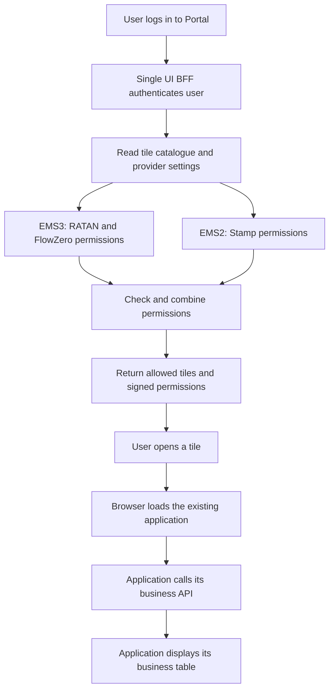

# EMS3 Migration Explained With RATAN, FlowZero And Stamp

Prepared: 7 October 2026. EM3 below means the EMS3 entitlement system.

## 1. The Proposal In Plain Words

The Portal keeps the same tiles and application links. Its BFF, the service that answers the browser's login request, learns how to get permissions from either EMS2 or EMS3.

One database row per existing entitlement entity tells the BFF which system to use. In this report's transition example:

| Application | Existing Portal entity | Get permissions from | What the user should see |
| --- | --- | --- | --- |
| RATAN | `X_RATANONE` | EMS3 | The same RATAN tiles and function permissions as before, provided its complete matrix and user assignments are migrated. |
| FlowZero | `FLOW_ZERO` | EMS3 | The Flowzero tile when the user has the matching EMS3 feature. Its old EMS2 matrix was not supplied. |
| Stamp | `STAMP_STATIC` | EMS2 | The existing Stamp tiles and function permissions. |

The browser does not choose the provider. The application registration owner can be the application team or the Portal team. This changes who manages permissions and the registration IDs; it does not have to change what users are allowed to do.



The implemented and tested part is the BFF's routing, permission conversion, tile filtering and token handling. The final business API and table depend on the separately deployed application. Section 7 explains that boundary.

### A Few Names Used In This Report

| Name | Simple meaning | Example |
| --- | --- | --- |
| Entity | The application's existing permission bucket in Portal. | `X_RATANONE` |
| Role | A named set of permissions assigned to a user. | `FMO_COO_SUP` |
| Subject / feature | The screen or function covered by a permission. EMS2 calls it a subject; EMS3 calls it a feature. | `RATAN_TRADE_BLOTTER` |
| Action | Something the role may do for that feature. | `F_Export_Data` |
| Matrix | The definitions of which role has which feature/action pair. It does not say which people have that role. | The tables below. |
| Registration | The EMS3 application record containing those definitions. | Application name, app ID and app UID. |
| JWT | A signed token containing identity or permissions. | The entitlement token read by existing applications. |

## 2. What We Actually Have Today

These are counts from the supplied files, not a live production query.

| Application | Supplied definition source | Roles | Subjects / features | Action names | Role/feature/action grants | What is missing |
| --- | --- | ---: | ---: | ---: | ---: | --- |
| RATAN | EMS2 `entitlements.xml` | 25 | 25 | 51 | 806 | Production user-role assignments and a complete confirmed EMS3 target catalogue. |
| FlowZero | EMS3 pilot application catalogue in `EMS3 Samples.json` | 39 | 8 | 11 | 398 | Its old EMS2 matrix and confirmation that the pilot catalogue is the complete intended production definition. |
| Stamp | EMS2 `entitlements_stamp.xml` | 4 | 32 | 6 | 458 | Production user-role assignments and future EMS3 registration details. |

**All supplied definitions are presented as tables in [Current Full Matrices](/Users/lushevol/.codex/worktrees/ems3-single-ui-bff/fdc3-broker-next/services/single-ui-bff-ems3/docs/ems3-matrices-current.md).** RATAN is grouped into one table per subject, FlowZero into one table per feature, and Stamp into a subject-by-role table. No supplied grants are omitted. Six FlowZero roles with no feature grants are included explicitly.

The shorter tables here explain the examples used later.

### RATAN: The Complete `FMO_COO_SUP` Role

This is one of RATAN's 25 roles. The full matrix contains all roles.

| EMS2 entity | Role | Subject | Allowed actions |
| --- | --- | --- | --- |
| `X_RATANONE` | `FMO_COO_SUP` | `RATAN_TRADE_BLOTTER` | `ACCESS_FMO_POST_TRADE_PORTAL`, `F_Custom_Query_Builder`, `F_Export_Data` |
| `X_RATANONE` | `FMO_COO_SUP` | `RATAN_FM_COO_EXCEPTION` | `ACCESS_FMO_POST_TRADE_PORTAL`, `F_Custom_Query_Builder`, `F_Custom_View_Builder_Private`, `F_Custom_View_Builder_Public`, `F_Exception_Addtional_Info_Update`, `F_Export_Data`, `F_Manually_Close_Exception` |
| `X_RATANONE` | `FMO_COO_SUP` | `RATAN_FM_COO_RULE` | `ACCESS_FMO_POST_TRADE_PORTAL`, `F_Input_Delete_Modify_Initiate`, `F_Input_Delete_Modify_Verify` |
| `X_RATANONE` | `FMO_COO_SUP` | `RATAN_RULE_ENGINE` | `F_Input_Delete_Modify_Initiate`, `F_Input_Delete_Modify_Verify` |
| `X_RATANONE` | `FMO_COO_SUP` | `RATAN_FLOW_ZERO` | `ACCESS_FMO_POST_TRADE_PORTAL`, `F_WORKFLOW_BPMN_DESIGNER`, `F_WORKFLOW_INSTANCE_REQUEST`, `F_WORKFLOW_QUERY`, `F_WORKFLOW_STA_CKR`, `F_WORKFLOW_STA_MKR` |

This role has **21 grants**. Exact names are kept, including the existing spelling `Addtional`.

`RATAN_FLOW_ZERO` here belongs to RATAN's `X_RATANONE` entity. It is separate from the `FLOW_ZERO` entity used by the independent Flowzero tile. Similar names do not make them the same permission bucket.

**A real gap in the supplied EMS3 sample:** its per-user response contains only 16 grants for `FMO_COO_SUP`. The five `F_WORKFLOW_*` actions in the last row are absent. Therefore that sample alone does not prove RATAN parity. The target in this report keeps all 21 grants for this role and all 806 grants across RATAN.

### FlowZero: The Known Pilot Role `Global_Onboard_BatchOps`

We cannot reconstruct its old EMS2 matrix from the supplied data. This table is from the existing EMS3 pilot catalogue.

| EMS3 feature | Role | Allowed actions |
| --- | --- | --- |
| `HOMEPAGE` | `Global_Onboard_BatchOps` | `ACCESS_FMO_POST_TRADE_PORTAL`, `VIEW_HOMEPAGE` |
| `TODO` | `Global_Onboard_BatchOps` | `ACCESS_FMO_POST_TRADE_PORTAL`, `APPROVE_TASK`, `EDIT_COMMENT`, `EDIT_TASK`, `REJECT_TASK`, `TERMINATE_TASK` |
| `REQUEST_CENTRE` | `Global_Onboard_BatchOps` | `ACCESS_FMO_POST_TRADE_PORTAL`, `EDIT_COMMENT` |
| `RAISE_REQUEST` | `Global_Onboard_BatchOps` | `ACCESS_FMO_POST_TRADE_PORTAL`, `BATCH_IMPORT`, `RAISE_NEW_REQUEST`, `VIEW_PUBLISHEDWORKFLOW` |
| `UPLOAD_FILE` | `Global_Onboard_BatchOps` | `ACCESS_FMO_POST_TRADE_PORTAL` |

This role has **15 grants**. The full pilot catalogue has 398 grants across 39 roles. Six roles have no feature/action grants, including `FLOWZERO Application User`. That role alone does not show tile 108, because that tile requires a matching feature.

### Stamp: Permissions For Its Two Portal Tiles

| EMS2 subject | `CHECKER` | `MAKER` | `STATIC_STAMP` | `VIEW_ONLY` |
| --- | --- | --- | --- | --- |
| `Mapping Query` | `Write` | `Write` | `Write` | `Read` |
| `Audit` | `Read` | `Read` | `Read` | `Read` |

The other 30 subjects are individual mapping functions. Every one has the following role pattern; their exact names appear in the full matrix.

| Subjects | `CHECKER` | `MAKER` | `STATIC_STAMP` | `VIEW_ONLY` |
| --- | --- | --- | --- | --- |
| Each of the other 30 mapping subjects | `Approve`, `Create`, `Delete`, `Edit`, `Read` | `Create`, `Delete`, `Edit`, `Read` | `Approve`, `Create`, `Delete`, `Edit`, `Read` | `Read` |

## 3. What The Matrices Look Like After Migration

The intended migration preserves permissions. EMS3 uses features where EMS2 used subjects. Keep the existing role, subject/feature and action names to preserve the current permission-token keys.

| Application | Target EMS3 role definitions | Target EMS3 features | Target grants | Change to the permission matrix |
| --- | ---: | ---: | ---: | --- |
| RATAN | 25 | 25 | 806 | Copy every EMS2 role/subject/action grant; subject names become feature names. |
| FlowZero | 39 | 8 | 398 | Use the supplied pilot catalogue as a candidate target; confirm completeness and legacy compatibility. |
| Stamp | 4 | 32 | 458 | Copy every EMS2 grant when Stamp's later migration is approved. |

These numbers describe the proposed target. They do not mean those registrations or user assignments have been created.

### Option A: Each Application Manages Its Own Registration

| Application | Who creates roles and assigns users | EMS3 registration ID | EMS3 logical app name, proposed | EMS3 app UID |
| --- | --- | --- | --- | --- |
| RATAN | RATAN team | `RATAN_ID_TBC` | `RATAN_ENTITLEMENT_RULE` | `RATAN_UID_TBC` |
| FlowZero | FlowZero team | `FLOWZERO_ID_TBC` | `FLOWZERO` | `FLOWZERO_UID_TBC` |
| Stamp, later | Stamp team | `STAMP_ID_TBC` | `STAMP` | `STAMP_UID_TBC` |

For example, RATAN's registration contains `FMO_COO_SUP -> RATAN_TRADE_BLOTTER -> F_Export_Data`. FlowZero's registration contains `Global_Onboard_BatchOps -> RAISE_REQUEST -> BATCH_IMPORT`. Stamp's future registration contains `VIEW_ONLY -> Mapping Query -> Read`.

**[Full EMS3 Matrices: Application-Owned](/Users/lushevol/.codex/worktrees/ems3-single-ui-bff/fdc3-broker-next/services/single-ui-bff-ems3/docs/ems3-matrices-application-owned.md)** lists every proposed role/feature/action grant for all three applications.

### Option B: Portal Manages All Registrations Centrally

Use one parent Portal ID while keeping a separate logical application name and UID for each application's permissions.

| Application | Who creates roles and assigns users | Shared EMS3 registration ID | EMS3 logical app name, proposed | EMS3 app UID |
| --- | --- | --- | --- | --- |
| RATAN | Portal team, with RATAN owner approval | `PORTAL_ID_TBC` | `RATAN_ENTITLEMENT_RULE` | `RATAN_UID_TBC` |
| FlowZero | Portal team, with FlowZero owner approval | `PORTAL_ID_TBC` | `FLOWZERO` | `FLOWZERO_UID_TBC` |
| Stamp, later | Portal team, with Stamp owner approval | `PORTAL_ID_TBC` | `STAMP` | `STAMP_UID_TBC` |

The example grant triples remain exactly the same as Option A. Portal ownership does not give a RATAN role access to FlowZero or Stamp. The BFF selects and maps each logical application independently.

**[Full EMS3 Matrices: Portal-Managed](/Users/lushevol/.codex/worktrees/ems3-single-ui-bff/fdc3-broker-next/services/single-ui-bff-ems3/docs/ems3-matrices-portal-managed.md)** lists every proposed role/feature/action grant under this arrangement.

The sample already shows RATAN and FlowZero sharing `appId="51358"` with different app names and UIDs: RATAN UID 10, FlowZero UID 65. Those are sample identities, not confirmation of a production Portal registration. The fork permits repeated `appId` and `itamId`; active EMS3 routes require distinct `appName` and `appUID`.

### How The Options Compare

| Question | Application-owned | Portal-managed |
| --- | --- | --- |
| Who makes a permission change? | Each application team. | Portal team handles it with the application owner. |
| Main advantage | Teams can manage their own roles, approvals and timing. | One team can keep naming, onboarding and audit practices consistent. |
| Main drawback | More registrations and coordination across teams. | Portal may become a queue for every team's permission changes. |
| What needs controlling? | Each team must follow the agreed compatibility and assignment rules. | Portal administrators need clear boundaries and application owner approval. |
| Can applications switch one by one? | Yes, through each entity's provider row. | Yes, with separate logical apps and provider rows. |
| Does either option remove shared BFF/EMS3 outage risk? | No. Both use the same runtime services. | No. Both use the same runtime services. |

There is no need to choose one management owner for all applications to run this POC. The runtime can support either supported arrangement once the actual registration identities are confirmed.

### A Different Meaning Of "One Portal ID"

If it means **one combined EMS3 app name and UID containing every application's roles**, the current fork does not implement that design. The unique app-name/UID constraints reject sharing one logical application across several active routes.

That variant would need an explicit mapping from each Portal role and feature/action pair to its destination entity and legacy permission names, plus tests for cross-application access and independent switches. For example, `PORTAL_RATAN_FMO_COO_SUP` would need to become `X_RATANONE:FMO_COO_SUP`, and a prefixed feature would need to become the old subject key. Removing the unique indexes alone would not provide those mappings.

This report's central option uses a shared parent ID with separate logical applications. EMS3 administrators must confirm how that arrangement is registered and delegated in the real system.

## 4. What Is Stored In The RATAN / Portal Database

The relevant database is the Single UI BFF's `post_trade_portal_service` schema. These are its Portal configuration tables, not RATAN's trade-storage tables. The matrix definitions and user-role assignments live in EMS2 or EMS3. The BFF stores the provider settings and application catalogue.

### Every Related BFF Table

| Table | What it stores | Role in this migration |
| --- | --- | --- |
| `application_category` | Menu categories and their ordering/active state. | Existing rows continue to group tiles. |
| `application_category_audit` | Category change history. | Existing application-managed audit behavior. |
| `application_tile` | Tile title, category/import references, entity, subject, module and tile path. | Existing names and paths continue to select permissions and open applications. |
| `application_tile_audit` | Tile change history. | Existing application-managed audit behavior. |
| `import_map` | Symbolic application names and deployed bundle locations. | Existing entries load application code; they do not grant access. |
| `import_map_audit` | Import-map change history. | Existing application-managed audit behavior. |
| `application_session` | Logged-out/revoked session IDs. | Existing blacklist checked during session validation; it is not a user-role table. |
| `authorization_application` | One provider choice and EMS3 identity per existing entity. | New routing configuration. |
| `authorization_application_audit` | Snapshots of routing changes. | New database-triggered audit for insert/update/delete, including direct SQL changes. |
| `post_trade_portal_service_schema_history` | Flyway migration history. | Infrastructure record of applied schema changes. |

There are no new local user, role, user-role assignment, feature/action catalogue or effective-permission cache tables. Direct SQL changes to old catalogue tables do not automatically create their application-managed audit records; the new authorization table has its own audit triggers.

Source: [new schema and triggers](/Users/lushevol/.codex/worktrees/ems3-single-ui-bff/fdc3-broker-next/services/single-ui-bff-ems3/src/main/resources/db/migration/V1_0_10__authorization_application.sql:12).

### Existing Catalogue Rows Stay The Same

| `application_tile_id` | Title | Category ID | Import-map ID | `ems2_entities` | `ems2_subject` | Module / tile in DB |
| --- | --- | ---: | ---: | --- | --- | --- |
| 54 | Trade Blotter | 15 | 10 | `X_RATANONE` | `RATAN_TRADE_BLOTTER` | `trade_blotter` / `trade` |
| 108 | Flowzero | 32 | 66 | `FLOW_ZERO` | `FLOW_ZERO_RAISE REQUEST` | `flowzero` / `home` |
| 48 | Mapping Query | 12 | 32 | `STAMP_STATIC` | `Mapping Query` | `stamp` / `stamp-mappingquery` |
| 49 | Audit | 12 | 32 | `STAMP_STATIC` | `Audit` | `stamp` / `stamp-audit` |

| Category ID | Category label | Import-map ID | Import-map key |
| --- | --- | --- | --- |
| 15 | Trade Processing | 10 | `ratan_container` |
| 32 | Flowzero | 66 | `flowzero` |
| 12 | Static Data Mapping | 32 | `stamp_container` |

The old column names still contain `ems2`, but their entity and subject values remain the Portal's matching keys even for an EMS3 application. Changing `ems2_role=RATAN_PROD` to `EMS3` would not switch the provider: those role labels belong to the existing configuration administration scheme. Visibility is decided by entity/subject matching.

Sources: [tile export](/Users/lushevol/code/github/fdc3-broker-next/scb-next/data/application_tile.csv:41), [category export](/Users/lushevol/code/github/fdc3-broker-next/scb-next/data/application_category.csv:15), [import-map export](/Users/lushevol/code/github/fdc3-broker-next/scb-next/data/import_map.csv:9).

### The New Routing Table's Fields

| Fields | Meaning |
| --- | --- |
| `id`, `bff_entity_name` | Row ID and unique existing entity name. |
| `provider` | Exactly `EMS2` or `EMS3`. |
| `bff_entity_id` | Existing numeric entitlement entity ID, required for EMS3. This is not a tile ID, app UID or registration ID. |
| `ems3_app_name`, `ems3_app_id`, `ems3_app_uid`, `ems3_itam_id` | Exact EMS3 identities that returned permissions must match. |
| `subject_long_names` | JSON map from an EMS3 feature name to the subject's compatibility long name used for tile matching. |
| `active` | Whether the route can be used. Missing/inactive required routes fail the lookup. |
| `mapping_version` | Configuration version; the database advances it once per update. |
| `created_at`, `updated_at`, `created_by`, `updated_by` | Change timestamps and actors. |

The migration initially backfills all tile entities as EMS2. The worked example changes only RATAN and FlowZero; the full supplied Portal catalogue contains many other entities that must retain valid rows.

### Option A Rows: RATAN And FlowZero Migrated, Stamp Still On EMS2

All `*_TBC` values below are placeholders. The numeric entity IDs and UIDs must come from the real systems before these settings can be applied.

| `bff_entity_name` | `provider` | `bff_entity_id` | `ems3_app_name` | `ems3_app_id` | `ems3_app_uid` | `ems3_itam_id` | `active` |
| --- | --- | --- | --- | --- | --- | --- | --- |
| `X_RATANONE` | `EMS3` | RATAN legacy entity ID | `RATAN_ENTITLEMENT_RULE` | `RATAN_ID_TBC` | RATAN UID | `RATAN_ITAM_TBC` | true |
| `FLOW_ZERO` | `EMS3` | FlowZero legacy entity ID | `FLOWZERO` | `FLOWZERO_ID_TBC` | FlowZero UID | `FLOWZERO_ITAM_TBC` | true |
| `STAMP_STATIC` | `EMS2` | Can remain unset | null | null | null | null | true |

### Option B Rows: The Same Migration With Central Ownership

| `bff_entity_name` | `provider` | `bff_entity_id` | `ems3_app_name` | `ems3_app_id` | `ems3_app_uid` | `ems3_itam_id` | `active` |
| --- | --- | --- | --- | --- | --- | --- | --- |
| `X_RATANONE` | `EMS3` | RATAN legacy entity ID | `RATAN_ENTITLEMENT_RULE` | `PORTAL_ID_TBC` | RATAN UID | `PORTAL_ITAM_TBC` | true |
| `FLOW_ZERO` | `EMS3` | FlowZero legacy entity ID | `FLOWZERO` | `PORTAL_ID_TBC` | FlowZero UID | `PORTAL_ITAM_TBC` | true |
| `STAMP_STATIC` | `EMS2` | Can remain unset | null | null | null | null | true |

Stamp's future EMS3 row would use `STAMP` and its own unique UID, with its own registration/ITAM under Option A or the Portal registration/ITAM under Option B. Neither future row is activated in this walkthrough.

### Subject Compatibility Settings

| Entity | Proposed `subject_long_names` content | Why |
| --- | --- | --- |
| `X_RATANONE` | All 25 `RATAN_*` feature names mapped to their existing `/RATAN_*` long names. | Preserve exported subject long names as well as the original subject keys. |
| `FLOW_ZERO` | `{"RAISE_REQUEST":"FLOW_ZERO_RAISE REQUEST"}` | The pilot feature and the existing tile subject have different names. This alias lets tile 108 match. |
| `STAMP_STATIC` | `{}` while on EMS2. At a later EMS3 switch, map all 32 features to their existing slash-prefixed long names. | EMS2 already returns the legacy subjects. |

The complete proposed maps are recorded in [matrix evidence](/Users/lushevol/.codex/worktrees/ems3-single-ui-bff/fdc3-broker-next/services/single-ui-bff-ems3/docs/evidence/ems3-three-application-matrix-manifest.json).

**An alias fixes tile matching, not renamed JWT keys.** The adapter sets `Subject.name` to the EMS3 feature name and only changes `Subject.longName` with this JSON. The JWT uses `Subject.name`. Thus FlowZero's key will be `RAISE_REQUEST`; this report cannot prove that it matches unknown former FlowZero EMS2 keys. If a consumer needs an old key, keep that feature name in EMS3 or implement and test an explicit canonical-name mapping.

Sources: [subject conversion](/Users/lushevol/.codex/worktrees/ems3-single-ui-bff/fdc3-broker-next/services/single-ui-bff-ems3/src/main/java/com/scb/sso/singleuibff/service/v2/implementation/EMS3AuthorizationImplementation.java:215), [JWT keys](/Users/lushevol/.codex/worktrees/ems3-single-ui-bff/fdc3-broker-next/services/single-ui-bff-ems3/src/main/java/com/scb/sso/singleuibff/controller/v2/JwtAuthenticationController.java:152).

## 5. Preparing The Mixed Setup

| Step | What happens | Required result |
| --- | --- | --- |
| 1 | Deploy the forked BFF schema with all routes initially EMS2 and connect the Portal gateway to that service in the test environment. | Existing behavior is checked through the actual browser route. |
| 2 | The chosen owners register RATAN and FlowZero in EMS3 using the relevant ownership arrangement. | Confirm app name, app ID, app UID and ITAM identity for both. |
| 3 | Load the proposed matrices and compare complete grant sets. | RATAN has all 806 intended grants; FlowZero's owner confirms the pilot target and its alias/claim compatibility. |
| 4 | Assign known test accounts to the intended roles in EMS3; retain Stamp assignments in EMS2. | An allow-list account and a denied account have known expected outcomes. |
| 5 | Configure the BFF's EMS3 token endpoint, detailed/aggregate grant endpoints, service credentials and timeouts. | The BFF service account can read both selected logical applications. Secrets stay in environment/service configuration. |
| 6 | Fill the approved route identities and compatibility maps, then set `FLOW_ZERO` and `X_RATANONE` to EMS3. | Versioned, audited rows are complete. `STAMP_STATIC` remains EMS2. |
| 7 | Perform fresh login and permission rechecks, including failures and role removal. | Correct tiles and claims, no fallback, and agreed browser behavior. |

Provider-row changes take effect on the next lookup without a BFF restart. Endpoint/credential configuration changes require the service configuration/restart process. This report creates no registrations, assignments or live database updates.

## 6. One Test User, From Login To The Menu

Use a synthetic account named `demo_migration`. The assignments below are an illustration; the real user assignment source has not been supplied.

| Application | Assigned role | Assignment system | Grant count for this example |
| --- | --- | --- | ---: |
| RATAN | `FMO_COO_SUP` | EMS3, using the complete proposed EMS2-equivalent definition | 21 |
| FlowZero | `Global_Onboard_BatchOps` | EMS3 pilot-equivalent definition | 15 |
| Stamp | `VIEW_ONLY` | EMS2 | 32 |

This walkthrough requires RATAN's full 21-grant target, not the partial 16-grant EMS3 user sample. Assume this account has no other application roles, the supplied catalogue is loaded, the FlowZero alias is approved, and all required calls succeed.

### Step 1: Open Portal And Authenticate

The root page loads its configured SystemJS import map. That map tells the browser where application bundles live. It does not decide who may open a tile.

The browser submits `/api/auth/v2/sso/login`, or the supported Entra login route. The BFF checks credentials through OUD/MFA or Entra, then uses the authenticated user's identity for permission lookup. A browser-provided application/provider choice cannot select the authorization route.

Sources: [root page](/Users/lushevol/code/github/fdc3-broker-next/scb/web/mfe-root-config-origin/src/index.ejs:22), [frontend login endpoints](/Users/lushevol/code/github/fdc3-broker-next/scb/web/mfe-base-origin/src/services/index.ts:15), [BFF login](/Users/lushevol/.codex/worktrees/ems3-single-ui-bff/fdc3-broker-next/services/single-ui-bff-ems3/src/main/java/com/scb/sso/singleuibff/controller/v2/JwtAuthenticationController.java:188).

### Step 2: Read The Catalogue And Provider Settings

The BFF joins active categories, tiles and import-map rows, ordered by category and tile order. It collects the entity names from those candidate tiles, then reads their `authorization_application` rows once for this lookup.

For the three examples, the resulting provider groups are:

| Provider group | Entity names | Use |
| --- | --- | --- |
| EMS3 | `X_RATANONE`, `FLOW_ZERO` | Get RATAN and FlowZero grants from EMS3. |
| EMS2 | `STAMP_STATIC` | Get Stamp grants from EMS2. |

The full Portal also includes the other active catalogue entities; those retain their configured providers. This table shows the three applications discussed here, not the complete Portal lookup scope.

Sources: [active catalogue query](/Users/lushevol/.codex/worktrees/ems3-single-ui-bff/fdc3-broker-next/services/single-ui-bff-ems3/src/main/java/com/scb/sso/singleuibff/repository/ApplicationCategoryRepo.java:24), [entity extraction](/Users/lushevol/.codex/worktrees/ems3-single-ui-bff/fdc3-broker-next/services/single-ui-bff-ems3/src/main/java/com/scb/sso/singleuibff/util/AdminModuleUtil.java:89), [provider routing](/Users/lushevol/.codex/worktrees/ems3-single-ui-bff/fdc3-broker-next/services/single-ui-bff-ems3/src/main/java/com/scb/sso/singleuibff/service/v2/implementation/RoutingAuthorizationService.java:54).

### Step 3: Fetch Stamp From EMS2

The EMS2 adapter fetches the user's role list. It retains only roles whose entities belong to the selected EMS2 group. It then requests function grants for the matched EMS2 entities.

Stamp's result is `STAMP_STATIC / VIEW_ONLY`, including `Mapping Query -> Read` and `Audit -> Read`. Even if the general EMS2 role list still contains RATAN or FlowZero roles, they are not used for those entities because their routes now select EMS3.

Source: [EMS2 adapter](/Users/lushevol/.codex/worktrees/ems3-single-ui-bff/fdc3-broker-next/services/single-ui-bff-ems3/src/main/java/com/scb/sso/singleuibff/service/v2/implementation/EMS2AuthorizationImplementation.java:33).

### Step 4: Fetch RATAN And FlowZero From EMS3

The BFF makes **one service-token request, one detailed user-grants request and one aggregate user-grants request** for this lookup. This is three EMS3 calls total, not three calls for each application. Both ownership options use the same request pattern and require service access to both logical apps.

The EMS3 service token is used only between the BFF and EMS3. It is separate from the user's Portal tokens and is never returned to the browser.

| EMS3 response | What it supplies | Why it is needed |
| --- | --- | --- |
| Detailed user grants | Assigned roles and each role's feature/action pairs, with application identities. | Preserve which permissions came from which role. |
| Aggregate user grants | Application/user identity, assigned role names and the union of feature/action pairs. | Check agreement with the detailed response for every selected application. |

The BFF checks app names, IDs/UIDs, nested identities, returned account identity, and detailed/aggregate agreement. Each selected app must have an explicit aggregate record, including a valid empty result if the account has no access.

For `demo_migration`, the target detail includes RATAN's 21 role grants and FlowZero's 15. Stamp is not selected from EMS3 even if that system returns an unrelated Stamp record.

Agreement between two endpoints does not prove the definition is complete against EMS2: both could omit the same permission. That is why the full matrix comparison is also required.

Source: [EMS3 HTTP calls](/Users/lushevol/.codex/worktrees/ems3-single-ui-bff/fdc3-broker-next/services/single-ui-bff-ems3/src/main/java/com/scb/sso/singleuibff/service/v2/implementation/EMS3AuthorizationImplementation.java:61), [response validation](/Users/lushevol/.codex/worktrees/ems3-single-ui-bff/fdc3-broker-next/services/single-ui-bff-ems3/src/main/java/com/scb/sso/singleuibff/service/v2/implementation/EMS3AuthorizationImplementation.java:185).

### Step 5: Convert To The Existing Portal Permission Format

The BFF converts EMS3 grants to the same entity/role/subject/action structure that existing consumers receive. This allows the common filter and JWT builder to continue using their existing inputs.

| Provider input | BFF entity / role | BFF subject name | BFF subject long name | Action |
| --- | --- | --- | --- | --- |
| RATAN EMS3 feature | `X_RATANONE / FMO_COO_SUP` | `RATAN_TRADE_BLOTTER` | `/RATAN_TRADE_BLOTTER`, with proposed alias map | `F_Export_Data` |
| FlowZero EMS3 feature | `FLOW_ZERO / Global_Onboard_BatchOps` | `RAISE_REQUEST` | `FLOW_ZERO_RAISE REQUEST`, with proposed alias | `BATCH_IMPORT` |
| Stamp EMS2 subject | `STAMP_STATIC / VIEW_ONLY` | `Mapping Query` | `/Mapping Query` | `Read` |

Separate roles remain separate records. Combining providers does not copy one application's permissions to another. Entity IDs can remain legacy IDs through `bff_entity_id`; EMS3 role/feature/action numeric IDs are returned as EMS3 IDs. The EMS3 per-grant `action.entitlementId` is null because the supplied contract has no equivalent ID. Consumers that depend on old numeric IDs need an explicit compatibility check.

Source: [EMS3 conversion](/Users/lushevol/.codex/worktrees/ems3-single-ui-bff/fdc3-broker-next/services/single-ui-bff-ems3/src/main/java/com/scb/sso/singleuibff/service/v2/implementation/EMS3AuthorizationImplementation.java:202).

### Step 6: Decide Which Tiles To Return

The normal filter asks: "Does this user have the tile's entity and its subject?" It matches subject name or long name, ignoring subject case. It does not require a particular action, and it does not check the catalogue's `ems2_role` label to show the tile.

| Tile | Required match | Example account has it? | Menu result |
| --- | --- | --- | --- |
| 54 Trade Blotter | `X_RATANONE` + `RATAN_TRADE_BLOTTER` | Yes, through `FMO_COO_SUP` from EMS3. | Show. |
| 104 FM COO Rules | `X_RATANONE` + `RATAN_FM_COO_RULE` | Yes, through EMS3. | Show. |
| 105 FM COO Exceptions | `X_RATANONE` + `RATAN_FM_COO_EXCEPTION` | Yes, through EMS3. | Show. |
| 156 RATAN Rule Engine | `X_RATANONE` + `RATAN_RULE_ENGINE` | Yes, through EMS3. | Show, even though this subject has no `ACCESS_FMO_POST_TRADE_PORTAL` action for this role. |
| 193 Exception Auto Recover | `X_RATANONE`; subject is blank. | Yes, the entity is assigned. | Show under the existing entity-only rule. |
| 108 Flowzero | `FLOW_ZERO` + `FLOW_ZERO_RAISE REQUEST` | Yes, `RAISE_REQUEST` matches through the long-name alias. | Show. |
| 48 Mapping Query | `STAMP_STATIC` + `Mapping Query` | Yes, with `Read` from EMS2. | Show. |
| 49 Audit | `STAMP_STATIC` + `Audit` | Yes, with `Read` from EMS2. | Show. |

There are **eight protected tiles from these applications** for this account. The supplied full catalogue also has 14 active template tiles that bypass permission matching after a successful authorization request. With no other assigned roles, this example therefore predicts 22 visible tiles in that snapshot. Templates do not rescue a failed provider lookup: authorization must succeed first.

The three-application account result is a calculation from the exports and filter rules. It is not a recorded live login. Earlier execution evidence separately proved the RATAN five-tile result and the mixed-provider mechanics with synthetic fixtures.

Source: [actual tile filter](/Users/lushevol/.codex/worktrees/ems3-single-ui-bff/fdc3-broker-next/services/single-ui-bff-ems3/src/main/java/com/scb/sso/singleuibff/util/AdminModuleUtil.java:97), [full catalogue replay](/Users/lushevol/.codex/worktrees/ems3-single-ui-bff/fdc3-broker-next/services/single-ui-bff-ems3/docs/ems3-user-records.md).

### Step 7: Return The Menu, Permission Records And Tokens

The successful login body contains `result`, `drawers`, `entities`, `entitlementsToken`, `oud` and `userInfo`. The identity/access token is returned in the `Single-UI-Authorization: Bearer ...` header. The entitlement token is a separate signed JWT.

This is a **fragment** of the JSON permission map stored as the JWT's `entitlements` string, illustrating the three roles:

```json
{
  "X_RATANONE:FMO_COO_SUP": {
    "RATAN_TRADE_BLOTTER": [
      "ACCESS_FMO_POST_TRADE_PORTAL",
      "F_Custom_Query_Builder",
      "F_Export_Data"
    ]
  },
  "FLOW_ZERO:Global_Onboard_BatchOps": {
    "RAISE_REQUEST": [
      "ACCESS_FMO_POST_TRADE_PORTAL",
      "BATCH_IMPORT",
      "RAISE_NEW_REQUEST",
      "VIEW_PUBLISHEDWORKFLOW"
    ]
  },
  "STAMP_STATIC:VIEW_ONLY": {
    "Mapping Query": ["Read"],
    "Audit": ["Read"]
  }
}
```

The actual token includes the other granted subjects too. Notice that the FlowZero key is `RAISE_REQUEST`, even though its tile matches `FLOW_ZERO_RAISE REQUEST`. This is why tile-alias compatibility and JWT-key compatibility must be checked separately.

Source: [response and token assembly](/Users/lushevol/.codex/worktrees/ems3-single-ui-bff/fdc3-broker-next/services/single-ui-bff-ems3/src/main/java/com/scb/sso/singleuibff/controller/v2/JwtAuthenticationController.java:95).

### Step 8: The Browser Shows The New Tile Menu

The frontend's success handler receives the login response, stores entities/drawers/tokens in shared state, and decodes the entitlement map into `user.entitlements`. The New Tile drawer renders the returned category/tile list.

The browser has no need to know which provider produced each tile. The tile record still names the same container, module and tile as before.

Sources: [success handler](/Users/lushevol/code/github/fdc3-broker-next/scb/web/mfe-base-origin/src/hooks/service/util/succes.response.handler.ts:24), [permission and drawer state](/Users/lushevol/code/github/fdc3-broker-next/scb/web/mfe-base-origin/src/utils/login.ts:67), [menu rendering](/Users/lushevol/code/github/fdc3-broker-next/scb/web/mfe-base-origin/src/components/Drawer/Menu.tsx:13).

## 7. From Clicking A Tile To Seeing The Business Table

### RATAN Trade Blotter

1. The user clicks **Trade Blotter** in the allowed menu.
2. The shell puts its container/module/tile into a workspace panel.
3. The workspace calls `System.import("@fm/ratan_container")`; the import map resolves that symbolic name to the deployed bundle.
4. The shell passes module `/trade_blotter` and tile `/trade` to the container. The BFF added the leading slashes when constructing the drawer entry; the database stores `trade_blotter` and `trade`.
5. The RATAN container routes to TradeBlotter, which imports `@fm/ratan_trades`.
6. The separately deployed trades application must call its business API, receive rows and render its grid. Its normal function controls can consume the same permission names. API authorization must still be enforced by the application backend.

### FlowZero And Stamp Follow The Same Shell Pattern

| User chooses | Symbolic container | Module / tile passed to app | Where permissions came from in this example |
| --- | --- | --- | --- |
| Flowzero | `@fm/flowzero` | `/flowzero` / `/home` | EMS3. |
| Mapping Query | `@fm/stamp_container` | `/stamp` / `/stamp-mappingquery` | EMS2. |
| Audit | `@fm/stamp_container` | `/stamp` / `/stamp-audit` | EMS2. |

FlowZero opens its existing home view; it is not evidence that a particular request table was queried. Stamp's container opens its existing Mapping Query or Audit screen. Registration ownership does not change these bundle names, application routes or business API locations.

**What is known:** source inspection traces the shell click, SystemJS loading, route parameters and RATAN trade-module import. **What is not available:** the actual deployed `ratan_trades` and Stamp application sources/API contracts are absent from `scb/web`; the FlowZero source elsewhere in the repo is not confirmed identical to the deployed bundle. We cannot truthfully name the last API URL, trade database query or row-filter policy from these exports alone, or claim a rendered business-table migration test.

Tile visibility and the function claims are this POC's scope. They do not prove which trade rows a user may read, whether a business API blocks an unauthorized direct call, or whether buttons inside the application are implemented correctly.

Sources: [tile click](/Users/lushevol/code/github/fdc3-broker-next/scb/web/mfe-base-origin/src/components/Drawer/common/MenuItem.useController.ts:11), [SystemJS workspace loading](/Users/lushevol/code/github/fdc3-broker-next/scb/web/mfe-base-origin/src/pages/Home/common/Container.tsx:11), [BFF drawer paths](/Users/lushevol/.codex/worktrees/ems3-single-ui-bff/fdc3-broker-next/services/single-ui-bff-ems3/src/main/java/com/scb/sso/singleuibff/util/AdminModuleUtil.java:136), [RATAN route](/Users/lushevol/code/github/fdc3-broker-next/scb/web/mfe-ratan-container-origin/src/Root/routing/index.tsx:20), [trade module import](/Users/lushevol/code/github/fdc3-broker-next/scb/web/mfe-ratan-container-origin/src/Root/import/TradeBlotter.tsx:7).

## 8. No Access, Failed Calls And Later Permission Changes

| Situation | Implemented BFF outcome | Practical meaning |
| --- | --- | --- |
| EMS3 validly reports no RATAN roles, with an explicit empty aggregate record | No RATAN entity/grants are returned. | RATAN protected tiles are absent. FlowZero and Stamp can still be returned if their checks succeed. |
| FlowZero has only `FLOWZERO Application User`, an empty-feature role | A role record can exist, but no `RAISE_REQUEST` subject. | FlowZero tile 108 is absent. |
| RATAN has an assigned role with no subject grants | Matching entity still exists. | Blank-subject tile 193 can remain visible under the existing rule. |
| Required EMS3 call times out, fails, is malformed, has wrong identity, or selected endpoints disagree | Entire authorization attempt returns HTTP 503 / `AUTHORIZATION_UNAVAILABLE`. | No successful partial menu/grants or new tokens; no fallback to EMS2. This also prevents a successful Stamp login response even though Stamp remains EMS2. |
| Required EMS2 lookup fails | Same whole-request rejection. | The mixed login depends on both providers succeeding. |
| A required route is missing or inactive | Same rejection. | Disabling a route is not a supported way to quietly hide its tiles. |
| Provider changes in DB | Next lookup reads the new route. | Existing already-signed tokens are not automatically revoked. |
| User loses a role in EMS3 | Fresh authorization uses the new grants. | Existing browser panels and old tokens need separate session/revocation handling. |

All six login/renewal paths recheck current permissions: normal login, Entra login, validate, relogin, extend and refresh. Extend/refresh keep their existing response shape; they do not automatically deliver a replacement menu and entitlement JWT to the browser. The entitlement JWT lifetime is currently 12 hours.

### Browser Work Still Needed Before Production

The inspected original shell has known gaps: it ignores an empty replacement drawer list, does not revalidate open panels on every grant update, and does not automatically clear old auth/menu state for `AUTHORIZATION_UNAVAILABLE` during renewal. Saved-workspace checks can also mishandle multiple roles, blank subjects and subject case.

Consequently the BFF's strict failure result is proved locally, while immediate removal of stale permissions from an already-open browser is not. Fix and test these shared-shell cases before the production pilot. The frontend gateway also needs to be connected to the fork; the existing development/production routes still target the original endpoints.

Source: [screen flow and exact frontend gaps](/Users/lushevol/.codex/worktrees/ems3-single-ui-bff/fdc3-broker-next/services/single-ui-bff-ems3/docs/ems3-user-screen-flow.md).

## 9. Evidence And The Remaining Checks

| Evidence | Result | What it supports |
| --- | --- | --- |
| Saved actual-BFF Surefire reports | 747 tests; 0 failures, 0 errors, 0 skips. | Actual BFF source verified with isolated PostgreSQL and synthetic HTTP providers through the public verification build. These are saved results, not a new live run for this report. |
| Saved standalone POC reports | 244 tests; 0 failures, 0 errors, 0 skips. | Earlier selected-role/permission pattern checks. |
| Saved full-dump replay | 113 candidate tiles, 1,044 requested entities, 1,048 backfilled mappings; 40 role/provider combinations and 50 individual-role cases. | Actual SQL/router/filter results for recorded synthetic fixtures; earlier FlowZero tile was not granted in those fixtures. |
| This report's full tables | RATAN 806, FlowZero pilot 398, Stamp 458 unique grants; no source duplicates. | A lossless presentation of the supplied definitions. Target tables preserve those sets, with FlowZero baseline qualification. |
| This report's three-application account | 8 protected tiles plus 14 templates predicted. | Readable calculation from source grants and existing filter rules; not a live EMS3/browser result. |

Supporting files: [BFF recorded verification](/Users/lushevol/.codex/worktrees/ems3-single-ui-bff/fdc3-broker-next/services/single-ui-bff-ems3/docs/ems3-bff-integration.md), [full-dump execution results](/Users/lushevol/.codex/worktrees/ems3-single-ui-bff/fdc3-broker-next/services/single-ui-bff-ems3/docs/evidence/ems3-scenario-results.json), [matrix source hashes, counts and aliases](/Users/lushevol/.codex/worktrees/ems3-single-ui-bff/fdc3-broker-next/services/single-ui-bff-ems3/docs/evidence/ems3-three-application-matrix-manifest.json).

### What We Still Need To Confirm

| Simple question / check | Why it remains |
| --- | --- |
| What are the real production registration identities and existing numeric entity IDs? | The sample IDs and this report's placeholders are not production configuration. |
| Can EMS3 provide the complete intended RATAN matrix, including the five missing workflow actions for `FMO_COO_SUP`? | The current EMS3 user sample is short of the EMS2 role definition. |
| Is the FlowZero pilot catalogue the complete target, and do its consumers accept `RAISE_REQUEST` as the permission key? | No old FlowZero matrix was supplied; the tile alias does not translate JWT keys. |
| Which test accounts should have access, and which should be denied? | Definitions alone do not establish user-role assignments. Test accounts are enough for the POC stage. |
| Do the live detailed/aggregate APIs meet the implemented completeness, empty-result and identity rules? | Synthetic responses validate code behavior; live paging/effective-permission rules still need agreement. |
| Does the deployed Portal, with its gateway pointed at the fork, pass fresh-login, renewal, revoked-role and failed-call browser tests? | The original shell gaps and deployment route remain unresolved. |
| Can the application owners show the real Trade Blotter, FlowZero and Stamp screens using those test accounts? | Final business-table behavior comes from separately deployed applications. |

The corporate build and production database upgrade also need their normal environment verification. No production registrations, assignments, routing settings or applications were changed to produce this report.

## 10. Reading The Full Matrices

- [Current supplied matrices](/Users/lushevol/.codex/worktrees/ems3-single-ui-bff/fdc3-broker-next/services/single-ui-bff-ems3/docs/ems3-matrices-current.md): RATAN and Stamp EMS2 exports plus the known FlowZero EMS3 pilot catalogue; FlowZero EMS2 is unavailable.
- [Proposed EMS3: each application manages itself](/Users/lushevol/.codex/worktrees/ems3-single-ui-bff/fdc3-broker-next/services/single-ui-bff-ems3/docs/ems3-matrices-application-owned.md): full target tables under distinct registrations.
- [Proposed EMS3: Portal manages them centrally](/Users/lushevol/.codex/worktrees/ems3-single-ui-bff/fdc3-broker-next/services/single-ui-bff-ems3/docs/ems3-matrices-portal-managed.md): full target tables under a shared parent ID with distinct logical apps.

The visible result for the worked account is the same under both ownership arrangements: RATAN permissions come from EMS3, FlowZero permissions come from EMS3, and Stamp permissions come from EMS2. The row chosen in `authorization_application` controls the source; the role matrix and assignments control what the user receives.
