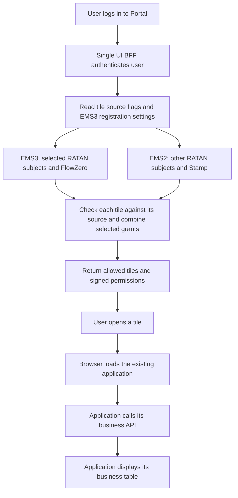
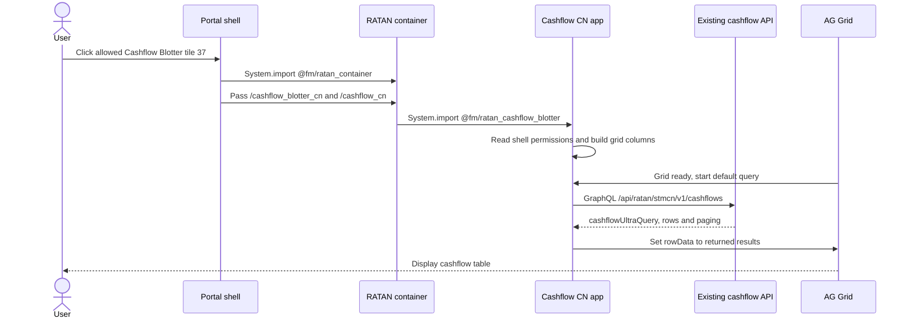

# EMS3 Migration Explained With RATAN Cashflow Blotter, FlowZero And Stamp

Prepared: 7 October 2026. Updated: 8 October 2026. EM3 below means the EMS3 entitlement system.

**Latest proposal:** select EMS2 or EMS3 directly on each `application_tile` row. Reuse `authorization_application` for EMS3 registration details. No additional subject-routing table is required for this example. This report describes the design; the tile flag and the required BFF changes have not been implemented.

### Where To Start

| What you want to understand | Where to read |
| --- | --- |
| Today's permissions, for all supplied roles | Section 2 and [complete current matrices](/Users/lushevol/.codex/worktrees/ems3-single-ui-bff/fdc3-broker-next/services/single-ui-bff-ems3/docs/ems3-matrices-current.md). |
| The two ways of managing EMS3 registrations | Section 3 and the two complete target matrices linked there. |
| The tile flags for selected RATAN settlement screens + FlowZero on EMS3, other RATAN screens + Stamp on EMS2 | Section 4, including proposed SQL. |
| One user logging in and opening the actual cashflow table | Sections 6 and 7. |
| What has been proved and what still needs a live check | Sections 8 and 9. |

## 1. The Proposal In Plain Words

The Portal keeps the same tiles and application links. Its BFF, the service that answers the browser's login request, learns how to get permissions from either EMS2 or EMS3.

Each tile has a proposed `entitlement_source` setting: `EMS2` or `EMS3`, defaulting to `EMS2`. The BFF uses the setting to decide which provider may grant access to that tile. In the revised transition example:

| Application | Existing Portal entity | Get permissions from | What the user should see |
| --- | --- | --- | --- |
| RATAN strategic cashflow, dashboards and NSTP rules | `X_RATANONE` | EMS3 for the selected tiles | Preserve the selected subjects' grants and assignments. |
| Other RATAN screens | `X_RATANONE` | EMS2 | Older Cashflow BAU, Grouping, Trade Blotter and other subjects stay on EMS2 in this example. |
| FlowZero launch tile 108 | `FLOW_ZERO` in the supplied tile row | EMS3 | FlowZero belongs to RATAN but can appear as a standalone application. Its supplied pilot has its own logical EMS3 app. |
| Stamp | `STAMP_STATIC` | EMS2 | The existing Stamp tiles and function permissions. |

The browser does not choose the provider. The application registration owner can be the application team or the Portal team. This changes who manages permissions and the registration IDs; it does not have to change what users are allowed to do.



The existing tested POC routes a whole entity to one provider. It does not yet support splitting `X_RATANONE` by tile. Its provider adapters and recorded tests remain evidence for the earlier implementation; they do not prove this revised tile-level design. Section 4 explains the required changes, and Section 7 traces the existing application code through the business table.

### A Few Names Used In This Report

| Name | Simple meaning | Example |
| --- | --- | --- |
| Entity | The application's existing permission bucket in Portal. | `X_RATANONE` |
| Role | A named set of permissions assigned to a user. | `FMO_OPS_BO` |
| Subject / feature | The screen or function covered by a permission. EMS2 calls it a subject; EMS3 calls it a feature. | `RATAN_CASHFLOW_BLOTTER` |
| Action | Something the role may do for that feature. | `F_Export_Data` |
| Matrix | The definitions of which role has which feature/action pair. It does not say which people have that role. | The tables below. |
| Registration | The EMS3 application record containing those definitions. | Application name, app ID and app UID. |
| JWT | A signed token containing identity or permissions. | The entitlement token read by existing applications. |

## 2. What We Actually Have Today

These are counts from the supplied files, not a live production query.

| Application | Supplied definition source | Roles | Subjects / features | Action names | Role/feature/action grants | What is missing |
| --- | --- | ---: | ---: | ---: | ---: | --- |
| RATAN | EMS2 `entitlements.xml` | 25 | 25 | 51 | 806 | Production user-role assignments and a complete confirmed EMS3 target catalogue. |
| FlowZero | EMS3 pilot application catalogue in `EMS3 Samples.json` | 39 | 8 | 11 | 398 | Its old EMS2 matrix and confirmation that the pilot catalogue is the complete intended production definition. |
| Stamp | EMS2 `entitlements_stamp.xml` | 4 | 32 | 6 | 458 | Production user-role assignments and future EMS3 registration details. |

**All supplied definitions are presented as tables in [Current Full Matrices](/Users/lushevol/.codex/worktrees/ems3-single-ui-bff/fdc3-broker-next/services/single-ui-bff-ems3/docs/ems3-matrices-current.md).** RATAN is grouped into one table per subject, FlowZero into one table per feature, and Stamp into a subject-by-role table. No supplied grants are omitted. Six FlowZero roles with no feature grants are included explicitly.

The shorter tables here explain the examples used later.

### RATAN Cashflow Blotter: Today's Matrix

The older Cashflow Blotter tile uses entity `X_RATANONE` and subject `RATAN_CASHFLOW_BLOTTER`. This table includes every role with grants for that subject. Roles with identical grants are grouped on one row. "Yes" means the named grant is present; a blank means it is absent.

| Roles | Open | Custom query | Private views | Public views | Export | All 12 operations below | ID test |
| --- | --- | --- | --- | --- | --- | --- | --- |
| `FMO_ID_OPS_TEST` | Yes | Yes | Yes | Yes | Yes | Yes | Yes |
| `FMO_OPS_BO`, `FMO_OPS_BOC`, `FMO_OPS_BOL`, `FMO_OPS_BOM`, `FMO_OPS_BOS`, `FMO_OPS_MKR` | Yes | Yes | Yes | Yes | Yes | Yes | |
| `FMO_MO_RO`, `FMO_MO_TE`, `FMO_MO_TE_SUP`, `FMO_MO_TV`, `FMO_MO_TV_SUP`, `FMO_RO`, `NON_FMO_RO`, `PSS_RO` | Yes | Yes | Yes | | Yes | | |
| `FMO_OPS_INV`, `FMO_STA_CKR`, `FMO_STA_MKR` | Yes | | | | | | |

| Label above | Exact action name |
| --- | --- |
| Open | `ACCESS_FMO_POST_TRADE_PORTAL` |
| Custom query | `F_Custom_Query_Builder` |
| Private views | `F_Custom_View_Builder_Private` |
| Public views | `F_Custom_View_Builder_Public` |
| Export | `F_Export_Data` |
| ID test | `ACCESS_ID_TEST` |

| The 12 operations | Exact action name |
| --- | --- |
| Start / verify an ad hoc Nostro change | `F_Ad_Hoc_Nostro_Initiate`, `F_Ad_Hoc_Nostro_Verify` |
| Start / verify an ad hoc SSI change | `F_Ad_Hoc_SSI_Initiate`, `F_Ad_Hoc_SSI_Verify` |
| Suppress / reinstate | `F_Ad_Hoc_Suppress`, `F_Reinstate` |
| Add a settlement comment | `F_Add_Settlement_Comment` |
| Change affirmation status | `F_Cashflow_Affirmation_Status_Change` |
| Release a cashflow | `F_Cashflow_Status_Change_Release` |
| Perform ad hoc netting | `F_Perform_Ad_Hoc_Netting` |
| Start / verify un-netting | `F_Perform_Un_Net_Initiate`, `F_Perform_Un_Net_Verify` |

That is **18 roles and 155 grants for this one subject**. `FMO_OPS_BO`, the role used later, has 17 of these actions and 58 grants across its 14 RATAN subjects. The seven RATAN roles not listed have no grants for this cashflow subject; in particular, `FMO_COO_SUP` is not a suitable Cashflow Blotter example.

There are also CN/strategic cashflow and group-management subjects. They are separate permission definitions, even though they belong to the same `X_RATANONE` entity:

| Cashflow example | Tile IDs in the export | Subject | Relevant `FMO_OPS_BO` grants |
| --- | --- | --- | --- |
| Older Cashflow Blotter / BAU | 36 | `RATAN_CASHFLOW_BLOTTER` | The 17 actions described above. |
| Cashflow Blotter: CN, Simple and Open Search examples | 37, 144, 152 | `RATAN_STRATEGIC_CASHFLOW_BLOTTER` | `ACCESS_FMO_POST_TRADE_PORTAL`, `F_Ad_Hoc_Suppress`, `F_Cashflow_Status_Change_Release`, `F_Custom_Query_Builder`, `F_Custom_View_Builder_Private`, `F_Export_Data`, `F_Fail`, `F_Hold`, `F_Modify_Settlement_Means`, `F_Multi_Exception_Initiate`, `F_Multi_Exception_Verify`, `F_Perform_Ad_Hoc_Netting`, `F_Perform_Cashflow_Split`, `F_Perform_Un_Net_Initiate`, `F_Perform_Un_Net_Verify`, `F_Reinstate`, `F_Un_Hold`. |
| Cashflow Group Management | 38 and 164 | `RATAN_CASHFLOW_GROUP_BLOTTER` | `ACCESS_FMO_POST_TRADE_PORTAL`, `F_Cashflow_Status_Change_Release`, `F_ManualStp`. |

The full current appendix contains every role for all three subjects. Section 7 traces the **CN screen**, whose query and grid code are supplied. The older BAU route is not present in that supplied cashflow source version.

| Cashflow subject | Roles with grants | Distinct actions | Role/subject/action grants |
| --- | ---: | ---: | ---: |
| `RATAN_CASHFLOW_BLOTTER` | 18 | 18 | 155 |
| `RATAN_STRATEGIC_CASHFLOW_BLOTTER` | 17 | 20 | 133 |
| `RATAN_CASHFLOW_GROUP_BLOTTER` | 10 | 3 | 22 |

Both proposed EMS3 ownership options retain these exact cashflow grant sets as the eventual full target. In the revised first phase, only selected subjects use EMS3: the older BAU and grouping subjects stay EMS2. The complete 806-grant appendix remains the reference for eventual RATAN migration, rather than a requirement to switch every subject at once.

**A separate RATAN parity gap:** the EMS3 per-user sample has 16 grants for `FMO_COO_SUP`, while its EMS2 definition has 21. Five `F_WORKFLOW_*` actions for `RATAN_FLOW_ZERO` are missing. That sample does not prove the complete RATAN target is registered. `RATAN_FLOW_ZERO` also belongs to `X_RATANONE`; it is separate from the independent `FLOW_ZERO` entity.

### FlowZero Belongs To RATAN, With Two Supplied Permission Keys

| Supplied record | Existing key | What the record proves |
| --- | --- | --- |
| RATAN EMS2 workflow functions | `X_RATANONE / RATAN_FLOW_ZERO` | 32 grants across seven roles, including workflow designer/request/query and maker/checker functions. No supplied tile row references this subject. |
| Standalone Flowzero launch tile 108 | `FLOW_ZERO / FLOW_ZERO_RAISE REQUEST` | This is the actual key the Portal uses to show the Flowzero tile. Its `ems2_role` is `RATAN_PROD`, which is configuration administration metadata. |
| FlowZero EMS3 pilot | Logical app `FLOWZERO`, including feature `RAISE_REQUEST` | This is the supplied pilot definition, not proof that its roles/actions replace RATAN's workflow functions one for one. |

RATAN ownership does not require renaming the existing launch key. The concrete example switches tile 108. Moving the separate, currently untiled `RATAN_FLOW_ZERO` function grants needs an explicit approved binding; a tile flag alone cannot select a subject that no tile references. Until that binding is agreed, those RATAN function grants keep the EMS2 default. Do not substitute the pilot's different role/action definitions automatically.

### FlowZero: The Known Pilot Role `Global_Onboard_BatchOps`

We cannot reconstruct its old EMS2 matrix from the supplied data. This table is from the existing EMS3 pilot catalogue.

| EMS3 feature | Role | Allowed actions |
| --- | --- | --- |
| `HOMEPAGE` | `Global_Onboard_BatchOps` | `ACCESS_FMO_POST_TRADE_PORTAL`, `VIEW_HOMEPAGE` |
| `TODO` | `Global_Onboard_BatchOps` | `ACCESS_FMO_POST_TRADE_PORTAL`, `APPROVE_TASK`, `EDIT_COMMENT`, `EDIT_TASK`, `REJECT_TASK`, `TERMINATE_TASK` |
| `REQUEST_CENTRE` | `Global_Onboard_BatchOps` | `ACCESS_FMO_POST_TRADE_PORTAL`, `EDIT_COMMENT` |
| `RAISE_REQUEST` | `Global_Onboard_BatchOps` | `ACCESS_FMO_POST_TRADE_PORTAL`, `BATCH_IMPORT`, `RAISE_NEW_REQUEST`, `VIEW_PUBLISHEDWORKFLOW` |
| `UPLOAD_FILE` | `Global_Onboard_BatchOps` | `ACCESS_FMO_POST_TRADE_PORTAL` |

This role has **15 grants**. The full pilot catalogue has 398 grants across 39 roles. Six roles have no feature/action grants, including `FLOWZERO Application User`. That role alone does not show tile 108, because that tile requires a matching feature.

### Stamp: Permissions For Its Two Portal Tiles

| EMS2 subject | `CHECKER` | `MAKER` | `STATIC_STAMP` | `VIEW_ONLY` |
| --- | --- | --- | --- | --- |
| `Mapping Query` | `Write` | `Write` | `Write` | `Read` |
| `Audit` | `Read` | `Read` | `Read` | `Read` |

The other 30 subjects are individual mapping functions. Every one has the following role pattern; their exact names appear in the full matrix.

| Subjects | `CHECKER` | `MAKER` | `STATIC_STAMP` | `VIEW_ONLY` |
| --- | --- | --- | --- | --- |
| Each of the other 30 mapping subjects | `Approve`, `Create`, `Delete`, `Edit`, `Read` | `Create`, `Delete`, `Edit`, `Read` | `Approve`, `Create`, `Delete`, `Edit`, `Read` | `Read` |

## 3. What The Matrices Look Like After Migration

The intended migration preserves permissions. EMS3 uses features where EMS2 used subjects. Keep the existing role, subject/feature and action names to preserve the current permission-token keys.

| Application | Target EMS3 role definitions | Target EMS3 features | Target grants | Change to the permission matrix |
| --- | ---: | ---: | ---: | --- |
| RATAN | 25 | 25 | 806 | Copy every EMS2 role/subject/action grant; subject names become feature names. |
| FlowZero | 39 | 8 | 398 | Use the supplied pilot catalogue as a candidate target; confirm completeness and legacy compatibility. |
| Stamp | 4 | 32 | 458 | Copy every EMS2 grant when Stamp's later migration is approved. |

These numbers describe the eventual full target. They do not mean those registrations or user assignments have been created. Tile flags decide which part is used during each migration phase; the unselected RATAN subjects continue to use EMS2.

### Option A: Each Application Manages Its Own Registration

| Application | Who creates roles and assigns users | EMS3 registration ID | EMS3 logical app name, proposed | EMS3 app UID |
| --- | --- | --- | --- | --- |
| RATAN | RATAN team | `RATAN_ID_TBC` | `RATAN_ENTITLEMENT_RULE` | `RATAN_UID_TBC` |
| FlowZero | RATAN / FlowZero owners | `FLOWZERO_ID_TBC` | `FLOWZERO` | `FLOWZERO_UID_TBC` |
| Stamp, later | Stamp team | `STAMP_ID_TBC` | `STAMP` | `STAMP_UID_TBC` |

For example, RATAN's registration contains `FMO_OPS_BO -> RATAN_CASHFLOW_BLOTTER -> F_Export_Data`. FlowZero's registration contains `Global_Onboard_BatchOps -> RAISE_REQUEST -> BATCH_IMPORT`. Stamp's future registration contains `VIEW_ONLY -> Mapping Query -> Read`.

**[Full EMS3 Matrices: Application-Owned](/Users/lushevol/.codex/worktrees/ems3-single-ui-bff/fdc3-broker-next/services/single-ui-bff-ems3/docs/ems3-matrices-application-owned.md)** lists every proposed role/feature/action grant for all three applications.

### Option B: Portal Manages All Registrations Centrally

Use one parent Portal ID while keeping a separate logical application name and UID for each application's permissions.

| Application | Who creates roles and assigns users | Shared EMS3 registration ID | EMS3 logical app name, proposed | EMS3 app UID |
| --- | --- | --- | --- | --- |
| RATAN | Portal team, with RATAN owner approval | `PORTAL_ID_TBC` | `RATAN_ENTITLEMENT_RULE` | `RATAN_UID_TBC` |
| FlowZero | Portal team, with FlowZero owner approval | `PORTAL_ID_TBC` | `FLOWZERO` | `FLOWZERO_UID_TBC` |
| Stamp, later | Portal team, with Stamp owner approval | `PORTAL_ID_TBC` | `STAMP` | `STAMP_UID_TBC` |

The example grant triples remain exactly the same as Option A. Portal ownership does not give a RATAN role access to FlowZero or Stamp. The BFF selects and maps each logical application independently.

### The Same Permissions Under Both Options

This table shows concrete target entries. The linked appendices contain the complete matrices, including all cashflow roles and all Stamp mapping functions.

| Role / EMS3 feature | Allowed actions after migration | Option A location | Option B location |
| --- | --- | --- | --- |
| `FMO_OPS_BO / RATAN_CASHFLOW_BLOTTER` | Exactly the same 17 actions from the current cashflow table. | RATAN registration, `RATAN_ENTITLEMENT_RULE`. | Portal registration, logical app `RATAN_ENTITLEMENT_RULE`. |
| `FMO_OPS_BO / RATAN_STRATEGIC_CASHFLOW_BLOTTER` | Exactly the same 17 CN actions listed above. | RATAN registration, `RATAN_ENTITLEMENT_RULE`. | Portal registration, logical app `RATAN_ENTITLEMENT_RULE`. |
| `Global_Onboard_BatchOps / HOMEPAGE` | `ACCESS_FMO_POST_TRADE_PORTAL`, `VIEW_HOMEPAGE`. | FlowZero registration, `FLOWZERO`. | Portal registration, logical app `FLOWZERO`. |
| `Global_Onboard_BatchOps / TODO` | `ACCESS_FMO_POST_TRADE_PORTAL`, `APPROVE_TASK`, `EDIT_COMMENT`, `EDIT_TASK`, `REJECT_TASK`, `TERMINATE_TASK`. | FlowZero registration, `FLOWZERO`. | Portal registration, logical app `FLOWZERO`. |
| `Global_Onboard_BatchOps / REQUEST_CENTRE` | `ACCESS_FMO_POST_TRADE_PORTAL`, `EDIT_COMMENT`. | FlowZero registration, `FLOWZERO`. | Portal registration, logical app `FLOWZERO`. |
| `Global_Onboard_BatchOps / RAISE_REQUEST` | `ACCESS_FMO_POST_TRADE_PORTAL`, `BATCH_IMPORT`, `RAISE_NEW_REQUEST`, `VIEW_PUBLISHEDWORKFLOW`. | FlowZero registration, `FLOWZERO`. | Portal registration, logical app `FLOWZERO`. |
| `Global_Onboard_BatchOps / UPLOAD_FILE` | `ACCESS_FMO_POST_TRADE_PORTAL`. | FlowZero registration, `FLOWZERO`. | Portal registration, logical app `FLOWZERO`. |
| `VIEW_ONLY / Mapping Query` | `Read`. | Stamp registration, `STAMP`, when migrated later. | Portal registration, logical app `STAMP`, when migrated later. |
| `VIEW_ONLY / Audit` | `Read`. | Stamp registration, `STAMP`, when migrated later. | Portal registration, logical app `STAMP`, when migrated later. |
| `VIEW_ONLY / each of the other 30 Stamp features` | `Read` for each. | Stamp registration, `STAMP`, when migrated later. | Portal registration, logical app `STAMP`, when migrated later. |

For the current walkthrough, Stamp and the older RATAN Cashflow BAU subject remain in **EMS2**. Their EMS3 target tables describe later migration. Strategic cashflow and NSTP subjects use EMS3, regardless of which team owns the registration.

**[Full EMS3 Matrices: Portal-Managed](/Users/lushevol/.codex/worktrees/ems3-single-ui-bff/fdc3-broker-next/services/single-ui-bff-ems3/docs/ems3-matrices-portal-managed.md)** lists every proposed role/feature/action grant under this arrangement.

The sample already shows RATAN and FlowZero sharing `appId="51358"` with different app names and UIDs: RATAN UID 10, FlowZero UID 65. Those are sample identities, not confirmation of a production Portal registration. The fork permits repeated `appId` and `itamId`; active EMS3 routes require distinct `appName` and `appUID`.

### How The Options Compare

| Question | Application-owned | Portal-managed |
| --- | --- | --- |
| Who makes a permission change? | Each application team. | Portal team handles it with the application owner. |
| Main advantage | Teams can manage their own roles, approvals and timing. | One team can keep naming, onboarding and audit practices consistent. |
| Main drawback | More registrations and coordination across teams. | Portal may become a queue for every team's permission changes. |
| What needs controlling? | Each team must follow the agreed compatibility and assignment rules. | Portal administrators need clear boundaries and application owner approval. |
| Can selected screens switch first? | Proposed: yes, through tile flags while other subjects stay EMS2. | Proposed: yes, through the same tile flags with centrally managed registration identities. |
| Does either option remove shared BFF/EMS3 outage risk? | No. Both use the same runtime services. | No. Both use the same runtime services. |

There is no need to choose one management owner for all applications to run this POC. The runtime can support either supported arrangement once the actual registration identities are confirmed.

### A Different Meaning Of "One Portal ID"

If it means **one combined EMS3 app name and UID containing every application's roles**, the current fork does not implement that design. The unique app-name/UID constraints reject sharing one logical application across several active routes.

That variant would need an explicit mapping from each Portal role and feature/action pair to its destination entity and legacy permission names, plus tests for cross-application access and independent switches. For example, `PORTAL_RATAN_FMO_OPS_BO` would need to become `X_RATANONE:FMO_OPS_BO`, and a prefixed feature would need to become the old subject key. Removing the unique indexes alone would not provide those mappings.

This report's central option uses a shared parent ID with separate logical applications. EMS3 administrators must confirm how that arrangement is registered and delegated in the real system.

## 4. What Is Stored In The RATAN / Portal Database

The relevant database is the Single UI BFF's `post_trade_portal_service` schema. These are its Portal configuration tables, not RATAN's trade-storage tables. The matrix definitions and user-role assignments live in EMS2 or EMS3. The BFF stores the provider settings and application catalogue.

### Every Related BFF Table

| Table | What it stores | Role in this migration |
| --- | --- | --- |
| `application_category` | Menu categories and their ordering/active state. | Existing rows continue to group tiles. |
| `application_category_audit` | Category change history. | Existing application-managed audit behavior. |
| `application_tile` | Tile title, category/import references, entity, subject, module and tile path. | Add proposed `entitlement_source`; existing matching keys and paths stay the same. |
| `application_tile_audit` | Tile change history. | Mirror the new source flag and record changes through the normal tile administration flow. |
| `import_map` | Symbolic application names and deployed bundle locations. | Existing entries load application code; they do not grant access. |
| `import_map_audit` | Import-map change history. | Existing application-managed audit behavior. |
| `application_session` | Logged-out/revoked session IDs. | Existing blacklist checked during session validation; it is not a user-role table. |
| `authorization_application` | Existing POC provider setting and EMS3 identity per existing entity. | Reuse for EMS3 identities, aliases and the default for permissions not selected by tile flags. The revised BFF must use tile flags for tile decisions. |
| `authorization_application_audit` | Snapshots of routing changes. | New database-triggered audit for insert/update/delete, including direct SQL changes. |
| `post_trade_portal_service_schema_history` | Flyway migration history. | Infrastructure record of applied schema changes. |

There are no new local user, role, user-role assignment, feature/action catalogue or effective-permission cache tables. Direct SQL changes to old catalogue tables do not automatically create their application-managed audit records; the new authorization table has its own audit triggers.

No `authorization_subject_route` table is proposed for this example. The source decision lives on the tile; the shared EMS3 identity remains in the existing configuration table.

Source: [new schema and triggers](/Users/lushevol/.codex/worktrees/ems3-single-ui-bff/fdc3-broker-next/services/single-ui-bff-ems3/src/main/resources/db/migration/V1_0_10__authorization_application.sql:12).

### Existing Catalogue Rows Stay The Same

| `application_tile_id` | Actual title | Subtitle / explanation | Category ID | Import-map ID | `ems2_entities` | `ems2_subject` | Module / tile in DB |
| --- | --- | --- | ---: | ---: | --- | --- | --- |
| 36 | Cashflow Blotter | Subtitle: `[FX & Equity]` | 9 | 10 | `X_RATANONE` | `RATAN_CASHFLOW_BLOTTER` | `cashflow_blotter` / `cashflow_bau` |
| 37 | Cashflow Blotter | No subtitle; CN implementation. | 9 | 10 | `X_RATANONE` | `RATAN_STRATEGIC_CASHFLOW_BLOTTER` | `cashflow_blotter_cn` / `cashflow_cn` |
| 108 | Flowzero | No subtitle. | 32 | 66 | `FLOW_ZERO` | `FLOW_ZERO_RAISE REQUEST` | `flowzero` / `home` |
| 48 | Mapping Query | No subtitle. | 12 | 32 | `STAMP_STATIC` | `Mapping Query` | `stamp` / `stamp-mappingquery` |
| 49 | Audit | No subtitle. | 12 | 32 | `STAMP_STATIC` | `Audit` | `stamp` / `stamp-audit` |

| Category ID | Category label | Import-map ID | Import-map key |
| --- | --- | --- | --- |
| 9 | Settlement | 10 | `ratan_container` |
| 32 | Flowzero | 66 | `flowzero` |
| 12 | Static Data Mapping | 32 | `stamp_container` |

The old column names still contain `ems2`, but their entity and subject values remain the Portal's matching keys even for an EMS3 application. Changing `ems2_role=RATAN_PROD` to `EMS3` would not switch the provider: those role labels belong to the existing configuration administration scheme. Visibility is decided by entity/subject matching.

Sources: [cashflow tile export](/Users/lushevol/code/github/fdc3-broker-next/scb-next/data/application_tile.csv:26), [Settlement category export](/Users/lushevol/code/github/fdc3-broker-next/scb-next/data/application_category.csv:10), [RATAN import-map export](/Users/lushevol/code/github/fdc3-broker-next/scb-next/data/import_map.csv:9).

**Current code versus proposed design:** today's fork still switches an entire entity. The new design makes `application_tile.entitlement_source` authoritative for each tile, so selected settlement screens can use EMS3 while other `X_RATANONE` screens use EMS2. Adding the column without changing the BFF will not enable this behavior.

The dump also contains data-filter metadata; this function-permission POC does not evaluate that metadata or determine which cashflow rows the backend returns.

### Proposed Tile Flags For The First Phase

This concrete scope includes the named strategic cashflow/dashboard and NSTP subjects, plus standalone Flowzero tile 108. "Other settlement screens" are not silently included: their exact subject groups can be switched in a later configuration change.

| Tile IDs | Screens | Existing entity / subject | Proposed source |
| --- | --- | --- | --- |
| 37, 39, 144, 152, 161, 165 | Strategic Cashflow Blotter, Simple/Open Search variants and dashboards, including Indonesia variants | `X_RATANONE / RATAN_STRATEGIC_CASHFLOW_BLOTTER` | EMS3 |
| 30, 31, 172 | Settlement NSTP Rules, including Indonesia variant | `X_RATANONE / RATAN_SETTLEMENT_STP_RULE` | EMS3 |
| 108 | Flowzero | `FLOW_ZERO / FLOW_ZERO_RAISE REQUEST` | EMS3 |
| 36 | Older Cashflow BAU | `X_RATANONE / RATAN_CASHFLOW_BLOTTER` | EMS2 |
| 38, 164 | Grouping Blotter | `X_RATANONE / RATAN_CASHFLOW_GROUP_BLOTTER` | EMS2 in this example; optional later group |
| 32, 33, 34, 173, 174 | Suppression rules | `X_RATANONE / RATAN_SUPPRESSION_RULE` | EMS2 in this example; optional later group |
| 29, 171 | Authorization Limits | `X_RATANONE / RATAN_PROFILE_LIMITS` | EMS2 in this example; optional later group |
| 54 | Trade Blotter | `X_RATANONE / RATAN_TRADE_BLOTTER` | EMS2 |
| 48, 49 | Stamp Mapping Query / Audit | `STAMP_STATIC / Mapping Query` or `Audit` | EMS2 |
| Other configured tiles | Existing screens | Existing keys | EMS2 by default |

The example switches ten configured tile rows. NSTP is in menu category **Business Rule**, so changing every row in category **Settlement** would not select the correct scope.

### Proposed SQL, Not Applied

The following illustrates the schema/configuration change. It is not an executed migration or proof that the current BFF understands the flag. Add the same column to tile audit storage and include it in admin APIs, CSV import/export and audit snapshots during implementation.

```sql
ALTER TABLE post_trade_portal_service.application_tile
    ADD COLUMN entitlement_source varchar(4) NOT NULL DEFAULT 'EMS2'
    CHECK (entitlement_source IN ('EMS2', 'EMS3'));

UPDATE post_trade_portal_service.application_tile
SET entitlement_source = 'EMS3',
    updated_at = CURRENT_TIMESTAMP,
    updated_by = CURRENT_USER
WHERE (btrim(ems2_entities) = 'X_RATANONE'
       AND ems2_subject IN (
           'RATAN_STRATEGIC_CASHFLOW_BLOTTER',
           'RATAN_SETTLEMENT_STP_RULE'
       ))
   OR (btrim(ems2_entities) = 'FLOW_ZERO'
       AND ems2_subject = 'FLOW_ZERO_RAISE REQUEST');
```

This example selects complete matching subject groups in the supplied single-entity rows, including inactive variants if present. Production changes should use the audited tile administration flow, or explicitly create its required audit records; a direct SQL update does not automatically populate `application_tile_audit`.

### The Shared-Subject Rule

| Situation | Proposed handling |
| --- | --- |
| Two non-template tiles have the same entity and subject | Require the same source for both, including configured variants that may be activated later. |
| Strategic blotter is EMS3 but its dashboard is EMS2 | Reject the inconsistent configuration when preserving today's shared function-permission format. |
| Only menu visibility is being split | A provider-aware filter could distinguish individual tiles, but that does not provide separate button/action permissions. |
| A template or blank-subject tile | Preserve its existing explicit behavior; do not infer a function subject or migrate it by menu-category name. |

The existing JWT identifies grants by entity, role and subject, without a tile ID or source. That is why shared-subject consistency is needed. The BFF can validate it from tile rows; it does not require a separate subject-routing table.

### Reuse The Existing Application Configuration

| Fields | Meaning |
| --- | --- |
| `id`, `bff_entity_name` | Row ID and unique existing entity name. |
| `provider` | Current code: provider for the entire entity. Proposed: default for permissions not selected by tile flags; it cannot override a tile's explicit source. |
| `bff_entity_id` | Existing numeric entitlement entity ID, required for EMS3. This is not a tile ID, app UID or registration ID. |
| `ems3_app_name`, `ems3_app_id`, `ems3_app_uid`, `ems3_itam_id` | Exact EMS3 identities that returned permissions must match. |
| `subject_long_names` | JSON map from an EMS3 feature name to the subject's compatibility long name used for tile matching. |
| `active` | Whether the route can be used. Missing/inactive required routes fail the lookup. |
| `mapping_version` | Configuration version; the database advances it once per update. |
| `created_at`, `updated_at`, `created_by`, `updated_by` | Change timestamps and actors. |

The earlier migration backfills all tile entities as EMS2. In the revised design, RATAN keeps an EMS2 default and complete EMS3 identity fields for its selected tiles. All FlowZero launch tiles use EMS3 in this supplied catalogue, so its application permissions can use the EMS3 default. Other Portal entities retain valid settings.

### Option A Rows: Application Teams Manage The Registration Details

All `*_TBC` values below are placeholders. The numeric entity IDs and UIDs must come from the real systems before these settings can be applied.

| `bff_entity_name` | `provider` | `bff_entity_id` | `ems3_app_name` | `ems3_app_id` | `ems3_app_uid` | `ems3_itam_id` | `active` |
| --- | --- | --- | --- | --- | --- | --- | --- |
| `X_RATANONE` | `EMS2` default | RATAN legacy entity ID | `RATAN_ENTITLEMENT_RULE` | `RATAN_ID_TBC` | RATAN UID | `RATAN_ITAM_TBC` | true |
| `FLOW_ZERO` | `EMS3` | FlowZero legacy entity ID | `FLOWZERO` | `FLOWZERO_ID_TBC` | FlowZero UID | `FLOWZERO_ITAM_TBC` | true |
| `STAMP_STATIC` | `EMS2` | Can remain unset | null | null | null | null | true |

### Option B Rows: The Same Tile Flags With Central Ownership

| `bff_entity_name` | `provider` | `bff_entity_id` | `ems3_app_name` | `ems3_app_id` | `ems3_app_uid` | `ems3_itam_id` | `active` |
| --- | --- | --- | --- | --- | --- | --- | --- |
| `X_RATANONE` | `EMS2` default | RATAN legacy entity ID | `RATAN_ENTITLEMENT_RULE` | `PORTAL_ID_TBC` | RATAN UID | `PORTAL_ITAM_TBC` | true |
| `FLOW_ZERO` | `EMS3` | FlowZero legacy entity ID | `FLOWZERO` | `PORTAL_ID_TBC` | FlowZero UID | `PORTAL_ITAM_TBC` | true |
| `STAMP_STATIC` | `EMS2` | Can remain unset | null | null | null | null | true |

Stamp's future EMS3 row would use `STAMP` and its own unique UID, with its own registration/ITAM under Option A or the Portal registration/ITAM under Option B. Neither future row is activated in this walkthrough.

The literal `provider` value for RATAN is `EMS2`; "default" in the table explains its revised meaning. Current code ignores RATAN's EMS3 identity fields while this value is EMS2. The new router must validate/use those fields whenever a RATAN tile selects EMS3, and enforce uniqueness for every consumed EMS3 identity, even when the entity default is EMS2.

This simple reuse supports one EMS3 logical application per existing entity. If several different EMS3 logical applications must all emit `X_RATANONE` permissions, add a tile reference to the selected mapping and adjust the existing mapping constraints/adapter. A source flag alone does not identify which of several registrations to use. RATAN ownership or a shared Portal parent ID does not by itself require this extra variant.

### Subject Compatibility Settings

| Entity | Proposed `subject_long_names` content | Why |
| --- | --- | --- |
| `X_RATANONE` | All 25 `RATAN_*` feature names mapped to their existing `/RATAN_*` long names. | Preserve exported subject long names as well as the original subject keys. |
| `FLOW_ZERO` | `{"RAISE_REQUEST":"FLOW_ZERO_RAISE REQUEST"}` | The pilot feature and the existing tile subject have different names. This alias lets tile 108 match. |
| `STAMP_STATIC` | `{}` while on EMS2. At a later EMS3 switch, map all 32 features to their existing slash-prefixed long names. | EMS2 already returns the legacy subjects. |

The complete proposed maps are recorded in [matrix evidence](/Users/lushevol/.codex/worktrees/ems3-single-ui-bff/fdc3-broker-next/services/single-ui-bff-ems3/docs/evidence/ems3-three-application-matrix-manifest.json).

**An alias fixes tile matching, not renamed JWT keys.** The adapter sets `Subject.name` to the EMS3 feature name and only changes `Subject.longName` with this JSON. The JWT uses `Subject.name`. Thus FlowZero's key will be `RAISE_REQUEST`; this report cannot prove that it matches unknown former FlowZero EMS2 keys. If a consumer needs an old key, keep that feature name in EMS3 or implement and test an explicit canonical-name mapping.

Sources: [subject conversion](/Users/lushevol/.codex/worktrees/ems3-single-ui-bff/fdc3-broker-next/services/single-ui-bff-ems3/src/main/java/com/scb/sso/singleuibff/service/v2/implementation/EMS3AuthorizationImplementation.java:215), [JWT keys](/Users/lushevol/.codex/worktrees/ems3-single-ui-bff/fdc3-broker-next/services/single-ui-bff-ems3/src/main/java/com/scb/sso/singleuibff/controller/v2/JwtAuthenticationController.java:152).

## 5. Preparing The Mixed Setup

These are implementation and rollout steps for the revised proposal, not a claim that the existing fork can already execute it.

| Step | What happens | Required result |
| --- | --- | --- |
| 1 | Implement the tile flag, audit/admin/import support and provider-aware BFF flow; initially set all tiles to EMS2. Connect the Portal gateway to the fork in the test environment. | Verify the existing all-EMS2 behavior through the actual browser route. |
| 2 | The chosen owners register RATAN and FlowZero in EMS3 using the relevant ownership arrangement. | Confirm app name, app ID, app UID and ITAM identity for both. |
| 3 | Load and compare the complete selected subject definitions. Keep the full appendices as the eventual target. | RATAN strategic cashflow has 133 grants and NSTP has 22: 155 selected grants, while 651 other RATAN grants remain EMS2. FlowZero's owner confirms the pilot target and compatibility. |
| 4 | Assign known test accounts to the intended roles in EMS3; retain the needed RATAN and Stamp assignments in EMS2. | An allow-list account and a denied account have known expected outcomes; role assignments need not move for unselected subjects. |
| 5 | Configure the BFF's EMS3 token endpoint, detailed/aggregate grant endpoints, service credentials and timeouts. | The BFF service account can read both selected logical applications. Secrets stay in environment/service configuration. |
| 6 | Fill the EMS3 identity/compatibility settings, then flag the ten selected tiles EMS3. Keep RATAN's default EMS2 and all Stamp tiles EMS2. | Validate same-subject consistency, required identities and audited changes. Do not switch all `X_RATANONE` to EMS3. |
| 7 | Perform fresh login and permission rechecks, including failures and role removal. | Correct tiles and claims, no fallback, and agreed browser behavior. |

The proposed BFF reads tile flags and identities afresh on each lookup. Endpoint/credential changes use the service configuration/restart process. This report creates no registrations, assignments, schema migrations or live database updates.

### Required BFF Changes

| Change | Why it is necessary |
| --- | --- |
| Pass tile source/subject requirements into authorization, instead of only distinct entity names. | RATAN now needs both providers in one lookup. |
| Keep provider results separate until each tile has been checked against its selected source. | An EMS2 subject must not show an EMS3 tile. |
| Remove migrated subjects from all EMS2 role records, even when EMS3 returns no grant for them. | A valid denial must not become an implicit fallback. |
| Keep only selected RATAN subjects from EMS3; use the entity default for untiled functions. | Extra EMS3 RATAN features must not take over unselected EMS2 functions. For fully migrated FlowZero, retain its confirmed full application permissions, including features without separate Portal tiles. |
| Merge by canonical entity and role before building the response/JWT; preserve approved subject names. | The current JWT builder overwrites duplicate `entity:role` blocks, so simply appending provider records loses permissions. Different numeric role/feature IDs need explicit compatibility handling. |
| Validate the same-subject rule, identity mappings, templates and blank-subject behavior. | Invalid or ambiguous settings must fail rather than select another provider. |
| Add focused mixed-RATAN tests, including an EMS3 denial while EMS2 still grants that subject. | Earlier whole-entity tests do not prove this new source isolation. |

Sources: [current entity-only router](/Users/lushevol/.codex/worktrees/ems3-single-ui-bff/fdc3-broker-next/services/single-ui-bff-ems3/src/main/java/com/scb/sso/singleuibff/service/v2/implementation/RoutingAuthorizationService.java:54), [current JWT builder](/Users/lushevol/.codex/worktrees/ems3-single-ui-bff/fdc3-broker-next/services/single-ui-bff-ems3/src/main/java/com/scb/sso/singleuibff/controller/v2/JwtAuthenticationController.java:152).

## 6. One Test User, From Login To The Menu

This section describes the expected flow after the tile-source extension is implemented. Source links show the existing code to reuse/change; this is not a recorded execution of the revised design.

Use a synthetic account named `demo_migration`. The assignments below are an illustration; the real user assignment source has not been supplied.

| Application / selected subjects | Assigned role | Assignment system | Grant count for this example |
| --- | --- | --- | ---: |
| RATAN strategic cashflow + NSTP | `FMO_OPS_BO` | EMS3, using equivalent selected subject definitions | 18 |
| Other RATAN subjects | `FMO_OPS_BO` | EMS2, with selected EMS3 subjects removed from the result | 40 |
| FlowZero | `Global_Onboard_BatchOps` | EMS3 pilot-equivalent definition | 15 |
| Stamp | `VIEW_ONLY` | EMS2 | 32 |

The account's 58 RATAN grants are split: 17 strategic cashflow actions and one NSTP access action come from EMS3; 40 others, including 17 BAU cashflow actions, come from EMS2. The selected EMS3 definitions are copied from the export, not a recorded live response. Assume equivalent assignments exist in the required systems, no other roles are assigned, FlowZero's alias is approved, and all required calls succeed. There are still 105 effective grants across three canonical roles.

### Step 1: Open Portal And Authenticate

The root page loads its configured SystemJS import map. That map tells the browser where application bundles live. It does not decide who may open a tile.

The browser sends the login request. The BFF checks credentials through OUD/MFA or Entra, then uses the authenticated user's identity for permission lookup. A browser-provided application/provider choice cannot select the authorization route.

| Browser submits | BFF endpoint | Where the verified user identity comes from |
| --- | --- | --- |
| Username and password | `/api/auth/v2/sso/login` | OUD LDAP authentication. |
| Legacy SSO `code`, `iss`, `client_id` | `/api/auth/v2/sso/login` | MFA exchange and its returned ID token. |
| Entra SSO `code` | `/api/auth/v3/sso/login` | Entra exchange and its returned ID token. |

Sources: [root page](/Users/lushevol/code/github/fdc3-broker-next/scb/web/mfe-root-config-origin/src/index.ejs:22), [frontend login endpoints](/Users/lushevol/code/github/fdc3-broker-next/scb/web/mfe-base-origin/src/services/index.ts:15), [BFF login](/Users/lushevol/.codex/worktrees/ems3-single-ui-bff/fdc3-broker-next/services/single-ui-bff-ems3/src/main/java/com/scb/sso/singleuibff/controller/v2/JwtAuthenticationController.java:188).

### Step 2: Read The Catalogue And Provider Settings

The BFF joins active categories, tiles and import-map rows, ordered by category and tile order. The revised flow must also read each tile's `entitlement_source`, validate shared-subject consistency, and take one snapshot of required application identities/defaults. The current code only passes distinct entity names to the router, which must change.

For the three examples, the resulting provider groups are:

| Provider group | Entity names | Selected scope |
| --- | --- | --- |
| EMS3 | `X_RATANONE` | Only strategic cashflow/dashboard and NSTP subjects. |
| EMS3 | `FLOW_ZERO` | Confirmed FlowZero application permissions; alias the launch feature to tile 108. |
| EMS2 | `X_RATANONE` | Other RATAN subjects; exclude every subject owned by selected EMS3 tiles. |
| EMS2 | `STAMP_STATIC` | Existing Stamp permissions. |

Notice that `X_RATANONE` is deliberately in both provider groups. Each subject still has one authoritative source. The full Portal includes other catalogue entities that retain their settings; this table shows the three examples rather than the complete lookup scope.

Sources: [active catalogue query](/Users/lushevol/.codex/worktrees/ems3-single-ui-bff/fdc3-broker-next/services/single-ui-bff-ems3/src/main/java/com/scb/sso/singleuibff/repository/ApplicationCategoryRepo.java:24), [entity extraction](/Users/lushevol/.codex/worktrees/ems3-single-ui-bff/fdc3-broker-next/services/single-ui-bff-ems3/src/main/java/com/scb/sso/singleuibff/util/AdminModuleUtil.java:89), [provider routing](/Users/lushevol/.codex/worktrees/ems3-single-ui-bff/fdc3-broker-next/services/single-ui-bff-ems3/src/main/java/com/scb/sso/singleuibff/service/v2/implementation/RoutingAuthorizationService.java:54).

### Step 3: Fetch The Remaining RATAN And Stamp Permissions From EMS2

The EMS2 adapter fetches the user's role list. It retains only roles whose entities belong to the selected EMS2 group. It then requests function grants for the matched EMS2 entities.

EMS2 may still return all 58 RATAN grants for `FMO_OPS_BO`. The revised BFF removes strategic cashflow and NSTP from every EMS2 role record, leaving this role's other 40 grants. This removal is required even if the user has no corresponding EMS3 role or grant.

Stamp's result is `STAMP_STATIC / VIEW_ONLY`, including `Mapping Query -> Read` and `Audit -> Read`. EMS2 FlowZero launch grants cannot authorize tile 108 once it selects EMS3.

Source: [EMS2 adapter](/Users/lushevol/.codex/worktrees/ems3-single-ui-bff/fdc3-broker-next/services/single-ui-bff-ems3/src/main/java/com/scb/sso/singleuibff/service/v2/implementation/EMS2AuthorizationImplementation.java:33).

### Step 4: Fetch RATAN And FlowZero From EMS3

The BFF makes **one service-token request, one detailed user-grants request and one aggregate user-grants request** for this lookup. This is three EMS3 calls total, not three calls for each application. Both ownership options use the same request pattern and require service access to both logical apps.

The EMS3 service token is used only between the BFF and EMS3. It is separate from the user's Portal tokens and is never returned to the browser.

| EMS3 response | What it supplies | Why it is needed |
| --- | --- | --- |
| Detailed user grants | Assigned roles and each role's feature/action pairs, with application identities. | Preserve which permissions came from which role. |
| Aggregate user grants | Application/user identity, assigned role names and the union of feature/action pairs. | Check agreement with the detailed response for every selected application. |

The BFF checks app names, IDs/UIDs, nested identities, returned account identity, and detailed/aggregate agreement. Each selected app must have an explicit aggregate record, including a valid empty result if the account has no access.

For `demo_migration`, retain RATAN's 18 selected role grants and FlowZero's 15 confirmed pilot grants. If EMS3 also returns unrelated RATAN subjects, validate its response but do not use those subjects to replace the EMS2-owned permissions. Stamp is not selected from EMS3 even if an unrelated Stamp record appears.

Agreement between two endpoints does not prove the definition is complete against EMS2: both could omit the same permission. That is why the full matrix comparison is also required.

Source: [EMS3 HTTP calls](/Users/lushevol/.codex/worktrees/ems3-single-ui-bff/fdc3-broker-next/services/single-ui-bff-ems3/src/main/java/com/scb/sso/singleuibff/service/v2/implementation/EMS3AuthorizationImplementation.java:61), [response validation](/Users/lushevol/.codex/worktrees/ems3-single-ui-bff/fdc3-broker-next/services/single-ui-bff-ems3/src/main/java/com/scb/sso/singleuibff/service/v2/implementation/EMS3AuthorizationImplementation.java:185).

### Step 5: Convert And Merge The Selected Permissions

The existing EMS3 adapter converts grants into the entity/role/subject/action format. The proposed router must additionally retain the correct provider's subjects and merge mixed records by canonical entity/role before building the response/JWT. This avoids duplicate `X_RATANONE:FMO_OPS_BO` blocks overwriting one another.

| Provider input | BFF entity / role | BFF subject name | BFF subject long name | Action |
| --- | --- | --- | --- | --- |
| RATAN EMS2 subject | `X_RATANONE / FMO_OPS_BO` | `RATAN_CASHFLOW_BLOTTER` | `/RATAN_CASHFLOW_BLOTTER`, returned by EMS2 | `F_Export_Data` |
| RATAN EMS3 CN feature | `X_RATANONE / FMO_OPS_BO` | `RATAN_STRATEGIC_CASHFLOW_BLOTTER` | `/RATAN_STRATEGIC_CASHFLOW_BLOTTER`, with proposed alias map | `F_Export_Data` |
| FlowZero EMS3 feature | `FLOW_ZERO / Global_Onboard_BatchOps` | `RAISE_REQUEST` | `FLOW_ZERO_RAISE REQUEST`, with proposed alias | `BATCH_IMPORT` |
| Stamp EMS2 subject | `STAMP_STATIC / VIEW_ONLY` | `Mapping Query` | `/Mapping Query` | `Read` |

Different canonical roles remain separate records; the same canonical role's disjoint subjects must be merged. Combining providers must not copy one application's permissions to another. The current adapter can preserve entity IDs through `bff_entity_id`, but returns EMS3 role/feature/action IDs and null per-grant `action.entitlementId`. In the revised split, the same role may have different numeric IDs across providers: agree the canonical identity/metadata mapping rather than choosing whichever record arrives first. Numeric-ID consumers require a compatibility check.

Source: [EMS3 conversion](/Users/lushevol/.codex/worktrees/ems3-single-ui-bff/fdc3-broker-next/services/single-ui-bff-ems3/src/main/java/com/scb/sso/singleuibff/service/v2/implementation/EMS3AuthorizationImplementation.java:202).

### Step 6: Decide Which Tiles To Return

The current filter matches entity and subject name/long name, ignoring subject case; it does not require a particular action or the tile's `ems2_role` label. The revised filter must first limit the check to the tile's selected provider. A merged all-provider grant list must not restore an EMS2 grant for an EMS3-selected subject.

| Tile | Required match | Example account has it? | Menu result |
| --- | --- | --- | --- |
| 36 Cashflow Blotter [FX & Equity] | EMS2: `X_RATANONE` + `RATAN_CASHFLOW_BLOTTER` | Yes, through `FMO_OPS_BO` from EMS2. | Show. |
| 37 Cashflow Blotter, CN | `X_RATANONE` + `RATAN_STRATEGIC_CASHFLOW_BLOTTER` | Yes, through the same EMS3 role. | Show. |
| 38 Grouping Blotter | EMS2: `X_RATANONE` + `RATAN_CASHFLOW_GROUP_BLOTTER` | Yes, through the EMS2 role. | Show. |
| 193 Exception Auto Recover | EMS2: `X_RATANONE`; subject is blank. | Yes, the entity is assigned in EMS2. | Show under the existing entity-only rule, using only its selected EMS2 source. |
| 108 Flowzero | `FLOW_ZERO` + `FLOW_ZERO_RAISE REQUEST` | Yes, `RAISE_REQUEST` matches through the long-name alias. | Show. |
| 48 Mapping Query | `STAMP_STATIC` + `Mapping Query` | Yes, with `Read` from EMS2. | Show. |
| 49 Audit | `STAMP_STATIC` + `Audit` | Yes, with `Read` from EMS2. | Show. |

The table above highlights the screens discussed here. The complete calculation predicts **40 RATAN protected tiles, one FlowZero tile and two Stamp tiles**. The supplied full catalogue also has 14 active template tiles that bypass permission matching after a successful authorization request. With no other assigned roles, that is **57 visible tiles out of 113 active joined candidates**. Templates do not rescue a failed provider lookup: authorization must succeed first.

| Source in the revised example | Visible protected tiles |
| --- | ---: |
| EMS3: selected RATAN strategic cashflow/dashboard + NSTP | 9 |
| EMS3: FlowZero | 1 |
| EMS2: remaining RATAN | 31 |
| EMS2: Stamp | 2 |
| Templates, outside function matching | 14 |
| **Total** | **57** |

| Menu category | Protected tile IDs for this account | Count |
| --- | --- | ---: |
| Trade Processing | 54 | 1 |
| Settlement | 36, 37, 38, 39, 144, 152, 161, 164, 165 | 9 |
| Exception Management | 15, 16, 17, 115, 193 | 5 |
| Business Rule | 29, 30, 31, 32, 33, 34, 162, 171, 172, 173, 174 | 11 |
| Static | 50, 51, 52, 53, 123, 137, 166, 167, 168, 169, 170, 183, 196 | 13 |
| Flowzero | 108 | 1 |
| Static Data Mapping | 48, 49 | 2 |
| Verification Sample | 109 | 1 |
| Templates, across their categories | 65, 66, 67, 68, 69, 70, 71, 72, 73, 79, 80, 101, 131, 136 | 14 |
| **Total** | | **57** |

Without the FlowZero long-name alias, tile 108 does not match and the total is 56. Several tiles share the same subject, so a role can expose more tiles than it has subjects. Tile 109 is an existing unusual case: it opens the BAU module but matches `RATAN_VALIDATION_EXCEPTION`.

This result was independently calculated from structured exports and existing matching rules. It assumes the proposed provider checks and equivalent grants preserve access. It is not a recorded tile-flag login: earlier evidence proved whole-entity routing, not a RATAN entity split or this 57-tile scenario.

Source: [actual tile filter](/Users/lushevol/.codex/worktrees/ems3-single-ui-bff/fdc3-broker-next/services/single-ui-bff-ems3/src/main/java/com/scb/sso/singleuibff/util/AdminModuleUtil.java:97), [full catalogue replay](/Users/lushevol/.codex/worktrees/ems3-single-ui-bff/fdc3-broker-next/services/single-ui-bff-ems3/docs/ems3-user-records.md).

### Step 7: Return The Menu, Permission Records And Tokens

The successful login body contains `result`, `drawers`, `entities`, `entitlementsToken`, `oud` and `userInfo`. The identity/access token is returned in the `Single-UI-Authorization: Bearer ...` header. The entitlement token is a separate signed JWT.

This is a **fragment** of the JSON permission map stored as the JWT's `entitlements` string, illustrating the three roles:

```json
{
  "X_RATANONE:FMO_OPS_BO": {
    "RATAN_CASHFLOW_BLOTTER": [
      "ACCESS_FMO_POST_TRADE_PORTAL",
      "F_Custom_Query_Builder",
      "F_Export_Data"
    ],
    "RATAN_STRATEGIC_CASHFLOW_BLOTTER": [
      "ACCESS_FMO_POST_TRADE_PORTAL",
      "F_Custom_Query_Builder",
      "F_Custom_View_Builder_Private",
      "F_Export_Data"
    ]
  },
  "FLOW_ZERO:Global_Onboard_BatchOps": {
    "RAISE_REQUEST": [
      "ACCESS_FMO_POST_TRADE_PORTAL",
      "BATCH_IMPORT",
      "RAISE_NEW_REQUEST",
      "VIEW_PUBLISHEDWORKFLOW"
    ]
  },
  "STAMP_STATIC:VIEW_ONLY": {
    "Mapping Query": ["Read"],
    "Audit": ["Read"]
  }
}
```

The expected token includes all selected grants, not just the fragment above. The proposed response returns one merged entity/role record for `X_RATANONE / FMO_OPS_BO`, one for `FLOW_ZERO / Global_Onboard_BatchOps`, and one for `STAMP_STATIC / VIEW_ONLY`. Subject entries contain their action arrays. The RATAN function helper can read those records directly from shell state.

In the proposed combined RATAN record, BAU cashflow permissions come from EMS2 and strategic cashflow permissions come from EMS3. The JWT keeps the existing keys, without provider or tile identifiers. The selected-provider filtering and merge must happen before signing it; the current code does not yet implement that merge.

Notice that the FlowZero JWT key is `RAISE_REQUEST`, even though its tile matches `FLOW_ZERO_RAISE REQUEST`. This is why tile-alias compatibility and JWT-key compatibility must be checked separately.

Source: [response and token assembly](/Users/lushevol/.codex/worktrees/ems3-single-ui-bff/fdc3-broker-next/services/single-ui-bff-ems3/src/main/java/com/scb/sso/singleuibff/controller/v2/JwtAuthenticationController.java:95).

### Step 8: The Browser Shows The New Tile Menu

The frontend's success handler receives the login response, stores entities/drawers/tokens in shared state, and decodes the entitlement map into `user.entitlements`. The New Tile drawer renders the returned category/tile list.

The browser has no need to know which provider produced each tile. The tile record still names the same container, module and tile as before.

Sources: [success handler](/Users/lushevol/code/github/fdc3-broker-next/scb/web/mfe-base-origin/src/hooks/service/util/succes.response.handler.ts:24), [permission and drawer state](/Users/lushevol/code/github/fdc3-broker-next/scb/web/mfe-base-origin/src/utils/login.ts:67), [menu rendering](/Users/lushevol/code/github/fdc3-broker-next/scb/web/mfe-base-origin/src/components/Drawer/Menu.tsx:13).

## 7. From Clicking A Tile To Seeing The Business Table

### The Common Shell Steps

After login, the user initially sees the workspace. The permitted applications are choices in the **New Tile** drawer; login does not open every table at once.

1. The user clicks **New Tile**, then a returned tile.
2. The shell copies its container/module/tile into a workspace panel and closes the drawer.
3. The panel shows a loading splash while it calls `System.import` for the named container.
4. The import map finds the deployed JavaScript bundle. The imported app receives the module and tile path.
5. That app opens its own screen, calls its business API, then places the returned rows into its grid.

| User chooses | Symbolic container | Module / tile passed to app | Permission source |
| --- | --- | --- | --- |
| Cashflow Blotter [FX & Equity], tile 36 | `@fm/ratan_container` | `/cashflow_blotter` / `/cashflow_bau` | EMS2, `RATAN_CASHFLOW_BLOTTER`. |
| Cashflow Blotter, CN, tile 37 | `@fm/ratan_container` | `/cashflow_blotter_cn` / `/cashflow_cn` | EMS3, `RATAN_STRATEGIC_CASHFLOW_BLOTTER`. |
| Flowzero, tile 108 | `@fm/flowzero` | `/flowzero` / `/home` | EMS3, `RAISE_REQUEST` with the tile alias. |
| Mapping Query, tile 48 | `@fm/stamp_container` | `/stamp` / `/stamp-mappingquery` | EMS2, `Mapping Query`. |
| Audit, tile 49 | `@fm/stamp_container` | `/stamp` / `/stamp-audit` | EMS2, `Audit`. |

The BFF adds the leading slashes when constructing the drawer entry; the database stores the paths without them. Registration ownership does not change the bundle names, screen routes or business API addresses.

Sources: [tile click](/Users/lushevol/code/github/fdc3-broker-next/scb/web/mfe-base-origin/src/components/Drawer/common/MenuItem.useController.ts:11), [SystemJS workspace loading](/Users/lushevol/code/github/fdc3-broker-next/scb/web/mfe-base-origin/src/pages/Home/common/Container.tsx:11), [BFF drawer paths](/Users/lushevol/.codex/worktrees/ems3-single-ui-bff/fdc3-broker-next/services/single-ui-bff-ems3/src/main/java/com/scb/sso/singleuibff/util/AdminModuleUtil.java:136).

### RATAN Cashflow CN: From The Tile To Actual Grid Rows

This is traced through supplied frontend source. It has not been executed in a browser connected to the EMS3 fork.



| Step | Actual code behavior | Source |
| --- | --- | --- |
| 1. Load the screen | RATAN routes `/cashflow_blotter_cn` to CashFlowCN, which imports `@fm/ratan_cashflow_blotter`. | [container route](/Users/lushevol/code/github/fdc3-broker-next/scb/web/mfe-ratan-container-origin/src/Root/routing/index.tsx:28), [nested app import](/Users/lushevol/code/github/fdc3-broker-next/scb/web/mfe-ratan-container-origin/src/Root/import/CashFlowCN.tsx:7). |
| 2. Create the table | The nested app routes `/cashflow_cn` to Cashflow_CN. Main renders CashflowDataGrid, which loads business-field column definitions and creates the shared DataGrid / AgGridReact. | [app route](/Users/lushevol/code/github/fdc3-broker-next/scb/web/mfe-cashflow-blotter-origin/src/Root/routing/index.tsx:37), [grid construction](/Users/lushevol/code/github/fdc3-broker-next/scb/web/mfe-cashflow-blotter-origin/src/Cashflow_CN/components/CashflowDataGrid/index.tsx:148). |
| 3. Start the query | When the grid is ready, query the supplied cashflow ID or filters if present; otherwise run the default search. Build filters, page size, page index and requested fields. | [grid-ready search](/Users/lushevol/code/github/fdc3-broker-next/scb/web/mfe-cashflow-blotter-origin/src/Cashflow_CN/components/CashflowDataGrid/hooks/useGridReadyEvent.ts:33), [query payload](/Users/lushevol/code/github/fdc3-broker-next/scb/web/mfe-cashflow-blotter-origin/src/Cashflow_CN/Main/store/actions/cashflowAction.ts:208). |
| 4. Call the business API | Send GraphQL to `/api/ratan/stmcn/v1/cashflows`, carrying the shell's `Single-UI-Authorization` token and `Userid`. This code does not send the EMS3 service token. | [API and headers](/Users/lushevol/code/github/fdc3-broker-next/scb/web/mfe-cashflow-blotter-origin/src/Root/rtk-query/baseGraphQLApi.ts:13). |
| 5. Receive rows | Read `cashflowUltraQuery.results`, plus `totalResult`, `pageIndex`, `itemsPerPage` and `lastPage`. The real backend supplies the business rows; EMS3 supplies function permissions. | [query shape](/Users/lushevol/code/github/fdc3-broker-next/scb/web/mfe-cashflow-blotter-origin/src/Cashflow_CN/schema/ultra-cashflow-query.generated.ts:35), [response handling](/Users/lushevol/code/github/fdc3-broker-next/scb/web/mfe-cashflow-blotter-origin/src/Cashflow_CN/Main/store/actions/cashflowAction.ts:231). |
| 6. Show the table | Call `api.setGridOption("rowData", results)` and end loading. A query error clears rows and shows the no-rows overlay. | [row assignment](/Users/lushevol/code/github/fdc3-broker-next/scb/web/mfe-cashflow-blotter-origin/src/Cashflow_CN/Main/store/actions/cashflowAction.ts:249). |

These are literal excerpts from the row-handling code, with intervening paging assignments omitted:

```typescript
const { cashflowUltraQuery } = res ?? {};
const {
  results: responsResults,
  pageIndex,
  itemsPerPage,
  totalResult,
  lastPage,
} = cashflowUltraQuery ?? {};
results = responsResults ?? [];
// The code checks that this is still the current query before rendering.
api?.setGridOption("rowData", results);
api?.setGridOption("loading", false);
```

### How A Function Inside Cashflow Keeps Working

The actual Export button checks this existing permission:

```typescript
hasPermission("RATAN_STRATEGIC_CASHFLOW_BLOTTER:F_Export_Data")
```

For the worked account:

| Check | What supplies the answer |
| --- | --- |
| Does `FMO_OPS_BO` have the CN feature? | The migrated EMS3 role definition. |
| Does that feature contain `F_Export_Data`? | Yes, in the EMS2 export and proposed EMS3 target. |
| How does the old frontend find it? | The BFF converts it to an `X_RATANONE` subject/action record; the shell stores that in `entities`; RATAN's `getUser` / `hasPermission` reads it. |
| What does the user see? | The Export File control can render; it remains disabled until its grid API is ready. |
| How is exporting done? | Existing code calls AG Grid's CSV or Excel export. EMS3 is not called again when exporting. |

Source: [export condition and implementation](/Users/lushevol/code/github/fdc3-broker-next/scb/web/mfe-cashflow-blotter-origin/src/Cashflow_CN/components/GridFooter/ExportFile.tsx:39), [permission helper](/Users/lushevol/code/github/fdc3-broker-next/scb/web/mfe-ratan-container-origin/src/ratanutils/authenticator.ts:38).

This example shows why keeping the subject/action names matters. It is source evidence of one control's permission check, not proof that every control or business API has been tested after migration.

### Older RATAN Cashflow BAU: The Known Limit

Tile 36 follows the same shell steps, then its RATAN wrapper runs `System.import("@fm/ratan_cashflow")`. The matching BAU application's source is not supplied. The available CN application's routes do not implement `/cashflow_bau`, so its query cannot be presented as the BAU query.

We can show tile 36's complete matrix, eventual EMS3 target grants, existing filtering and wrapper load. It remains EMS2 in this revised first phase. Its last business API call and grid implementation still require the matching BAU bundle/source or a live application trace.

Source: [BAU app import](/Users/lushevol/code/github/fdc3-broker-next/scb/web/mfe-ratan-container-origin/src/Root/import/CashFlow.tsx:8).

### FlowZero: From Home To The Request Table

Tile 108 opens the deployed `/static/flowzero/flowzero.js` bundle. There is no matching production FlowZero source under `scb/web`. The following last steps are from the **local reference implementation** in `apps/mfe-flowzero`; its equality with that deployed bundle needs confirmation.

| Step | Local reference behavior | Source |
| --- | --- | --- |
| 1. Open FlowZero | `/flowzero/home` displays its home view and statistics, not the request table. | [home route](/Users/lushevol/code/github/fdc3-broker-next/apps/mfe-flowzero/src/Root/routing/index.tsx:71). |
| 2. Choose My Request | Its menu opens `/flowzero/task-center`, which renders RequestCenter. | [menu link](/Users/lushevol/code/github/fdc3-broker-next/apps/mfe-flowzero/src/components/SiderMenu/index.tsx:48), [screen route](/Users/lushevol/code/github/fdc3-broker-next/apps/mfe-flowzero/src/Root/routing/index.tsx:51). |
| 3. Ask for a page of rows | The grid datasource calls `getTaskCenter` with page, size, the shell user ID, workflow-name filter and status filter. | [request construction](/Users/lushevol/code/github/fdc3-broker-next/apps/mfe-flowzero/src/pages/RequestCenter/index.tsx:194). |
| 4. Call the business API | GET `/api/flowzero/v1/workflow-request/my-request` with those query parameters. It uses the shared Base service, which adds `Single-UI-Authorization` and `userId`. | [API call](/Users/lushevol/code/github/fdc3-broker-next/apps/mfe-flowzero/src/api/index.ts:132), [shared headers](/Users/lushevol/code/github/fdc3-broker-next/apps/base/src/hooks/service/util/success.request.handler.ts:7). |
| 5. Show the table | `res.data` supplies rows, `res.totalElements` supplies the count; pass them to the grid's `successCallback`. Columns include Workflow Name, Request ID, Status and Request Time. | [rows and count](/Users/lushevol/code/github/fdc3-broker-next/apps/mfe-flowzero/src/pages/RequestCenter/index.tsx:201), [column definitions](/Users/lushevol/code/github/fdc3-broker-next/apps/mfe-flowzero/src/pages/RequestCenter/index.tsx:62). |

The row-delivery code uses the following values:

```typescript
const rows = res.data || [];
const total = res.totalElements ?? 0;
```

The datasource then sorts/delivers those rows through `rowParams.successCallback(sorted, totalRef.current)`.

The inspected reference menu, routes and request-centre screen do not check EMS feature/action grants. Therefore a migrated `RAISE_NEW_REQUEST` or `EDIT_COMMENT` grant is not proof that this UI enforces those actions. The Portal tile gate is established; production function checks and backend behavior need confirmation. We are not expanding the migration into business-row entitlement control here.

### Stamp: Keep Its Existing EMS2 Path

| Step | What happens in the mixed setup | Evidence |
| --- | --- | --- |
| 1. Get its permissions | BFF fetches `STAMP_STATIC / VIEW_ONLY` from EMS2. | EMS2 adapter and supplied complete matrix. |
| 2. Return its tiles | `Mapping Query / Read` and `Audit / Read` provide matching subjects for tiles 48 and 49. | BFF filter and supplied tile rows. |
| 3. Open its screen | Shell imports `@fm/stamp_container`, resolved to `/stamp_container/stamp_container.js`, and passes the existing Mapping Query or Audit route. | Tile/import-map dump and inspected shell. |
| 4. Load its table data | The Stamp app calls its existing business API and fills its own table. | Expected application step; the Stamp app/API source was not supplied. |

The import map also contains `/stamp_tiles/stamp_tiles.js`; the available data does not prove exactly how Stamp's container uses it. We cannot name Stamp's final API, response shape or table component from these exports. Nothing in the mixed-provider setting moves Stamp permissions to EMS3.

Sources: [Stamp tile rows](/Users/lushevol/code/github/fdc3-broker-next/scb-next/data/application_tile.csv:35), [Stamp bundle rows](/Users/lushevol/code/github/fdc3-broker-next/scb-next/data/import_map.csv:29).

### What The Whole Flow Means

The entitlement systems answer **which tiles and functions this user may use**. The BFF checks and translates those answers. The Portal opens an allowed application. The application then gets rows from its existing business API and renders its table.

Both registration-ownership options follow this same sequence. Neither ownership arrangement changes the table query. The BFF POC does not prove which business rows a user may read or that an application backend rejects an unauthorized direct API call.

## 8. No Access, Failed Calls And Later Permission Changes

| Situation | Expected revised outcome | Evidence / practical meaning |
| --- | --- | --- |
| EMS3 validly reports no selected RATAN grants, with an explicit empty aggregate record | No strategic cashflow/dashboard or NSTP tiles are returned. Other RATAN subjects can remain available from EMS2. | Proposed split behavior; old whole-entity tests do not prove it. EMS2 copies of the migrated subjects must not restore access. |
| FlowZero has only `FLOWZERO Application User`, an empty-feature role | A role record can exist, but no `RAISE_REQUEST` subject. | FlowZero tile 108 is absent. |
| RATAN has an EMS2-assigned role with no subject grants | Matching EMS2 entity still exists. | Blank-subject tile 193 remains eligible under the existing entity-only rule. An EMS3-only role cannot authorize this EMS2 tile. |
| Required EMS3 call times out, fails, is malformed, has wrong identity, or selected endpoints disagree | Entire authorization attempt returns HTTP 503 / `AUTHORIZATION_UNAVAILABLE`. | Retain the tested POC failure policy: no partial success, new tokens or fallback. Reverify after tile routing changes. |
| Required EMS2 lookup fails | Same whole-request rejection. | The mixed login depends on both providers succeeding. |
| A required EMS3 identity is missing/inactive, a flag is invalid, or same-subject tiles disagree | Reject the authorization attempt. | Proposed validation; disabling configuration must not quietly change a tile's source. |
| Tile source changes in DB | Next lookup reads the new flag after implementation. | Existing already-signed tokens are not automatically revoked. |
| User loses a role in EMS3 | Fresh authorization uses the new grants. | Existing browser panels and old tokens need separate session/revocation handling. |

All six login/renewal paths recheck current permissions: normal login, Entra login, validate, relogin, extend and refresh. Extend/refresh keep their existing response shape; they do not automatically deliver a replacement menu and entitlement JWT to the browser. The entitlement JWT lifetime is currently 12 hours.

Those are properties of the existing POC. The tile-source extension must cover the same six paths and add the source-isolation/merge checks above; it has not yet been verified.

### Browser Work Still Needed Before Production

The inspected original shell has known gaps: it ignores an empty replacement drawer list, does not revalidate open panels on every grant update, and does not automatically clear old auth/menu state for `AUTHORIZATION_UNAVAILABLE` during renewal. Saved-workspace checks can also mishandle multiple roles, blank subjects and subject case.

Consequently the BFF's strict failure result is proved locally, while immediate removal of stale permissions from an already-open browser is not. Fix and test these shared-shell cases before the production pilot. The frontend gateway also needs to be connected to the fork; the existing development/production routes still target the original endpoints.

The RATAN function helper also overwrites an earlier entity's subject map when several role records have the same entity name. Our one-RATAN-role example avoids that existing issue, but users with multiple RATAN roles need a check before claiming full function-control parity. Source: [role-to-permission loop](/Users/lushevol/code/github/fdc3-broker-next/scb/web/mfe-ratan-container-origin/src/ratanutils/authenticator.ts:15).

Source: [screen flow and exact frontend gaps](/Users/lushevol/.codex/worktrees/ems3-single-ui-bff/fdc3-broker-next/services/single-ui-bff-ems3/docs/ems3-user-screen-flow.md).

## 9. Evidence And The Remaining Checks

| Evidence | Result | What it supports |
| --- | --- | --- |
| Saved actual-BFF Surefire reports | 747 tests; 0 failures, 0 errors, 0 skips. | Earlier whole-entity BFF routing verified with isolated PostgreSQL and synthetic HTTP providers. These are saved results, not tests of the proposed tile flag. |
| Saved standalone POC reports | 244 tests; 0 failures, 0 errors, 0 skips. | Earlier selected-role/permission pattern checks. |
| Saved full-dump replay | 113 candidate tiles, 1,044 requested entities, 1,048 backfilled mappings; 40 role/provider combinations and 50 individual-role cases. | Actual SQL/router/filter results for recorded synthetic fixtures; earlier FlowZero tile was not granted in those fixtures. |
| This report's full tables | RATAN 806, FlowZero pilot 398, Stamp 458 unique grants; no source duplicates. | A lossless presentation of the supplied definitions. Target tables preserve those sets, with FlowZero baseline qualification. |
| Independent matrix comparison | Current and both EMS3 target appendices: zero missing or extra grants for all three applications. | Exact equality with supplied definitions; no claim of completed registration. |
| This report's revised cashflow account | 43 protected tiles plus 14 templates predicted; 105 grants across three roles. RATAN grants split 18 EMS3 / 40 EMS2; protected tiles split 10 EMS3 / 33 EMS2. | Independently checked calculation under preserved grants and the proposed source rules; not an executed tile-flag or live-browser result. |
| Tile-source design | Proposed column, SQL, scope groups and required BFF changes documented. | Not implemented or tested. No subject-routing table added, and no database changes applied. |
| Cashflow CN code trace | GraphQL API, request headers, response-to-row assignment and Export permission condition found. | Explains the last steps through the supplied source; not a new rendered-table execution result. |

Supporting files: [BFF recorded verification](/Users/lushevol/.codex/worktrees/ems3-single-ui-bff/fdc3-broker-next/services/single-ui-bff-ems3/docs/ems3-bff-integration.md), [full-dump execution results](/Users/lushevol/.codex/worktrees/ems3-single-ui-bff/fdc3-broker-next/services/single-ui-bff-ems3/docs/evidence/ems3-scenario-results.json), [matrix source hashes, counts and aliases](/Users/lushevol/.codex/worktrees/ems3-single-ui-bff/fdc3-broker-next/services/single-ui-bff-ems3/docs/evidence/ems3-three-application-matrix-manifest.json).

### What We Still Need To Confirm

| Simple question / check | Why it remains |
| --- | --- |
| What are the real production registration identities and existing numeric entity IDs? | The sample IDs and this report's placeholders are not production configuration. |
| Which additional settlement subject groups should join the first phase? | The concrete example includes strategic cashflow/dashboard and NSTP. Grouping, suppression, limits and other functions remain EMS2 until selected. |
| Does FlowZero migration include only tile 108, or also the separate `RATAN_FLOW_ZERO` function grants? | The latter has no supplied tile row, so it needs an explicit binding/default decision beyond a tile flag. Ownership alone does not map the pilot's different roles/actions. |
| Can EMS3 provide the complete selected RATAN subject definitions, then the full matrix for later phases? | The first phase needs strategic cashflow/NSTP parity; the separate `FMO_COO_SUP` workflow gap still matters when that subject migrates. |
| Is the FlowZero pilot catalogue the complete target, and do its consumers accept `RAISE_REQUEST` as the permission key? | No old FlowZero matrix was supplied; the tile alias does not translate JWT keys. |
| Which test accounts should have access, and which should be denied? | Definitions alone do not establish user-role assignments. Test accounts are enough for the POC stage. |
| Do the live detailed/aggregate APIs meet the implemented completeness, empty-result and identity rules? | Synthetic responses validate code behavior; live paging/effective-permission rules still need agreement. |
| Does the revised BFF pass same-entity mixed-provider, duplicate-role merge, invalid-flag and EMS3-denial tests? | The 747 saved tests predate this proposal. An EMS2 grant must never restore a selected EMS3 grant. |
| Does the deployed Portal, with its gateway pointed at the fork, pass fresh-login, renewal, revoked-role and failed-call browser tests? | The original shell gaps and deployment route remain unresolved. |
| Can the application owners show the real Cashflow Blotter, FlowZero and Stamp screens using those test accounts? | CN source is traced; BAU and Stamp sources are missing, and local FlowZero source is not confirmed as the production bundle. |

The corporate build and production database upgrade also need their normal environment verification. No production registrations, assignments, routing settings or applications were changed to produce this report.

## 10. Reading The Full Matrices

- [Current supplied matrices](/Users/lushevol/.codex/worktrees/ems3-single-ui-bff/fdc3-broker-next/services/single-ui-bff-ems3/docs/ems3-matrices-current.md): RATAN and Stamp EMS2 exports plus the known FlowZero EMS3 pilot catalogue; FlowZero EMS2 is unavailable. [BAU cashflow table](/Users/lushevol/.codex/worktrees/ems3-single-ui-bff/fdc3-broker-next/services/single-ui-bff-ems3/docs/ems3-matrices-current.md:46); [CN cashflow table](/Users/lushevol/.codex/worktrees/ems3-single-ui-bff/fdc3-broker-next/services/single-ui-bff-ems3/docs/ems3-matrices-current.md:328).
- [Proposed EMS3: each application manages itself](/Users/lushevol/.codex/worktrees/ems3-single-ui-bff/fdc3-broker-next/services/single-ui-bff-ems3/docs/ems3-matrices-application-owned.md): eventual full target under application-managed registrations; tile flags select the first-phase subset.
- [Proposed EMS3: Portal manages them centrally](/Users/lushevol/.codex/worktrees/ems3-single-ui-bff/fdc3-broker-next/services/single-ui-bff-ems3/docs/ems3-matrices-portal-managed.md): the same eventual target under a shared parent ID with distinct logical apps; tile flags select the same subset.

The expected visible result is the same under both ownership arrangements. Selected RATAN strategic cashflow/NSTP subjects and FlowZero come from EMS3; other RATAN subjects and Stamp come from EMS2. **The proposed flag on `application_tile` controls each tile's source.** Existing application configuration supplies EMS3 identities/defaults; matrices and assignments determine the grants. The additional subject-routing table suggested earlier is not required for this example.
